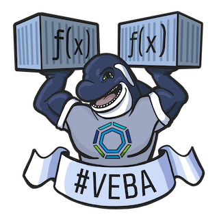

# VMware Event Broker Appliance

## Table of Contents

- [VMware Event Broker Appliance](#vcenter-event-broker-appliance)
  - [Getting Started](#getting-started)
  - [Overview](#overview)
  - [Architecture](#architecture)
  - [Getting in touch](#getting-in-touch)
  - [Contributing](#contributing)
  - [License](#license)

## Getting Started

Visit our website [vmweventbroker.io](https://vmweventbroker.io/) and explore our [documentation](https://vmweventbroker.io/kb) to get started quickly.

## Overview

The [VMware Event Broker Appliance](https://flings.vmware.com/vmware-event-broker-appliance#summary) Fling enables customers to unlock the hidden potential of events in their SDDC to easily create [event-driven automation](https://octo.vmware.com/vsphere-power-event-driven-automation/) and take vCenter Server Events to the next level! Extending vSphere by easily triggering custom or prebuilt actions to deliver powerful integrations within your datacenter across public cloud has never been more easier before. A detailed list of use cases and possibilities with VMware Event Broker Appliance is available [here](https://vmweventbroker.io)

With this appliance, end-users, partners and independent software vendors only have to write minimal business logic without going through a steep learning curve understanding vSphere APIs. As such, we believe this solution not only offers a better user experience in solving existing problems for vSphere operators. More importantly, it will enable new integration use cases and workflows to grow the vSphere ecosystem and community, similar to what AWS has achieved with AWS Lambda.

Learn more about the VMware Event Broker Appliance [here](https://vmweventbroker.io). 

Additional resources can be found [here](https://vmweventbroker.io) and some quick references are highlighted below
 - Watch [Michael Gasch](https://github.com/embano1) and [William Lam](https://github.com/lamw/) of VMware present a session at VMworld 2019 called ["If This Then That" for vSphere- The Power of Event-Driven Automation](https://videos.vmworld.com/global/2019/videoplayer/29523) (free VMworld account login is required to view).
 - Watch [Partheeban Kandasamy (PK)](https://github.com/embano1), [Michael Gasch](https://github.com/embano1) and [William Lam](https://github.com/lamw/) present about [Unlocking the potential of Events for SDDC automation](https://youtu.be/tOjp5_qn-Fg)

<!-- ## Users and Use Cases

Hear from the community on how they are taking advantage of the vCenter Server Appliance [here](https://vmweventbroker.io/casestudy-wip.md) -->

## Architecture

VMware Event Broker Appliance is provided as a Virtual Appliance that can be deployed to any vSphere-based infrastructure, including an on-premises and/or any public cloud environment, running on vSphere such as VMware Cloud on AWS or VMware Cloud on Dell-EMC.

The VMware Event Broker Appliance follows a highly modular approach, using Kubernetes and containers as an abstraction layer between the base operating system ([Photon OS](https://github.com/vmware/photon)) and the required application services. Currently the following components are used in the appliance:

- VMware Event Router ([Github](https://github.com/vmware-samples/vcenter-event-broker-appliance/vmware-event-router))
  - Supported Event Stream Sources:
    - VMware vCenter ([Website](https://www.vmware.com/products/vcenter-server.html))
  - Supported Event Stream Processors: 
    - OpenFaaS ([Website](https://www.openfaas.com/))
    - AWS EventBridge ([Website](https://aws.amazon.com/eventbridge/))
- Contour ([Github](https://github.com/projectcontour/contour))
- Kubernetes ([Github](https://github.com/kubernetes/kubernetes))
- Photon OS ([Github](https://github.com/vmware/photon))

For more details about the individual components and how they are used in the VMware Event Broker Appliance, please see the [Architecture page](https://vmweventbroker.io/kb/architecture).

## Getting in touch

Feel free to reach out to [Team #VEBA](https://vmweventbroker.io/#team-veba) and the community 
  - Email us at [dl-veba@vmware.com](mailto:dl-veba@vmware.com)
  - Join our users on slack [#vcenter-event-broker-appliance](https://vmwarecode.slack.com/archives/CQLT9B5AA) which is part of the [VMware {Code}](https://code.vmware.com/web/code/join) Slack instance
  - Follow for updates [@VMWEventBroker](https://twitter.com/VMWEventBroker)

## Contributing

The VMware Event Broker Appliance team welcomes contributions from the community.

To help you get started making contributions to VMware Event Broker Appliance, we have collected some helpful best practices in the [Contributing guidelines](https://vmweventbroker.io/community#guidelines).

Before submitting a pull request, please make sure that your change satisfies the requirements specified [here](https://vmweventbroker.io/community#pull-requests)

## License

VMware Event Broker Appliance is available under the BSD-2 license. Please see [LICENSE.txt](LICENSE.txt).
