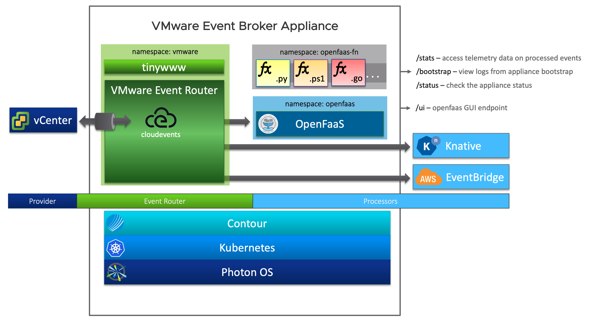

# VMware Event Broker Appliance

## Table of Contents

- [VMware Event Broker Appliance](#vmware-event-broker-appliance)
  - [Table of Contents](#table-of-contents)
  - [Getting Started](#getting-started)
  - [Overview](#overview)
  - [Architecture](#architecture)
  - [Getting in touch](#getting-in-touch)
    - [Community Calls](#community-calls)
    - [Other Channels](#other-channels)
  - [Contributing](#contributing)
  - [License](#license)

## Getting Started

Visit our website [vmweventbroker.io](https://vmweventbroker.io/) and explore
our [documentation](https://vmweventbroker.io/kb) to get started quickly.

## Overview

The [VMware Event Broker
Appliance](https://flings.vmware.com/vmware-event-broker-appliance#summary)
Fling enables customers to unlock the hidden potential of events in their SDDC
to easily create [event-driven
automation](https://octo.vmware.com/vsphere-power-event-driven-automation/). The
VMware Event Broker Appliance includes support for vCenter Server and VMware
Horizon events as well as any valid `CloudEvent` through the native webhook
event provider. Easily triggering custom or prebuilt actions to deliver powerful
integrations within your datacenter across public cloud has never been more
easier before. A detailed list of use cases and possibilities with VMware Event
Broker Appliance is available [here](https://vmweventbroker.io)

With this solution, end-users, partners and independent software vendors only
have to write minimal business logic without going through a steep learning
curve understanding the vSphere or Horizon APIs. As such, we believe this
solution not only offers a better user experience in solving existing problems
for VI/Cloud Admins, SRE/Operators, Automation Engineers and 3rd Party Vendors.
More importantly, it will enable new integration use cases and workflows to grow
the VMware ecosystem and community, similar to what AWS has achieved with AWS
Lambda.

Learn more about the VMware Event Broker Appliance
[here](https://vmweventbroker.io).

Additional resources can be found [here](https://vmweventbroker.io) and some
quick references are highlighted below
 - Watch [Michael Gasch](https://github.com/embano1) and [William
   Lam](https://github.com/lamw/) of VMware present a session at VMworld 2019
   called ["If This Then That" for vSphere- The Power of Event-Driven
   Automation](https://www.vmware.com/vmworld/en/video-library/video-landing.html?sessionid=15614121705290019EX2&region=EU)
   and at VMworld 2020 ["VEBA and the Power of Event-Driven Automation –
   Reloaded"](https://www.vmware.com/vmworld/en/video-library/video-landing.html?sessionid=1586353214997001Abo2)(free
   VMworld account login is required to view).
 - Watch [Partheeban Kandasamy (PK)](https://github.com/embano1), [Michael
   Gasch](https://github.com/embano1) and [William
   Lam](https://github.com/lamw/) present about [Unlocking the potential of
   Events for SDDC automation](https://youtu.be/tOjp5_qn-Fg)
 - Watch [Michael Gasch](https://github.com/embano1) and [William
   Lam](https://github.com/lamw/) present the [latest updates on VEBA at the
   recent Omaha
   VMUG](https://zoom.us/rec/share/4OMWH9hjC1rxTB4nshLC0LArcBCtHZ6n8zFO8IdWV7_P1BFphw8D_V8SotAYU5NL.HfS8ajp7BCctTpJO)
   (password: `MYN%0k9`)

<!-- ## Users and Use Cases

Hear from the community on how they are taking advantage of the vCenter Server Appliance [here](https://vmweventbroker.io/casestudy-wip.md) -->

## Architecture

VMware Event Broker Appliance is provided as a Virtual Appliance that can be
deployed to any vSphere-based infrastructure, including an on-premises and/or
any public cloud environment, running on vSphere such as VMware Cloud on AWS or
VMware Cloud on Dell-EMC.

The VMware Event Broker Appliance follows a highly modular approach, using
Kubernetes and containers as an abstraction layer between the base operating
system ([Photon OS](https://github.com/vmware/photon)) and the required
application services. Currently the following components are used in the
appliance:

- VMware Event Router
  ([Github](https://github.com/vmware-samples/vcenter-event-broker-appliance/vmware-event-router))
  - Supported Event Stream Sources:
    - VMware vCenter
      ([Website](https://www.vmware.com/products/vcenter-server.html))
    - VMware Horizon  [(Website)](https://www.vmware.com/products/horizon.html)
    - Incoming Webhooks
  - Supported Event Stream Processors:
    - Knative [(Website)](https://knative.dev/)
- Contour ([Github](https://github.com/projectcontour/contour))
- Kubernetes ([Github](https://github.com/kubernetes/kubernetes))
- Photon OS ([Github](https://github.com/vmware/photon))

For more details about the individual components and how they are used in the
VMware Event Broker Appliance, please see the [Architecture
page](https://vmweventbroker.io/kb/architecture).

## Getting in touch

### Community Calls

Public VEBA community meetings are held every **last Tuesday** in the month at
**8AM Pacific Time (US)**.

- **Zoom:** <https://via.vmw.com/veba-ama>
  - **Note:** The meeting is **password protected** to mitigate abuse. Please join the VEBA Slack [channel](https://vmwarecode.slack.com/archives/CQLT9B5AA) to receive the Zoom password or contact us in case of issues.
- **Notes**: <https://via.vmw.com/veba-notes>
- **Recording Playlist**: [VEBA Community Calls](https://youtube.com/playlist?list=PLnopqt07fPn3hspeQvarWuFH3IiwkMpDJ)

### Other Channels

Feel free to reach out to [Team #VEBA](https://vmweventbroker.io/#team-veba) and
the community via:
  - Email us at [dl-veba@vmware.com](mailto:dl-veba@vmware.com)
  - Join our users on slack
    [#vcenter-event-broker-appliance](https://vmwarecode.slack.com/archives/CQLT9B5AA)
    which is part of the [VMware {Code}](https://code.vmware.com/web/code/join)
    Slack instance
  - Follow for updates [@VMWEventBroker](https://twitter.com/VMWEventBroker)

## Contributing

The VMware Event Broker Appliance team welcomes contributions from the
community.

To help you get started making contributions to VMware Event Broker Appliance,
we have collected some helpful best practices in the [Contributing
guidelines](https://vmweventbroker.io/community#guidelines).

Before submitting a pull request, please make sure that your change satisfies
the requirements specified
[here](https://vmweventbroker.io/community#pull-requests)

## License

VMware Event Broker Appliance is available under the BSD-2 license. Please see
[LICENSE.txt](LICENSE.txt).
