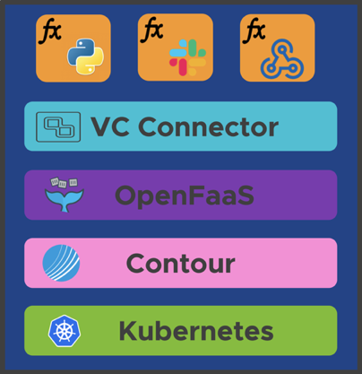

# Architecture

The vCenter Event Broker Appliance follows a highly modular approach, using Kubernetes and containers as an abstraction layer between the base operating system ([Photon OS](https://github.com/vmware/photon)) and the required application services. Currently the following components are used in the appliance:

- Photon OS ([Github](https://github.com/vmware/photon))
- Kubernetes ([Github](https://github.com/kubernetes/kubernetes))
- Contour ([Github](https://github.com/projectcontour/contour))
- OpenFaaS ([Website](https://www.openfaas.com/))
- vCenter Connector ([Github](https://github.com/openfaas-incubator/vcenter-connector/))

In the following sections we describe the individual components.

> **Note:** Encompassing details are also provided in the [FAQ](FAQ.md).

### Photon OS

Photon OS&trade; is an open source Linux container host optimized for cloud-native applications, cloud platforms, and VMware infrastructure. Photon OS provides a **secure run-time environment for efficiently running containers** and out of the box support for Kubernetes.

Photon OS is the foundation for many appliances built for the vSphere platform and its ecosystem and thus the first choice for building the vCenter Event Broker Appliance.

### Kubernetes

Kubernetes is an open source system for managing containerized applications across multiple hosts. It provides basic mechanisms for deployment, maintenance, and scaling of applications.

For application and appliance developers Kubernetes provides **powerful platform capabilities**, such as application (container) self-healing, secrets and configuration management, resource management, extensibility, etc. Kubernetes lays the foundation for future improvements of the vCenter Event Broker Appliance with regards to **high availability (n+1) and scalability (horizontal scale out)**.

### Contour

Contour is an Ingress controller for Kubernetes that works by deploying the Envoy proxy as a reverse proxy and load balancer. Contour supports dynamic configuration updates out of the box while maintaining a lightweight profile.

In the vCenter Event Broker Appliance Contour provides **TLS termination for the various HTTP(S) endpoints** served.

### OpenFaaS

OpenFaaS&reg; makes it easy for developers to deploy event-driven functions and microservices to Kubernetes without repetitive, boiler-plate coding. Package your code or an existing binary in a Docker image to get a highly scalable endpoint with auto-scaling and metrics.

In the vCenter Event Broker Appliance OpenFaaS powers the **function creation, deployment, and workflows to trigger functions based on vSphere events**. The OpenFaaS user interface provides an easy to use dashboard to deploy and monitor functions. Functions can be authored and also deployed via an easy to use [CLI](https://github.com/openfaas/faas-cli).

### vCenter Connector

vcenter-connector is an OpenFaaS event connector built to consume events from vCenter. It leverages the [OpenFaaS Connector SDK](https://github.com/openfaas-incubator/connector-sdk) to **bind and forward vSphere events to OpenFaaS functions**.