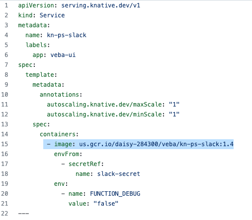
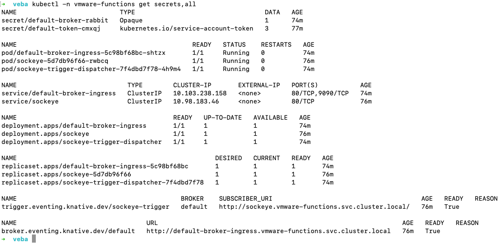
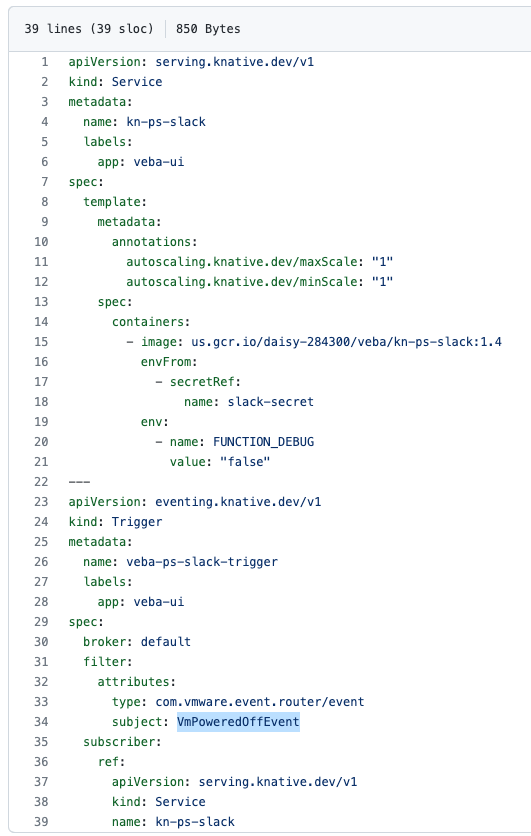
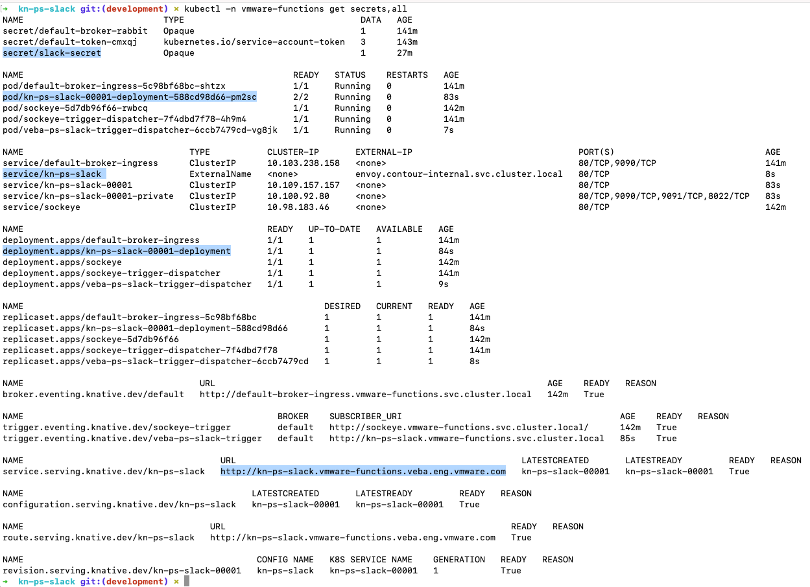
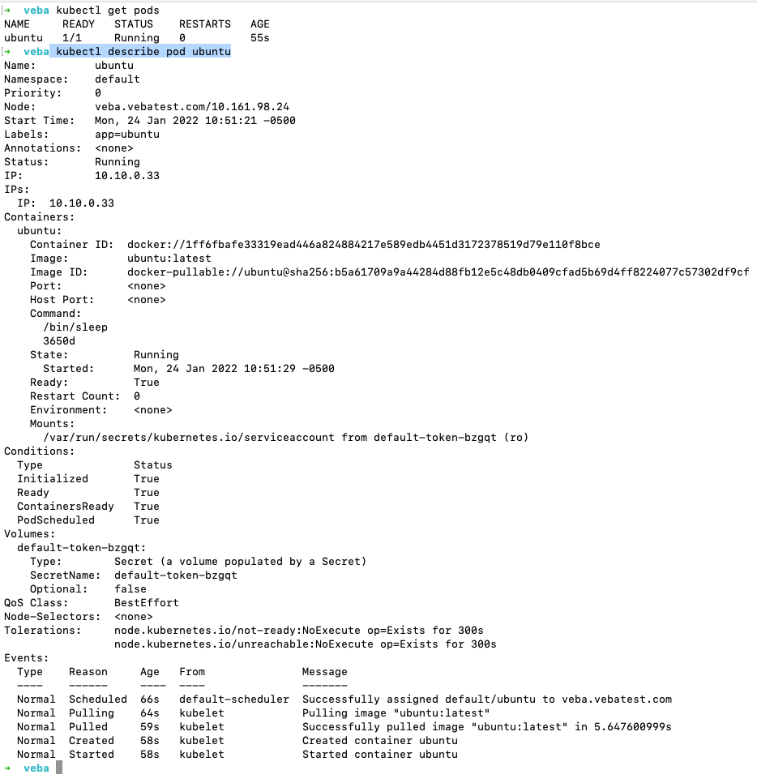
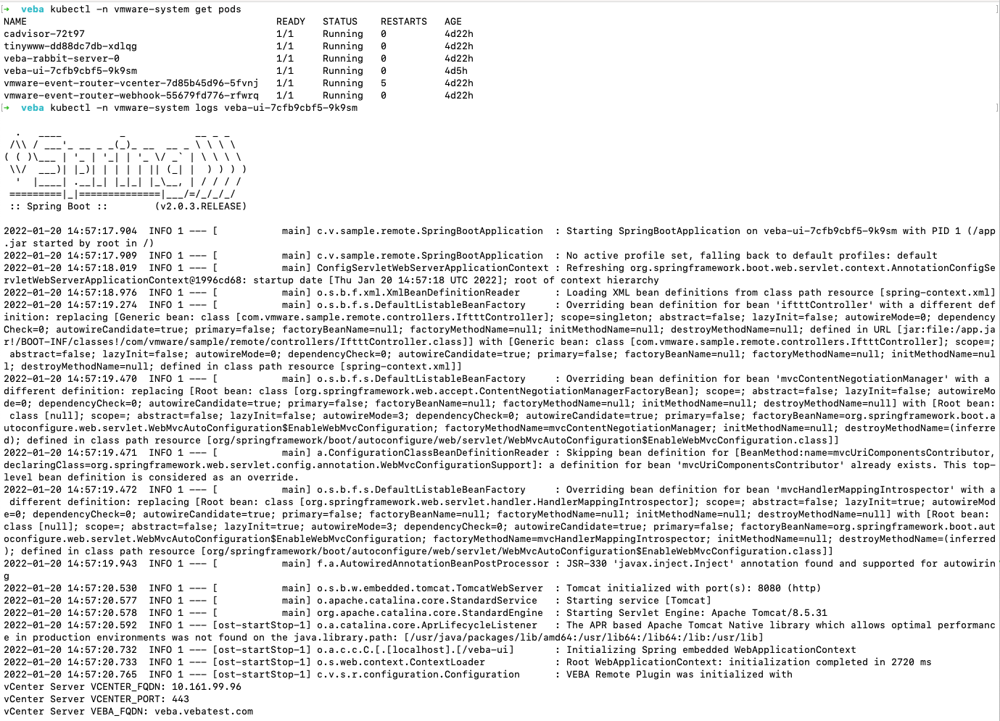
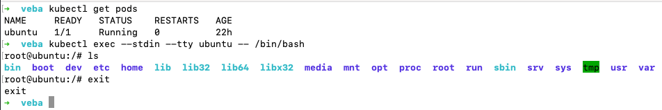
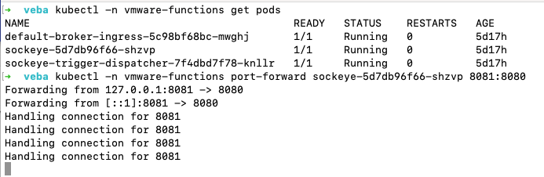
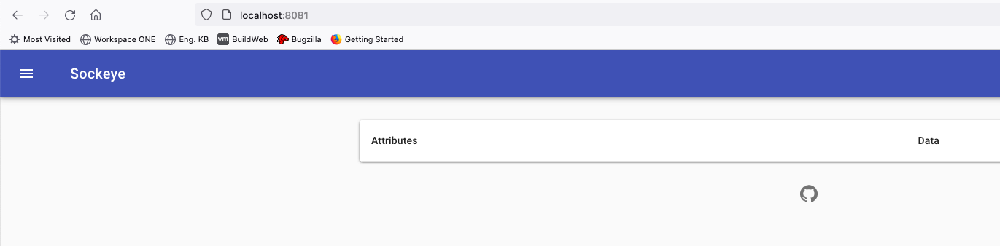

# In-depth function tutorial - Deploy a Function to the VEBA Appliance

This part of the tutorial will go over:
- Pushing the [kn-ps-slack](https://github.com/vmware-samples/vcenter-event-broker-appliance/tree/master/examples/knative/powershell/kn-ps-slack) Docker container to the DockerHub registry.  For this example, we will use the modification we developed in the previous example and will restrict sending a Slack webhook when a Virtual Machine is powered off AND the VM Name starts with "prod".
- Create a Kubernetes secret that contains the sensitive Slack webhook address.
- Deploy the [kn-ps-slack](https://github.com/vmware-samples/vcenter-event-broker-appliance/tree/master/examples/knative/powershell/kn-ps-slack) function to the Kubernetes cluster on the VEBA appliance.
- Verify function operation.

## Table of Contents
- [Push the Docker container to the DockerHub registry](#push-the-docker-container-to-the-dockerhub-registry)
- [Introduction to the Kubernetes vmware-functions namespace](#introduction-to-the=kubernetes-vmware-functions-namespace)
- [Deploy kn-ps-slack Function to the VEBA Appliance](#deploy-kn-ps-slack-function-to-the-veba-appliance)

## Push the Docker container to the DockerHub registry
Since we made a change to the code in the handler.ps1 file that we'd like to use, we will need to push our new Docker container to the DockerHub registry.  This will then make it available to be pulled down into VEBA's Kubernetes cluster.  The location of the container to use is referenced in the function.yaml file:



You can see that the default container referenced is: "us.gcr.io/daisy-284300/veba/kn-ps-slack:1.4".  We will replace this with our own container address.

First, open a command prompt/terminal and push the docker image (replace docker-username):

```
docker push <docker-username>/kn-ps-slack:1.1
```

Once the push is complete, log into dockerhub and you will be able to see your container image in the registry:


Note the container image name and also the available TAG.  If your company uses a private registry such as [VMware Harbor Registry](https://docs.pivotal.io/vmware-harbor/index.html), the process of pushing your custom docker image to it will be similar to the example here but may include authentication and a reference to the address of the private registry.  When referencing the image in the function.yaml, the address of the container image will take the form of:
```
docker.io/<docker username>/<container image name>:<TAG>
```

"docker.io" references the DockerHub registry which is the default registry used by the Docker application and so can also be left off the address.  If you use an alternate registry, you will need to use the full address of the registry.  You may also use the following format that leaves off the default registry address (either format will work):
```
<docker username>/<container image name>:<TAG>
```


## Introduction to the Kubernetes vmware-functions namespace
With the Docker image pushed to the registry, we are now ready to deploy the function to the VEBA appliance.  Remember, you will need to copy the Kubernetes config file to your workstation and export the KUBECONFIG environment variable so that the kubectl command can access the Kubernetes cluster on the VEBA appliance.  We will use kubectl to deploy the function.  Below is a reminder of the steps we used to copy and use the VEBA appliance config file.  Getting the Kubernetes config file was covered in the intro [Function Tutorial - Function Intro](function-tutorial-intro).  If you have opened a new terminal window, you may need to export KUBECONFIG once more for the current session.

```
export KUBECONFIG=$HOME/veba/config   #Linux
```
or for Windows:
```
Env:KUBECONFIG="$HOME\veba\config"    #Windows
```


Kubernetes namespaces are resource boundaries within the cluster.  Function related resources in the VEBA appliance are segregated into the "vmware-functions" namespace.  Use kubectl to list out the resources in the vmware-functions namespace:

```
kubectl -n vmware-functions get secrets,all
```


**A note about kubectl:**  kubectl get "all" does not return "all" resources - only a partial list.  In the above command, secrets are not returned by "all" and so the "secrets" qualifier needs to be added to the command.  The "-n" flag allows specification of the namespace to target.  Without a "-n" flag, the "default" namepace is targeted.

As you can see from the above image, there are some default deployments (default-broker-ingress, sockeye...) but no custom functions yet.  Sockeye displays incoming events and is helpful in troubleshooting.  Sockeye can be accessed by opening a browser to: https://veba-fqdn/events


## Deploy kn-ps-slack Function to the VEBA Appliance
1.  Move to the /vcenter-event-broker-appliance/examples/knative/powershell/kn-ps-slack directory that you cloned earlier with git.  

2.  Update the slack_secret.json file with your Slack webhook URL.

3.  Create the Kubernetes secret which can then be accessed from within the function by using the environment variable named SLACK_SECRET.

```
# create secret
kubectl -n vmware-functions create secret generic slack-secret --from-file=SLACK_SECRET=slack_secret.json

# update label for secret to show up in VEBA UI
kubectl -n vmware-functions label secret slack-secret app=veba-ui
```

4.  Edit the function.yaml file with the name of the custom container image you pushed to DockerHub. For the example listed above, we would use:

```
spec:
  containers:
    - image: docker.io/atauber/kn-ps-slack:1.1
```

By default, the function deployment will filter on the VmPoweredOffEvent vCenter server event. If you wish to change this event type, update the subject field within function.yaml to the desired event type.  The function.yaml file is shown below.  vCenter server events are described here: [vCenter Events](https://vmweventbroker.io/kb/vcenter-events).




5.  Deploy the function to the VEBA Appliance.

```
# deploy function
kubectl -n vmware-functions apply -f function.yaml
```

Now with the new function deployed, we should see these resources in the vmware-functions namespace:




If we then create a VM named "prod-testvm" and power on / power off, we should have success!


You will also be able to see the alert in Sockeye by searching for the VmPoweredOffEvent:


## Kubernetes Troubleshooting commands
When things don't work as expected, it is usefull to know how to troubleshoot a system.  Help in troubleshooting the VEBA appliance and functions can be found here:
- [Troubleshoot Appliance](troubleshoot-appliance)
- [Troubleshoot Functions](troubleshoot-functions)

We have used kubectl get and apply in the above examples.  The following are some of the more common kubectl commands used in troubleshooting.  For the describe and exec commands, we will use an ubuntu pod as our test case. Use the following command to deploy the ubuntu pod:

```
cat <<EOF | kubectl apply -f -
apiVersion: v1
kind: Pod
metadata:
  name: ubuntu
  labels:
    app: ubuntu
spec:
  containers:
  - name: ubuntu
    image: ubuntu:latest
    command: ["/bin/sleep", "3650d"]
    imagePullPolicy: IfNotPresent
  restartPolicy: Always
EOF
```

Note that the above command will create an ubuntu pod in the "default" namespace of your Kubernetes cluster.  For objects in the default namespace, the "-n" flag is not needed to designate the namespace.  Kubectl defaults to the "default" namespace.

### describe ###
The "kubectl describe" command is very useful and shows details about Kubernetes objects like pods.

```
kubectl get pods
kubectl describe pod ubuntu
```



There is some interesting info here:
- The node (in our case, the VEBA VM) and IP where the pod is running
- The internal IP address of the pod
- Details about the container image that is running
- Events: the events are very useful to diagnose issues related to container images not being "pulled" or downloaded successfully.  This is the first place to look if the pod doesn't have a "Running" status.

### logs ###
The "kubectl logs" command dumps the logs from a pod and is very useful in diagnosing container application issues.  What you will see in the logs is analogous to the output on a linux machine's console.  The example below dumps the logs for the veba-ui pod.  If the pod you are issuing the logs command against has more than one container, you will need to add a container name to the end of the command (you will be prompted for this).

```
kubectl get pods
kubectl -n vmware-system logs <pod name>
```



### exec ###
The "kubectl exec" command allows you to get a shell inside a running container.  This is especially helpful to determine if secrets are mounted successfully or to determine network name resolution issues.  We will shell into the running ubuntu pod for this example.

**Helpful Tip:**  In most cases, the container OS will be very purpose built and streamlined - lacking in tools you might need for diagnosing an issue.  In such a case, you can still use a package manager to add the needed tool to the container OS.  For example, in our ubuntu pod below, we could use "apt install dnsutils" if we wanted to use the utility "nslookup".  Just remember to "clean up" the pod by deleting it and reinstalling it to return it to it's default state afterwards.

```
kubectl get pods
kubectl exec --stdin --tty ubuntu -- /bin/bash
```


### port-forward ####
The "kubectl port-forward" command will forward ports from pods or services to your local workstation.  This is very helpful when your Kubernetes cluster does not have ingress setup for a specific application and you want to see if a specific port is "live" and working.  For our example, we will port-forward the sockeye application pod in the vmware-functions namespace.  Sockeye is a web application that displays events in the VEBA appliance.  Sockeye IS enabled in ingress and ususally you can access it by pointing your web browser to "https://veba-fqdn/events".

```
kubectl -n vmware-functions get pods
kubectl -n vmware-functions port-forward <sockeye pod name> 8081:8080
```



In the above example, the port-forwad command is directing the 8080 port from the sockeye-5d7db96f66-shzvp pod to the 8081 port on the local workstation we are running kubectl on.  You can find what port a pod is exposing (if any) by using "kubectl describe" on the pod or corresponding service.  If we open a browser on our workstation to: localhost:8081, we should see the following:


