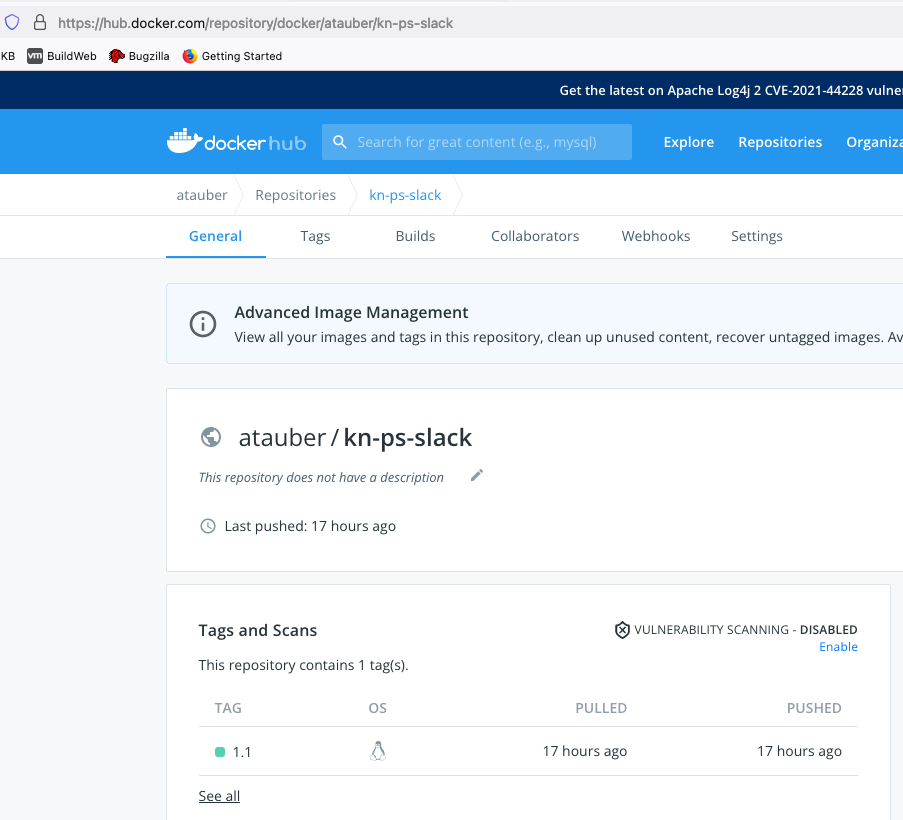
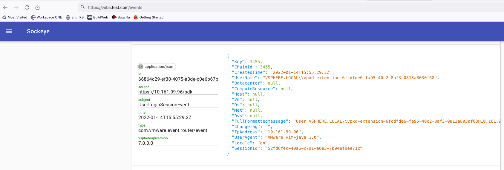
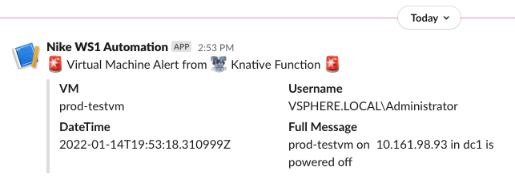
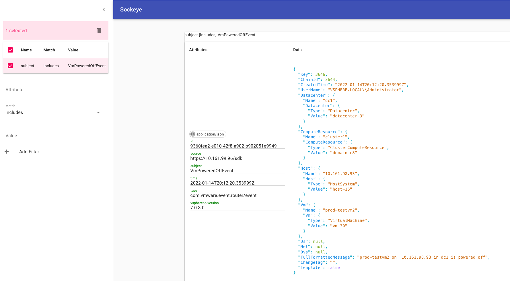

# In-depth function tutorial - Deploy a Function to the VEBA Appliance

This part of the tutorial will go over:
- Pushing the [kn-ps-slack](https://github.com/vmware-samples/vcenter-event-broker-appliance/tree/master/examples/knative/powershell/kn-ps-slack) Docker container to the DockerHub registry.  For this example, we will use the modification we developed in the previous example and will restrict sending a Slack webhook when a Virtual Machine is powered off AND the VM Name starts with "prod".
- Create a Kubernetes secret that contains the sensitive Slack webhook address.
- Deploy the [kn-ps-slack](https://github.com/vmware-samples/vcenter-event-broker-appliance/tree/master/examples/knative/powershell/kn-ps-slack) function to the Kubernetes cluster on the VEBA appliance.
- Verify function operation.
- Kubernetes troubleshooting commands

## Table of Contents
- [Push the Docker container to the DockerHub registry](#push-the-docker-container-to-the-dockerhub-registry)
- [Introduction to the Kubernetes vmware-functions namespace](#introduction-to-the=kubernetes-vmware-functions-namespace)
- [Deploy kn-ps-slack Function to the VEBA Appliance](#deploy-kn-ps-slack-function-to-the-veba-appliance)
- [Kubernetes Troubleshooting commands](#kubernetes-troubleshooting-commands)

## Push the Docker container to the DockerHub registry
Since we made a change to the code in the `handler.ps1` file that we'd like to use, we will need to push our new Docker container to the DockerHub registry.  This will then make it available to be pulled down into VEBA's Kubernetes cluster.  The location of the container to use is referenced in the `function.yaml` file:


```yaml
apiVersion: serving.knative.dev/v1
kind: Service
metadata:
  name: kn-ps-slack
  labels:
    app: veba-ui
spec:
  template:
    metadata:
      annotations:
        autoscaling.knative.dev/maxScale: "1"
        autoscaling.knative.dev/minScale: "1"
    spec:
      containers:
        - image: us.gcr.io/daisy-284300/veba/kn-ps-slack:1.4
          envFrom:
            - secretRef:
                name: slack-secret
          env:
            - name: FUNCTION_DEBUG
              value: "false"
<snip>
```

You can see that the default container referenced is: `us.gcr.io/daisy-284300/veba/kn-ps-slack:1.4`.  We will replace this with our own container registry address.

First, open a command prompt/terminal and push the Docker image (replace docker-username with your Docker username):

```
docker push <docker-username>/kn-ps-slack:1.1
```

Once the push is complete, log into DockerHub and you will be able to see your container image in the registry:



Note the container image name and the assigned tag.  If your company uses a private registry such as [VMware Harbor Registry](https://docs.pivotal.io/vmware-harbor/index.html), the process of pushing your custom Docker image to it will be similar to the example here but may include authentication and a reference to the address of the private registry.  When referencing the image in the `function.yaml`, the address of the container image will take the form of:
```
docker.io/<docker username>/<container image name>:<TAG>
```

`docker.io` references the DockerHub registry which is the default registry used by the Docker application and so can also be left off the address.  If you use an alternate registry, you will need to use the full address of the registry.  You may also use the following format that leaves off the default registry address (either format will work):
```
<docker username>/<container image name>:<TAG>
```


## Introduction to the Kubernetes vmware-functions namespace
With the Docker image pushed to the registry, we are now ready to deploy the function to the VEBA appliance.  Remember, you will need to copy the Kubernetes config file to your workstation and export the `KUBECONFIG` environment variable so that the `kubectl` command can access the Kubernetes cluster on the VEBA appliance.  We will use `kubectl` to deploy the function.  Below is a reminder of the steps we used to copy and use the VEBA appliance config file.  Getting the Kubernetes config file was covered in the intro [Function Tutorial - Function Intro](function-tutorial-intro).  If you have opened a new terminal window, you may need to set the `KUBECONFIG` environment variable once more for the current session.

**Hint:** KUBECONFIG export for macOS:

```
export KUBECONFIG=$HOME/veba/config
```

**Hint:** KUBECONFIG export for Windows:

```
Env:KUBECONFIG="$HOME\veba\config"
```


Kubernetes namespaces are resource boundaries within the cluster.  Function related resources in the VEBA appliance are segregated into the "vmware-functions" namespace.  Use `kubectl` to list out the resources in the vmware-functions namespace:

```
kubectl -n vmware-functions get secrets,all
```

Here is the command output:

```
kubectl -n vmware-functions get secrets,all

NAME                           TYPE                                  DATA   AGE
secret/default-broker-rabbit   Opaque                                1      14d
secret/default-token-77dnr     kubernetes.io/service-account-token   3      14d

NAME                                              READY   STATUS    RESTARTS   AGE
pod/default-broker-ingress-5c98bf68bc-mwghj       1/1     Running   0          14d
pod/sockeye-5d7db96f66-shzvp                      1/1     Running   0          14d
pod/sockeye-trigger-dispatcher-7f4dbd7f78-knllr   1/1     Running   0          14d

NAME                             TYPE        CLUSTER-IP      EXTERNAL-IP   PORT(S)           AGE
service/default-broker-ingress   ClusterIP   10.97.111.83    <none>        80/TCP,9090/TCP   14d
service/sockeye                  ClusterIP   10.103.143.20   <none>        80/TCP            14d

NAME                                         READY   UP-TO-DATE   AVAILABLE   AGE
deployment.apps/default-broker-ingress       1/1     1            1           14d
deployment.apps/sockeye                      1/1     1            1           14d
deployment.apps/sockeye-trigger-dispatcher   1/1     1            1           14d

NAME                                                    DESIRED   CURRENT   READY   AGE
replicaset.apps/default-broker-ingress-5c98bf68bc       1         1         1       14d
replicaset.apps/sockeye-5d7db96f66                      1         1         1       14d
replicaset.apps/sockeye-trigger-dispatcher-7f4dbd7f78   1         1         1       14d

NAME                                  URL                                                                AGE   READY   REASON
broker.eventing.knative.dev/default   http://default-broker-ingress.vmware-functions.svc.cluster.local   14d   True    

NAME                                           BROKER    SUBSCRIBER_URI                                       AGE   READY   REASON
trigger.eventing.knative.dev/sockeye-trigger   default   http://sockeye.vmware-functions.svc.cluster.local/   14d   True    
```

**A note about kubectl:**  `kubectl get all` does not return "all" resources - only a partial list.  In the above command, secrets are not returned by "all" and so the "secrets" qualifier needs to be added to the command.  The "-n" flag allows specification of the namespace to target.  Without a "-n" flag, the "default" namespace is targeted.

As you can see from the above image, there are some default deployments (default-broker-ingress, sockeye...) but no custom functions yet.  Sockeye displays incoming events and is helpful in troubleshooting.  Sockeye can be accessed by opening a browser to: "https://veba-fqdn/events" (replace veba-fqdn with the VEBA appliance's FQDN) as shown below:




## Deploy kn-ps-slack Function to the VEBA Appliance
1.  Move to the `/vcenter-event-broker-appliance/examples/knative/powershell/kn-ps-slack` directory that you cloned earlier with `git`.  

2.  Update the `slack_secret.json` file with your Slack webhook URL.

3.  Create the Kubernetes secret which can then be accessed from within the function by using the environment variable named `SLACK_SECRET`.

```
# create secret
kubectl -n vmware-functions create secret generic slack-secret --from-file=SLACK_SECRET=slack_secret.json

# update label for secret to show up in VEBA UI
kubectl -n vmware-functions label secret slack-secret app=veba-ui
```

Edit the `function.yaml` file with the name of the custom container image you pushed to DockerHub. For the example listed above, we would use:

```
spec:
  containers:
    - image: docker.io/atauber/kn-ps-slack:1.1
```

By default, the function deployment will filter on the `VmPoweredOffEvent` vCenter server event. If you wish to change this event type, update the subject field within `function.yaml` to the desired event type.  The `function.yaml` file is shown below.  vCenter server events are described here: [vCenter Events](https://vmweventbroker.io/kb/vcenter-events).

```yaml
apiVersion: serving.knative.dev/v1
kind: Service
metadata:
  name: kn-ps-slack
  labels:
    app: veba-ui
spec:
  template:
    metadata:
      annotations:
        autoscaling.knative.dev/maxScale: "1"
        autoscaling.knative.dev/minScale: "1"
    spec:
      containers:
        - image: docker.io/atauber/kn-ps-slack:1.1
          envFrom:
            - secretRef:
                name: slack-secret
          env:
            - name: FUNCTION_DEBUG
              value: "false"
---
apiVersion: eventing.knative.dev/v1
kind: Trigger
metadata:
  name: veba-ps-slack-trigger
  labels:
    app: veba-ui
spec:
  broker: default
  filter:
    attributes:
      type: com.vmware.event.router/event
      subject: VmPoweredOffEvent
  subscriber:
    ref:
      apiVersion: serving.knative.dev/v1
      kind: Service
      name: kn-ps-slack
```

Deploy the function to the VEBA Appliance:

```
# deploy function
kubectl -n vmware-functions apply -f function.yaml
```

Now with the new function deployed, we should see these resources in the vmware-functions namespace:

```
kubectl -n vmware-functions get secret,all

NAME                           TYPE                                  DATA   AGE
secret/default-broker-rabbit   Opaque                                1      14d
secret/default-token-77dnr     kubernetes.io/service-account-token   3      14d
secret/slack-secret            Opaque                                1      2m7s

NAME                                                    READY   STATUS    RESTARTS   AGE
pod/default-broker-ingress-5c98bf68bc-mwghj             1/1     Running   0          14d
pod/kn-ps-slack-00001-deployment-6585d95fff-vl85t       2/2     Running   0          88s
pod/sockeye-5d7db96f66-shzvp                            1/1     Running   0          14d
pod/sockeye-trigger-dispatcher-7f4dbd7f78-knllr         1/1     Running   0          14d
pod/veba-ps-slack-trigger-dispatcher-6ccb7479cd-kkdtk   1/1     Running   0          13s

NAME                                TYPE           CLUSTER-IP      EXTERNAL-IP                                PORT(S)                             AGE
service/default-broker-ingress      ClusterIP      10.97.111.83    <none>                                     80/TCP,9090/TCP                     14d
service/kn-ps-slack                 ExternalName   <none>          envoy.contour-internal.svc.cluster.local   80/TCP                              13s
service/kn-ps-slack-00001           ClusterIP      10.109.162.56   <none>                                     80/TCP                              88s
service/kn-ps-slack-00001-private   ClusterIP      10.105.5.242    <none>                                     80/TCP,9090/TCP,9091/TCP,8022/TCP   88s
service/sockeye                     ClusterIP      10.103.143.20   <none>                                     80/TCP                              14d

NAME                                               READY   UP-TO-DATE   AVAILABLE   AGE
deployment.apps/default-broker-ingress             1/1     1            1           14d
deployment.apps/kn-ps-slack-00001-deployment       1/1     1            1           89s
deployment.apps/sockeye                            1/1     1            1           14d
deployment.apps/sockeye-trigger-dispatcher         1/1     1            1           14d
deployment.apps/veba-ps-slack-trigger-dispatcher   1/1     1            1           14s

NAME                                                          DESIRED   CURRENT   READY   AGE
replicaset.apps/default-broker-ingress-5c98bf68bc             1         1         1       14d
replicaset.apps/kn-ps-slack-00001-deployment-6585d95fff       1         1         1       89s
replicaset.apps/sockeye-5d7db96f66                            1         1         1       14d
replicaset.apps/sockeye-trigger-dispatcher-7f4dbd7f78         1         1         1       14d
replicaset.apps/veba-ps-slack-trigger-dispatcher-6ccb7479cd   1         1         1       14s

NAME                                  URL                                                                AGE   READY   REASON
broker.eventing.knative.dev/default   http://default-broker-ingress.vmware-functions.svc.cluster.local   14d   True    

NAME                                                 BROKER    SUBSCRIBER_URI                                          AGE   READY   REASON
trigger.eventing.knative.dev/sockeye-trigger         default   http://sockeye.vmware-functions.svc.cluster.local/      14d   True    
trigger.eventing.knative.dev/veba-ps-slack-trigger   default   http://kn-ps-slack.vmware-functions.svc.cluster.local   97s   True    

NAME                                            LATESTCREATED       LATESTREADY         READY   REASON
configuration.serving.knative.dev/kn-ps-slack   kn-ps-slack-00001   kn-ps-slack-00001   True    

NAME                                    URL                                                     READY   REASON
route.serving.knative.dev/kn-ps-slack   http://kn-ps-slack.vmware-functions.veba.vebatest.com   True    

NAME                                             CONFIG NAME   K8S SERVICE NAME    GENERATION   READY   REASON
revision.serving.knative.dev/kn-ps-slack-00001   kn-ps-slack   kn-ps-slack-00001   1            True    

NAME                                      URL                                                     LATESTCREATED       LATESTREADY         READY   REASON
service.serving.knative.dev/kn-ps-slack   http://kn-ps-slack.vmware-functions.veba.vebatest.com   kn-ps-slack-00001   kn-ps-slack-00001   True    

```


If we then create a VM named "prod-testvm" and power it off, we should have success!




You will also be able to see the alert in Sockeye by searching for the `VmPoweredOffEvent`:




## Kubernetes Troubleshooting commands
When things don't work as expected, it is useful to know how to troubleshoot a system.  Help in troubleshooting the VEBA appliance and functions can be found here:
- [Troubleshoot Appliance](troubleshoot-appliance)
- [Troubleshoot Functions](troubleshoot-functions)

We have used `kubectl get` and `kubectl apply` in the above examples.  The following are some of the more common `kubectl` commands used in troubleshooting.  


### describe ###
The `kubectl describe` command is very useful and shows details about Kubernetes objects like pods.  Remember, we need to explicitly set the namespace if not "default".

```
kubectl -n vmware-functions get pods
kubectl -n vmware-functions describe pod <pod name>
```

The output will look something like this:

```yml
kubectl -n vmware-functions get pods

NAME                                                READY   STATUS    RESTARTS   AGE
default-broker-ingress-5c98bf68bc-mwghj             1/1     Running   0          14d
kn-ps-slack-00001-deployment-6585d95fff-vl85t       2/2     Running   0          18m
sockeye-5d7db96f66-shzvp                            1/1     Running   0          14d
sockeye-trigger-dispatcher-7f4dbd7f78-knllr         1/1     Running   0          14d
veba-ps-slack-trigger-dispatcher-6ccb7479cd-kkdtk   1/1     Running   0          16m

kubectl -n vmware-functions describe pod kn-ps-slack-00001-deployment-6585d95fff-vl85t

Name:         kn-ps-slack-00001-deployment-6585d95fff-vl85t
Namespace:    vmware-functions
Priority:     0
Node:         veba.vebatest.com/10.161.98.24
Start Time:   Thu, 03 Feb 2022 15:33:27 -0500
Labels:       app=kn-ps-slack-00001
              pod-template-hash=6585d95fff
              serving.knative.dev/configuration=kn-ps-slack
              serving.knative.dev/configurationGeneration=1
              serving.knative.dev/revision=kn-ps-slack-00001
              serving.knative.dev/revisionUID=f0aef14d-8093-44be-ac24-68554bf7390a
              serving.knative.dev/service=kn-ps-slack
Annotations:  autoscaling.knative.dev/maxScale: 1
              autoscaling.knative.dev/minScale: 1
              serving.knative.dev/creator: kubernetes-admin
Status:       Running
IP:           10.10.0.35
IPs:
  IP:           10.10.0.35
Controlled By:  ReplicaSet/kn-ps-slack-00001-deployment-6585d95fff
Containers:
  user-container:
    Container ID:   docker://1a5bda93dffadcfa7ea93d0dd7686ac3046d8271367cb9a585ce5ba67942cf98
    Image:          harbor-repo.vmware.com/dockerhub-proxy-cache/atauber/kn-ps-slack@sha256:1c51c475c382744de769f87b769dc4a386c96928670c564908959745bf237ad5
    Image ID:       docker-pullable://harbor-repo.vmware.com/dockerhub-proxy-cache/atauber/kn-ps-slack@sha256:1c51c475c382744de769f87b769dc4a386c96928670c564908959745bf237ad5
    Port:           8080/TCP
    Host Port:      0/TCP
    State:          Running
      Started:      Thu, 03 Feb 2022 15:34:31 -0500
    Ready:          True
    Restart Count:  0
    Environment Variables from:
      slack-secret  Secret  Optional: false
    Environment:
      FUNCTION_DEBUG:   false
      PORT:             8080
      K_REVISION:       kn-ps-slack-00001
      K_CONFIGURATION:  kn-ps-slack
      K_SERVICE:        kn-ps-slack
    Mounts:
      /var/run/secrets/kubernetes.io/serviceaccount from default-token-77dnr (ro)

<snip>

Conditions:
  Type              Status
  Initialized       True
  Ready             True
  ContainersReady   True
  PodScheduled      True
Volumes:
  default-token-77dnr:
    Type:        Secret (a volume populated by a Secret)
    SecretName:  default-token-77dnr
    Optional:    false
QoS Class:       Burstable
Node-Selectors:  <none>
Tolerations:     node.kubernetes.io/not-ready:NoExecute op=Exists for 300s
                 node.kubernetes.io/unreachable:NoExecute op=Exists for 300s
Events:
  Type    Reason     Age   From               Message
  ----    ------     ----  ----               -------
  Normal  Scheduled  18m   default-scheduler  Successfully assigned vmware-functions/kn-ps-slack-00001-deployment-6585d95fff-vl85t to veba.vebatest.com
  Normal  Pulling    18m   kubelet            Pulling image "harbor-repo.vmware.com/dockerhub-proxy-cache/atauber/kn-ps-slack@sha256:1c51c475c382744de769f87b769dc4a386c96928670c564908959745bf237ad5"
  Normal  Pulled     17m   kubelet            Successfully pulled image "harbor-repo.vmware.com/dockerhub-proxy-cache/atauber/kn-ps-slack@sha256:1c51c475c382744de769f87b769dc4a386c96928670c564908959745bf237ad5" in 1m1.20243842s
  Normal  Created    17m   kubelet            Created container user-container
  Normal  Started    17m   kubelet            Started container user-container
  Normal  Pulling    17m   kubelet            Pulling image "gcr.io/knative-releases/knative.dev/serving/cmd/queue@sha256:9ec8ba5c982a0a7f6dfab384365082655083413c14bdb50b01a51b730284ae32"
  Normal  Pulled     17m   kubelet            Successfully pulled image "gcr.io/knative-releases/knative.dev/serving/cmd/queue@sha256:9ec8ba5c982a0a7f6dfab384365082655083413c14bdb50b01a51b730284ae32" in 2.674026273s
  Normal  Created    17m   kubelet            Created container queue-proxy
  Normal  Started    17m   kubelet            Started container queue-proxy
```

There is some interesting info here:
- The node (in our case, the VEBA VM) and IP where the pod is running
- The internal IP address of the pod
- Details about the container image that is running
- Events: the events are very useful to diagnose issues related to container images not being "pulled" or downloaded successfully.  This is the first place to look if the pod doesn't have a "Running" status.


### logs ###
The `kubectl logs` command dumps the logs from a pod and is very useful in diagnosing container application issues.  What you will see in the logs is analogous to the output on a linux machine's console.  The example below dumps the logs for the `veba-ui` pod.  If the pod you are issuing the logs command against has more than one container, you will need to add a container name to the end of the command (you will be prompted for this).

```
kubectl -n vmware-system get pods
kubectl -n vmware-system logs <pod name>
```

Output will be similar to this:

```
kubectl -n vmware-system get pods

NAME                                           READY   STATUS    RESTARTS   AGE
cadvisor-72t97                                 1/1     Running   0          14d
tinywww-dd88dc7db-xdlqg                        1/1     Running   0          14d
veba-rabbit-server-0                           1/1     Running   0          14d
veba-ui-7cfb9cbf5-9k9sm                        1/1     Running   0          14d
vmware-event-router-vcenter-7d85b45d96-5fvnj   1/1     Running   5          14d
vmware-event-router-webhook-55679fd776-rfwrq   1/1     Running   0          14d

kubectl -n vmware-system logs veba-ui-7cfb9cbf5-9k9sm

  .   ____          _            __ _ _
 /\\ / ___'_ __ _ _(_)_ __  __ _ \ \ \ \
( ( )\___ | '_ | '_| | '_ \/ _` | \ \ \ \
 \\/  ___)| |_)| | | | | || (_| |  ) ) ) )
  '  |____| .__|_| |_|_| |_\__, | / / / /
 =========|_|==============|___/=/_/_/_/
 :: Spring Boot ::        (v2.0.3.RELEASE)

2022-01-20 14:57:17.904  INFO 1 --- [           main] c.v.sample.remote.SpringBootApplication  : Starting SpringBootApplication on veba-ui-7cfb9cbf5-9k9sm with PID 1 (/app.jar started by root in /)
2022-01-20 14:57:17.909  INFO 1 --- [           main] c.v.sample.remote.SpringBootApplication  : No active profile set, falling back to default profiles: default
2022-01-20 14:57:18.019  INFO 1 --- [           main] ConfigServletWebServerApplicationContext : Refreshing org.springframework.boot.web.servlet.context.AnnotationConfigServletWebServerApplicationContext@1996cd68: startup date [Thu Jan 20 14:57:18 UTC 2022]; root of context hierarchy
2022-01-20 14:57:18.976  INFO 1 --- [           main] o.s.b.f.xml.XmlBeanDefinitionReader      : Loading XML bean definitions from class path resource [spring-context.xml]
2022-01-20 14:57:19.274  INFO 1 --- [           main] o.s.b.f.s.DefaultListableBeanFactory     : Overriding bean definition for bean 'iftttController' with a different definition: replacing [Generic bean: class [com.vmware.sample.remote.controllers.IftttController]; scope=singleton; abstract=false; lazyInit=false; autowireMode=0; dependencyCheck=0; autowireCandidate=true; primary=false; factoryBeanName=null; factoryMethodName=null; initMethodName=null; destroyMethodName=null; defined in URL [jar:file:/app.jar!/BOOT-INF/classes!/com/vmware/sample/remote/controllers/IftttController.class]] with [Generic bean: class [com.vmware.sample.remote.controllers.IftttController]; scope=; abstract=false; lazyInit=false; autowireMode=0; dependencyCheck=0; autowireCandidate=true; primary=false; factoryBeanName=null; factoryMethodName=null; initMethodName=null; destroyMethodName=null; defined in class path resource [spring-context.xml]]
2
<snip>
```

### exec ###
The `kubectl exec` command allows you to get a shell inside a running container.  This is especially helpful to determine if secrets are mounted successfully or to determine network name resolution issues.  We will shell into the running `veba-ui` pod for this example.

**Helpful Tip:**  In most cases, the container OS will be very purpose built and streamlined - lacking in tools you might need for diagnosing an issue.  In such a case, you can still use a package manager to add the needed tool to the container OS.  For example, in an Ubuntu based pod, we could use "apt install dnsutils" if we wanted to use the utility `nslookup`.  Just remember to "clean up" the pod by deleting it and reinstalling it to return it to its default state afterwards.

```
kubectl -n vmware-system get pods
kubectl -n vmware-system exec --stdin --tty <pod name> -- /bin/sh
```

Output will be similar to:

```
kubectl -n vmware-system get pods

NAME                                           READY   STATUS    RESTARTS   AGE
cadvisor-72t97                                 1/1     Running   0          14d
tinywww-dd88dc7db-xdlqg                        1/1     Running   0          14d
veba-rabbit-server-0                           1/1     Running   0          14d
veba-ui-7cfb9cbf5-9k9sm                        1/1     Running   0          14d
vmware-event-router-vcenter-7d85b45d96-5fvnj   1/1     Running   5          14d
vmware-event-router-webhook-55679fd776-rfwrq   1/1     Running   0          14d

kubectl -n vmware-system exec --stdin --tty veba-ui-7cfb9cbf5-9k9sm -- /bin/sh

# ls
app.jar  bin  boot  dev  etc  home  lib  lib64	media  mnt  opt  proc  root  run  sbin	srv  sys  tmp  usr  var
# exit
```

### port-forward ####
The `kubectl port-forward` command will forward ports from pods or services to your local workstation.  This is very helpful when your Kubernetes cluster does not have ingress setup for a specific application and you want to see if a specific port is "live" and working.  For our example, we will port-forward the sockeye application pod in the vmware-functions namespace.  Sockeye is a web application that displays events in the VEBA appliance.  Sockeye IS enabled in ingress and usually you can access it by pointing your web browser to "https://veba-fqdn/events".

```
kubectl -n vmware-functions get pods
kubectl -n vmware-functions port-forward <sockeye pod name> 8081:8080
```

Output will be similar to:

```
kubectl -n vmware-functions get pods

NAME                                                READY   STATUS    RESTARTS   AGE
default-broker-ingress-5c98bf68bc-mwghj             1/1     Running   0          14d
kn-ps-slack-00001-deployment-6585d95fff-vl85t       2/2     Running   0          34m
sockeye-5d7db96f66-shzvp                            1/1     Running   0          14d
sockeye-trigger-dispatcher-7f4dbd7f78-knllr         1/1     Running   0          14d
veba-ps-slack-trigger-dispatcher-6ccb7479cd-kkdtk   1/1     Running   0          33m

kubectl -n vmware-functions port-forward sockeye-5d7db96f66-shzvp 8081:8080

Forwarding from 127.0.0.1:8081 -> 8080
Forwarding from [::1]:8081 -> 8080
```

In the above example, the port-forward command is directing the 8080 port from the sockeye-5d7db96f66-shzvp pod to the 8081 port on the local workstation we are running `kubectl` on.  You can find what port a pod is exposing (if any) by using `kubectl describe` on the pod or corresponding service.  If we open a browser on our workstation to: `localhost:8081`, we should see output from the Sockeye application.
