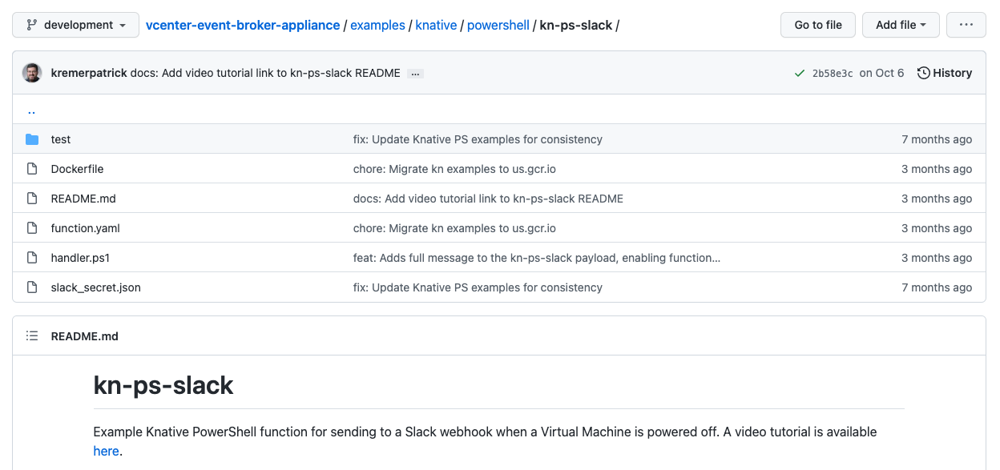

# In-depth Function Tutorial - Intro

This tutorial will go over:
- What is a VEBA function
- The anatomy of a PowerShell function and how to do basic modifications to it.  We will use the [kn-ps-slack](https://github.com/vmware-samples/vcenter-event-broker-appliance/tree/master/examples/knative/powershell/kn-ps-slack) function for our example.
- Setting up the required tools on your workstation: `git`, `docker`, and `kubectl`
- Modify and test a function locally on your workstation
- How to deploy the function to the Kubernetes cluster in your VEBA appliance

## Table of Contents
- [In-depth Function Tutorial - Intro](#in-depth-function-tutorial---intro)
  - [Table of Contents](#table-of-contents)
  - [The big picture](#the-big-picture)
  - [The anatomy of a VEBA function](#the-anatomy-of-a-veba-function)
  - [Installing required tools on your workstation](#installing-required-tools-on-your-workstation)
  - [macOS Instructions](#macos-instructions)
    - [Install `git` and clone the repo to your workstation](#install-git-and-clone-the-repo-to-your-workstation)
    - [Install Docker](#install-docker)
    - [Install and Configure `kubectl`](#install-and-configure-kubectl)
  - [Windows Instructions](#windows-instructions)
    - [Install `git` and clone the repo to your workstation](#install-git-and-clone-the-repo-to-your-workstation-1)
    - [Install Docker](#install-docker-1)
    - [Install and Configure `kubectl`](#install-and-configure-kubectl-1)

## The big picture
VEBA functions provide the "custom" logic to the VEBA appliance to fulfil your business requirements.  Functions are packaged as Docker images.  The functions can be written in PowerShell, Python, Go, or just about any language, and are packaged and distributed as Docker images.  This is because the VEBA appliance runs Kubernetes (on top of the Photon OS) and functions are deployed as containers on the Kubernetes system.  Kubernetes provides an abstraction layer to allow containers to run seamlessly on disparate hardware/OSes.

The VEBA team has provided a library of sample functions for you to get started with: [VEBA Functions](https://github.com/vmware-samples/vcenter-event-broker-appliance/tree/master/examples/knative).  As you can see, they are assembled under the "knative" folder.  Knative is a framework of building blocks for Kubernetes that provides basic services to the VEBA application.  So the first step would be to review the provided functions and determine if there are any functions that match your use case requirements.  If your use case was to send an email message when a specific vCenter event occurred, the function: [kn-ps-email](https://github.com/vmware-samples/vcenter-event-broker-appliance/tree/master/examples/knative/powershell/kn-ps-email) would be a good solution to begin with.  In looking at the function, you can see that it is currently configured to fire/trigger for a VM deletion event.  Don't worry if your use case is a different vCenter event - this is easily modified in the function regardless of if you are adept with PowerShell programming.

**A word about programming languages:** If you find a function that meets your requirements but is written in a language you are not comfortable with, don't worry, you will still be able to deploy that function.  There are two parts to the VEBA functions: the programming logic and the input variables.  Variables contain things like: IP addresses, Event types, authentication parameters, email addresses, or Slack keys.  Variables are easily input and modified without knowledge of the specific programming language.  You will find examples of this later in the tutorial.

## The anatomy of a VEBA function
All VEBA functions have the same relative format regardless of what programming language the functions are written in.  Let's look at the [kn-ps-slack](https://github.com/vmware-samples/vcenter-event-broker-appliance/tree/master/examples/knative/powershell/kn-ps-slack) function.




- **test** - this directory contains scripts to test and run the VEBA function locally on your workstation, without need for the VEBA appliance.
- **Dockerfile** contains the instructions for the Docker application on how to build the Docker image.  You most likely will not need to modify this file.
- **README.md** is the default web page you see at [kn-ps-slack](https://github.com/vmware-samples/vcenter-event-broker-appliance/tree/master/examples/knative/powershell/kn-ps-slack).  It is written in markdown language.
- **function.yaml** contains the instructions to load the VEBA function into the Kubernetes cluster.  This file has two pieces of information that you may want to change:
  1. The vCenter Event that triggers the function.  The default event is: `VmPoweredOffEvent` but this may be modified to suit your requirements.
  2. The location of the Docker image to load into Kubernetes.  If the PowerShell code will not be modified, you can leave the default image as is.  If you modify the PowerShell code in the handler file, you will need to build a new Docker image and specify the name/location in this file.
- **handler.ps1** contains the PowerShell code that runs when the specified vCenter event triggers it.  The `handler.ps1` file is injected into the Docker image which must be rebuilt every time the code changes.
- **slack_secret.json** contains the Slack key for your Slack channel.  This file will be used to create a Kubernetes secret that the function will read.  Most functions will include a secret file that contains: usernames/passwords, keys, or other sensitive information that will be used to create a Kubernetes secret.

**What are Kubernetes secrets?**  The VEBA appliance runs a Kubernetes cluster on top of the Photon OS.  This allows the VEBA functions to be packaged as containers that are then deployed into the Kubernetes cluster.  A Kubernetes secret is an object that contains a small amount of sensitive data that can be read by a Kubernets pod (pods are made up of one or more containers).  Secrets allow sensitive or confidential data to be packaged separate from a container's application code.


## Installing required tools on your workstation
You will need to install and configure/use three tools:
- `git` - used to clone the VEBA github repository down to your workstation (including the function code we want to use) so that you have a local copy to modify/test/deploy.
- `docker` - if you modify the function's code, you will use the Docker command line tool to:
  - create a new Docker image
  - push the image to the Docker registry so that it is available to be pulled down by the Kubernetes cluster.
  - test the function locally on your workstation without the need for a deployed VEBA appliance.
- `kubectl` - command line interface to the Kubernetes cluster.  This command is used to deploy the function and secret to the Kubernetes cluster.  It is also used in troubleshooting the VEBA appliance.

Note: even if the function's code is not modified, Docker will still be necessary to run local tests of the function from your workstation.

Install instructions for the required tools on macOS are below.  Install instructions for Windows follow after the macOS instructions.


## macOS Instructions

### Install `git` and clone the repo to your workstation

The following commands will all be run from a macOS terminal (Applications --> Utilities --> Terminal.app).  
Install Homebrew if needed.  Homebrew is a package manager for macOS.
```
/bin/bash -c "$(curl -fsSL https://raw.githubusercontent.com/Homebrew/install/HEAD/install.sh)"
```

Install `git` using Homebrew:
```
brew install git
```

Test by retrieving the version and set your username and email (replace with your own):
```
git --version
git config --global user.name "Donald Duck"
git config --global user.email "dduck@acme.com"
```

Move to a directory that you'd like to use to develop/test a function and clone the VEBA repo to your local workstation.
```
cd ~
mkdir test
cd test
git clone https://github.com/vmware-samples/vcenter-event-broker-appliance.git
```

### Install Docker

First, you will need to sign up for a Docker account here: [DockerHub sign up](https://hub.docker.com/signup).  This will be required later when you want to push your customized Docker image to the DockerHub registry.  The DockerHub registry is an online library of container images.  Kubernetes clusters pull container images from registries.  Once you login for the first time, you can choose the "Personal", or free plan.

Next, download the Docker dmg from: [Docker download](https://hub.docker.com/editions/community/docker-ce-desktop-mac/) and install.

Now login using the Docker account you just signed up with (replace dduck username and VMware1! password with your own account info below).  Open a Terminal window and submit:
```
docker login --username dduck --password VMware1!
```

### Install and Configure `kubectl`

`kubectl` is the command line utility used to access a Kubernetes cluster.  With `kubectl`, you can deploy the VEBA function in the form of Kubernetes secrets and pods, check logs, and troubleshoot the health of the Kubernetes cluster and VEBA application.  The `kubectl` command line utility determines which Kubernetes cluster to access and which certificate to use for authentication by reading a config file.  The default config file resides at: `~/.kube/config` on the VEBA appliance.

Install `kubectl` with brew:

```
brew install kubectl
kubectl version
```

Next we will copy the `.kube/config` file from the VEBA appliance to the local workstation.  You will need to know the IP address and root password of the deployed VEBA appliance and also verify that SSH has been enabled.  These parameters will have been set during the VEBA appliance deployment.  Once the config file is copied locally, we will export it so that it becomes the default `kubectl` config file.  You can switch which Kubernetes cluster `kubectl` points at by changing the `export KUBECONFIG` file link.  This example creates a "veba" folder to store the config file in and uses `scp` to copy the file from the VEBA appliance.  Replace <VEBA IP> below with the VEBA appliance IP address.  You will be prompted for the VEBA appliance root password.


```
cd ~
mkdir veba
cd veba
scp 'root@<VEBA IP>:/root/.kube/config' .
export KUBECONFIG=$HOME/veba/config
```
The above sample code is _**one**_ way of configuring the Kubernetes config file to use for access to the cluster.  How to navigate between multiple configs is documented here: [Kubernetes configure access](https://kubernetes.io/docs/tasks/access-application-cluster/configure-access-multiple-clusters/).


Check that everything is working.

- `kubectl config view`: returns the currently loaded config
- `kubectl cluster-info`: returns info from the Kubernetes cluster (within the VEBA appliance)
- `kubectl get ns`: returns the namespaces from the Kubernetes cluster

```
kubectl config view
kubectl cluster-info
kubectl get ns
```

You should see something similar to the below output:

```
kubectl config view

apiVersion: v1
clusters:
- cluster:
    certificate-authority-data: DATA+OMITTED
    server: https://10.161.98.24:6443
  name: kubernetes
contexts:
- context:
    cluster: kubernetes
    user: kubernetes-admin
  name: kubernetes-admin@kubernetes
current-context: kubernetes-admin@kubernetes
kind: Config
preferences: {}
users:
- name: kubernetes-admin
  user:
    client-certificate-data: REDACTED
    client-key-data: REDACTED

kubectl cluster-info

Kubernetes control plane is running at https://10.161.98.24:6443
KubeDNS is running at https://10.161.98.24:6443/api/v1/namespaces/kube-system/services/kube-dns:dns/proxy

To further debug and diagnose cluster problems, use 'kubectl cluster-info dump'.

kubectl get ns

NAME                 STATUS   AGE
contour-external     Active   14d
contour-internal     Active   14d
default              Active   14d
knative-eventing     Active   14d
knative-serving      Active   14d
kube-node-lease      Active   14d
kube-public          Active   14d
kube-system          Active   14d
local-path-storage   Active   14d
rabbitmq-system      Active   14d
vmware-functions     Active   14d
vmware-system        Active   14d

```


## Windows Instructions

### Install `git` and clone the repo to your workstation

Before we install `git`, lets look at two applications that are recommended:

**Visual Studio Code** is a free, open source code editor that is used to create or modify code.  It is not a requirement but has wide adoption in the development community.  The install link is here: [Visual Studio Code](https://code.visualstudio.com/)

**Chocolatey** is a package manager for Windows that is similar in function to Homebrew on a MacOS.  We will use Chocolatey to simplify the install of `git`, `docker`, and `kubectl` in the instructions below.  The install link for Chocolately is here: [Chocolatey](https://chocolatey.org/)

The following commands will all be run from a PowerShell window in Administrator mode (right click on the PowerShell icon and select `Run as administrator`).

```
choco install git
```

Test by retrieving the version and set your username and email (replace with your own):
```
git --version
git config --global user.name "Donald Duck"
git config --global user.email "dduck@acme.com"
```

Move to a directory that you'd like to use to develop/test a function and clone the VEBA repo to your local workstation.
```
cd ~
mkdir test
cd test
git clone https://github.com/vmware-samples/vcenter-event-broker-appliance.git
```

### Install Docker

First, you will need to sign up for a Docker account here: [DockerHub sign up](https://hub.docker.com/signup).  This will be required later when you want to push your customized Docker image to the DockerHub registry.  The DockerHub registry is an online library of container images.  Kubernetes clusters pull container images from registries.  Once you login for the first time, you can choose the "Personal", or free plan.

Next, install Docker with Chocolatey from a PowerShell window in Administrator mode.

```
choco install docker
```

Now login using the Docker account you just signed up with (replace dduck with your own username below).  Open a PowerShell window and submit:
```
docker login --username dduck
```

### Install and Configure `kubectl`

`kubectl` is the command line utility used to access a Kubernetes cluster.  With `kubectl`, you can deploy the VEBA function in the form of Kubernetes secrets and pods, check logs, and troubleshoot the health of the Kubernetes cluster and VEBA application.  The `kubectl` command line utility determines which Kubernetes cluster to access and which certificate to use for authentication by reading a config file.  The default config file resides at: `~/.kube/config` on the VEBA appliance.

Install `kubectl` with Chocolately from a PowerShell window in Administrator mode:

```
choco install kubernetes-cli
kubectl version
```

Next we will copy the `.kube/config` file from the VEBA appliance to the local workstation.  You will need to know the IP address and root password of the deployed VEBA appliance and also verify that SSH has been enabled.  These parameters will have been set during the VEBA appliance deployment.  Once the config file is copied locally, we will export it so that it becomes the default `kubectl` config file.  You can switch which Kubernetes cluster `kubectl` points at by changing the `Env:KUBECONFIG` file link.  This example creates a "veba" folder to store the config file in and uses `scp` to copy the file from the VEBA appliance.  `scp` is a secure copy utility and was installed as part of the Chocolately install of `git` earlier.  Replace "VEBA IP" below with the VEBA appliance IP address.  You will be prompted for the VEBA appliance root password.

```
cd ~
mkdir veba
cd veba
scp 'root@<VEBA IP>:/root/.kube/config' .
Env:KUBECONFIG="$HOME\veba\config"
```
The above sample code is _**one**_ way of configuring the Kubernetes config file to use for access to the cluster.  How to navigate between multiple configs is documented here: [Kubernetes configure access](https://kubernetes.io/docs/tasks/access-application-cluster/configure-access-multiple-clusters/).


Check that everything is working.
- `kubectl config view`: returns the currently loaded config
- `kubectl cluster-info`: returns info from the Kubernetes cluster (within the VEBA appliance)
- `kubectl get ns`: returns the namespaces from the Kubernetes cluster

```
kubectl config view
kubectl cluster-info
kubectl get ns
```

You should see something similar to the below output:

```
kubectl config view

apiVersion: v1
clusters:
- cluster:
    certificate-authority-data: DATA+OMITTED
    server: https://10.161.98.24:6443
  name: kubernetes
contexts:
- context:
    cluster: kubernetes
    user: kubernetes-admin
  name: kubernetes-admin@kubernetes
current-context: kubernetes-admin@kubernetes
kind: Config
preferences: {}
users:
- name: kubernetes-admin
  user:
    client-certificate-data: REDACTED
    client-key-data: REDACTED

kubectl cluster-info

Kubernetes control plane is running at https://10.161.98.24:6443
KubeDNS is running at https://10.161.98.24:6443/api/v1/namespaces/kube-system/services/kube-dns:dns/proxy

To further debug and diagnose cluster problems, use 'kubectl cluster-info dump'.

kubectl get ns

NAME                 STATUS   AGE
contour-external     Active   14d
contour-internal     Active   14d
default              Active   14d
knative-eventing     Active   14d
knative-serving      Active   14d
kube-node-lease      Active   14d
kube-public          Active   14d
kube-system          Active   14d
local-path-storage   Active   14d
rabbitmq-system      Active   14d
vmware-functions     Active   14d
vmware-system        Active   14d

```
