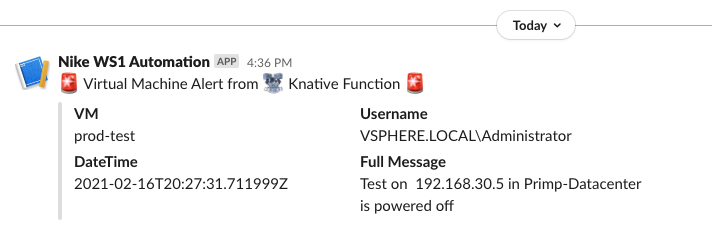

# In-depth function tutorial - Modify and Test a Function Locally

This part of the tutorial will go over:
- Modifying the [kn-ps-slack](https://github.com/vmware-samples/vcenter-event-broker-appliance/tree/master/examples/knative/powershell/kn-ps-slack) PowerShell function.  For this example, we will send a Slack webhook when a Virtual Machine is powered off AND the VM Name starts with "prod".
- Building a new Docker image locally
- The anatomy of the local test folder
- Testing the function locally

**What is a Webhook?**  A webhook is a service that allows one program to send data to another as soon as a particular event takes place.  We will use a Slack webhook to send alert data from the VEBA function to Slack.

## Table of Contents
- [Modifying the PowerShell Code](#modifying-the-powershell-code)
- [Building the Docker Container Image](#building-the-docker-container-image)
- [Testing the Function Locally](#testing-the-function-locally)

## Modifying the PowerShell Code
The PowerShell code is contained in the `handler.ps1` file.  The default function sends an alert to a Slack webhook when a Virtual Machine is powered off.  This handler file is included in the Docker image and so if it changes, it will require a rebuild of the Docker image.  You can see how the `handler.ps1` file is reference in the `Dockerfile` used to build the Docker image - note the `COPY handler.ps1 handler.ps1` command within the file:

```
FROM us.gcr.io/daisy-284300/veba/ce-ps-base:1.4

COPY handler.ps1 handler.ps1

CMD ["pwsh","./server.ps1"]
```


The vCenter event that triggers this function is `VmPoweredOffEvent`. You can find this in the `function.yaml` file.  If you would like to trigger your function with a different event, please see [vCenter Events](https://vmweventbroker.io/kb/vcenter-events) for a reference.  Changing the event trigger in the `function.yaml` file does NOT necessitate a Docker container rebuild.

```yml
<snip>
---
apiVersion: eventing.knative.dev/v1
kind: Trigger
metadata:
  name: veba-ps-slack-trigger
  labels:
    app: veba-ui
spec:
  broker: default
  filter:
    attributes:
      type: com.vmware.event.router/event
      subject: VmPoweredOffEvent
  subscriber:
    ref:
      apiVersion: serving.knative.dev/v1
      kind: Service
      name: kn-ps-slack
```


For our example, let's add some PowerShell code to only send the Slack webhook if the VM Name starts with "prod".  Move to the `/vcenter-event-broker-appliance/examples/knative/powershell/kn-ps-slack` directory - remember, we git cloned this repo during the previous setup instructions.  Use your favorite editor to open the `handler.ps1` file.

```
if(${env:FUNCTION_DEBUG} -eq "true") {
   Write-Host "$(Get-Date) - DEBUG: `"$body`""
}

if ($cloudEventData.Vm.Name.StartsWith("prod")) {

   Write-Host "$(Get-Date) - Sending Webhook payload to Slack ..."
   $ProgressPreference = "SilentlyContinue"

   try {
      Invoke-WebRequest -Uri $(${jsonSecrets}.SLACK_WEBHOOK_URL) -Method POST -ContentType "application/json" -Body $body
   } catch {
      throw "$(Get-Date) - Failed to send Slack Message: $($_)"
   }

   Write-Host "$(Get-Date) - Successfully sent Webhook ..."

}
```

As you can see on the fifth line of the code above, I've added some quick and dirty code to only Invoke-WebRequest if the `$cloudEventData.VM.NameStartsWith("prod")`

## Building the Docker Container Image
Now, let's build the Docker container image locally using the modified `handler.ps1` file.  To reiterate, a rebuild of the Docker image is only necessary if the handler code changes.  Open a command prompt and move to the `/vcenter-event-broker-appliance/examples/knative/powershell/kn-ps-slack` directory.  Assign a tag version and replace the docker-username with your own Docker login.  Tags are used to assign versions or references to Docker containers.  A Docker registry may contain multiple container images with the same name but each will have a different tag to indicate a different version.  In the below example, we will use a tag value equal to `1.1` (this is appended to the end of the container image name).  Docker container naming and tag rules are described here: [Docker tag](https://docs.docker.com/engine/reference/commandline/tag/).

Use the following command to build the Docker image (replace docker-username with your own Docker username):

```
docker build -t <docker-username>/kn-ps-slack:1.1 .
```

Output will be similar to below:
```
docker build -t atauber/kn-ps-slack:1.1 .

[+] Building 0.4s (7/7) FINISHED                                                                                                                                       
 => [internal] load build definition from Dockerfile                                                                                                              0.0s
 => => transferring dockerfile: 36B                                                                                                                               0.0s
 => [internal] load .dockerignore                                                                                                                                 0.0s
 => => transferring context: 2B                                                                                                                                   0.0s
 => [internal] load metadata for us.gcr.io/daisy-284300/veba/ce-ps-base:1.4                                                                                       0.3s
 => [internal] load build context                                                                                                                                 0.0s
 => => transferring context: 33B                                                                                                                                  0.0s
 => [1/2] FROM us.gcr.io/daisy-284300/veba/ce-ps-base:1.4@sha256:bb2c42f7355ad50e957e689dfb8f3fca0390f17290fdd2e1065d7d34a055f29b                                 0.0s
 => CACHED [2/2] COPY handler.ps1 handler.ps1                                                                                                                     0.0s
 => exporting to image                                                                                                                                            0.0s
 => => exporting layers                                                                                                                                           0.0s
 => => writing image sha256:becfa79b2bd7d5ff2d115f3bca4c543f9f52becfeaf4a0c156fcd86ee72b6dcb                                                                      0.0s
 => => naming to docker.io/atauber/kn-ps-slack:1.1                                                                                                                0.0s

Use 'docker scan' to run Snyk tests against images to find vulnerabilities and learn how to fix them
```

Use the command `docker images` to see your new image listed.

## Testing the Function Locally
The test subdirectory contains the files used to test the function locally.  You will need to edit two files:
1. `docker-test-env-variable` - enter the Slack webhook URL to use.  Slack webhook URLs are unique addresses that allow you to post to a Slack channel.  You can read how to create a Slack webhook URL [here](https://api.slack.com/messaging/webhooks)

2. `test-payload.json` - change the VM Name to use here.  For the example, I will use `Vm.Name="prod-test"` so that the new `handler.ps1` code triggers the Slack call for this specific VM Name.

Open a command prompt and run the following command (replacing docker-username with your Docker username).  This should be run in the `/vcenter-event-broker-appliance/examples/knative/powershell/kn-ps-slack/test` directory.  This will run your new function as a Docker container locally on your workstation.  Also remember to use the correct tag (i.e. `1.1`) to reference the version of the container you want to use.

```
docker run -e FUNCTION_DEBUG=true -e PORT=8080 --env-file docker-test-env-variable -it --rm -p 8080:8080 <docker-username>/kn-ps-slack:1.1
```
Results will look similar to below:

```
docker run -e FUNCTION_DEBUG=true -e PORT=8080 --env-file docker-test-env-variable -it --rm -p 8080:8080 atauber/kn-ps-slack:1.1

02/03/2022 21:16:24 - PowerShell HTTP server start listening on 'http://*:8080/'
02/03/2022 21:16:24 - Processing Init

02/03/2022 21:16:24 - Init Processing Completed

02/03/2022 21:16:24 - Starting HTTP CloudEvent listener

```

Now, open a second command prompt/terminal and run `send-cloudevent-test`: either .sh or .ps1 depending on your workstation OS.  This will send test-payload.json data to the listening Docker container function.  If all is working, you will see the new Alert pop up in your Slack channel.



Ok, now you have tested your new function locally, time to deploy it to your VEBA appliance.

Go to [Deploying a function to your VEBA appliance](function-tutorial-deploy)
