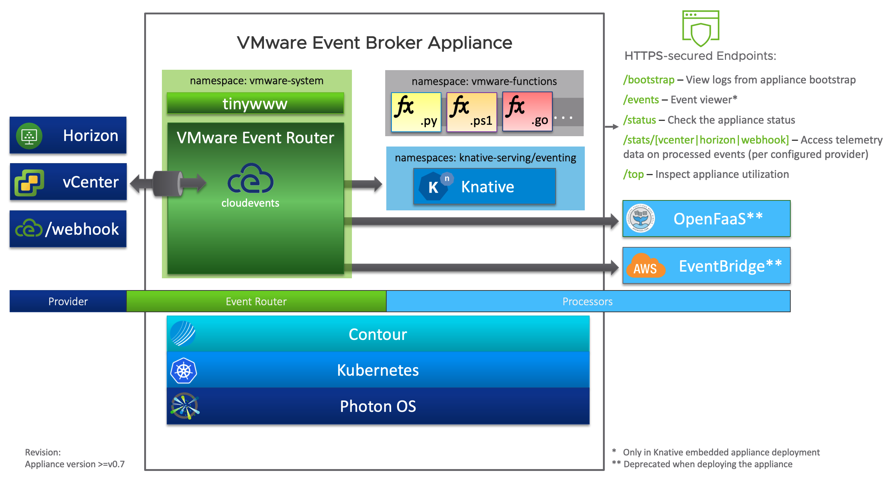

# Architecture

The VMware Event Broker Appliance follows a highly modular approach, using Kubernetes and containers as an abstraction layer between the base operating system ([Photon OS](https://github.com/vmware/photon)) and the required application services. Currently the following components are used in the appliance:

- VMware Event Router ([Github](https://github.com/vmware-samples/vcenter-event-broker-appliance/tree/master/vmware-event-router){:target="_blank"})
  - Supported Event Stream Sources:
    - VMware vCenter ([Website](https://www.vmware.com/products/vcenter-server.html){:target="_blank"})
    - VMware Horizon ([Website](https://www.vmware.com/products/horizon.html){:target="_blank"})
    - Incoming Webhooks
  - Supported Event Stream Processors:
    - Knative ([Website](https://www.knative.dev/){:target="_blank"})
- Contour ([Github](https://github.com/projectcontour/contour){:target="_blank"})
- Kubernetes ([Github](https://github.com/kubernetes/kubernetes){:target="_blank"})
- Photon OS ([Github](https://github.com/vmware/photon){:target="_blank"})

**[VMware Event Router](event-router)** implements the core functionality of the VMware Event Broker Appliance, that is connecting to event `streams` ("sources") and processing the events with a configurable event `processor` such as Knative.

**Knative** is a Kubernetes-based platform to deploy and manage modern serverless workloads. Knative has two core building blocks, that is Serving (Knative Service) and Eventing (Broker, Channel, etc.).
The VMware Event Router can be configured to directly send events to any addressable Knative resource (“reference”), e.g. a Knative Broker or Service. Broker is the recommended deployment model for the VMware Event Router. Please see the Knative documentation on Eventing for details around brokers, triggers, event filtering, etc.
Alternatively, the router can send events to a URI, e.g. an external HTTP endpoint accepting CloudEvents.

**Contour** is an ingress controller for Kubernetes that works by deploying the Envoy proxy as a reverse proxy and load balancer. Contour supports dynamic configuration updates out of the box while maintaining a lightweight profile. In the VMware Event Broker Appliance, Contour provides **TLS termination for the various HTTP(S) endpoints** served.

**Kubernetes** is an open source system for managing containerized applications across multiple hosts. It provides basic mechanisms for deployment, maintenance, and scaling of applications. For application and appliance developers, Kubernetes provides **powerful platform capabilities** such as application (container) self-healing, secrets and configuration management, resource management, and extensibility. Kubernetes lays the foundation for future improvements of the VMware Event Broker Appliance with regards to **high availability (n+1) and scalability (horizontal scale out)**.

**Photon OS&trade;** is an open source Linux container host optimized for cloud-native applications, cloud platforms, and VMware infrastructure. Photon OS provides a **secure runtime environment for efficiently running containers** and out of the box support for Kubernetes. Photon OS is the foundation for many appliances built for the vSphere platform and its ecosystem and thus the first choice for building the VMware Event Broker Appliance.

# Architectural Considerations

Even though the VMware Event Broker Appliance is instantiated as a single running virtual machine, internally its components follow a [microservices architecture](#architecture) running on Kubernetes. The individual services communicate via TCP/IP network sockets. Most of the communication is performed internally in the appliance so the chance of losing network packets is reduced. 

However, in case of a component becoming unavailable (crash-loop, overloaded,or slow to respond), communication might be impacted and; it's important to understand the consequences for event delivery, i.e. function invocation. To avoid the risk of blocking remote calls, which could render the whole system unusable, sensible default timeouts are applied, which can be fine-tuned if needed.

Kubernetes is a great platform and foundation for building highly available distributed systems. Even though we currently don't make use of its multi-node clustering capabilities (i.e. scale out), Kubernetes provides a lot of benefits to developers and users. Its self-healing capabilities continuously watch the critical VMware Event Broker Appliance components and user-deployed functions and trigger restarts when necessary.

Kubernetes and its dependencies, such as the Docker, are deployed as systemd units. This addresses the "who watches the watcher" problem in case the Kubernetes node agent (kubelet) or Docker container runtime crashes.

> **Note:** We are considering to use Kubernetes' cluster capabilities in the future to provide increased resiliency (node crashes), scalability (scale out individual components to handle higher load) and durability (replication and persistency). The downside is the added complexity of deploying and managing a multi-node VMware Event Broker Appliance environment.