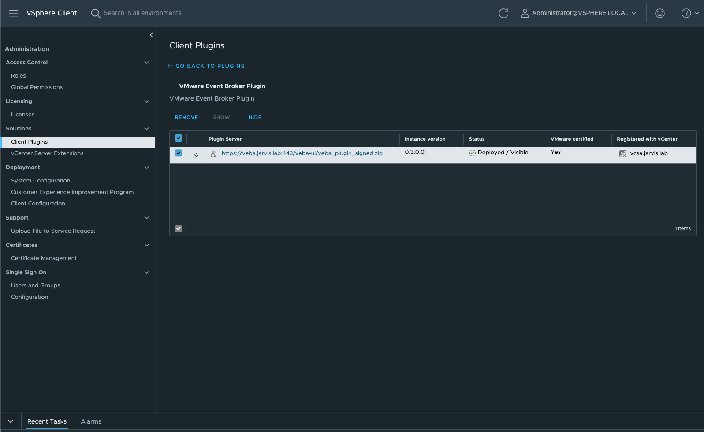
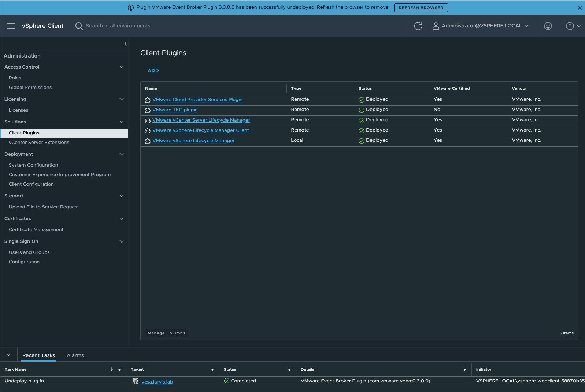
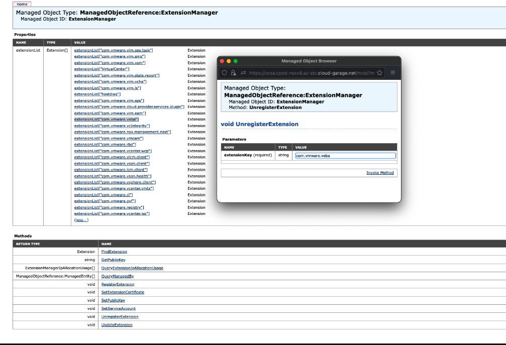
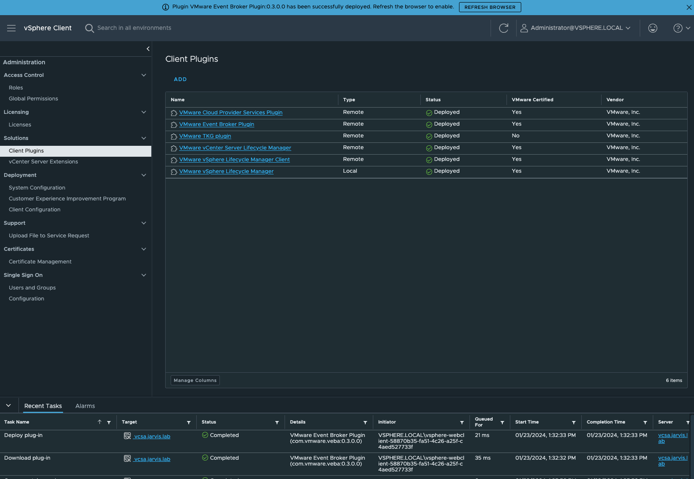

# Troubleshooting VEBA

<!-- omit in toc -->
## Table of Contents

- [Troubleshooting VEBA](#troubleshooting-veba)
  - [Requirements](#requirements)
  - [Troubleshooting an initial deployment](#troubleshooting-an-initial-deployment)
    - [Recovering from a crashing vcsa-source-adapter pod](#recovering-from-a-crashing-vcsa-source-adapter-pod)
  - [Check for completed installation](#check-for-completed-installation)
    - [Examine log files](#examine-log-files)
  - [Changing the vCenter service account](#changing-the-vcenter-service-account)
  - [Troubleshooting VMware Event Broker Appliance vSphere UI](#troubleshooting-vmware-event-broker-appliance-vsphere-ui)
  - [Remove and re-register VMware Event Broker Appliance vSphere UI](#remove-and-re-register-vmware-event-broker-appliance-vsphere-ui)
    - [Remove VEBA UI Plugin via vSphere H5 Client](#remove-veba-ui-plugin-via-vsphere-h5-client)
    - [Remove VEBA UI Plugin via the Managed Object Browser (MOB)](#remove-veba-ui-plugin-via-the-managed-object-browser-mob)
    - [Re-register the VEBA UI Remote Plugin](#re-register-the-veba-ui-remote-plugin)

## Requirements

You must log on to the VMware Event Broker appliance as root. If you did not enable SSH as part of the initial VMware Event Broker Appliance deployment, you can perform this operation at the console. To enable SSH access, execute the following command:

```console
systemctl start sshd
```

This turns on the SSH daemon but does not enable it to start on appliance boot. You should now be able to SSH into the appliance.

If you wish to disable the SSH daemon when you are done troubleshooting, execute the following command:

```console
systemctl stop sshd
```

## Troubleshooting an initial deployment

If the appliance is not working immediately after deployment, the first thing to do is check your Kubernetes pods.

```console
kubectl get pods -A
```

Here is the command output:

```console
kubectl get pods -A

NAMESPACE            NAME                                           READY   STATUS      RESTARTS        AGE
cert-manager         cert-manager-99bb69456-8xxlz                   1/1     Running     1 (3h23m ago)   2d16h
cert-manager         cert-manager-cainjector-ffb4747bb-fzclq        1/1     Running     1 (3h23m ago)   2d16h
cert-manager         cert-manager-webhook-545bd5d7d8-6rnk8          1/1     Running     1 (3h23m ago)   2d16h
contour-external     contour-685f87dc74-fcjrj                       1/1     Running     1 (3h23m ago)   2d16h
contour-external     contour-685f87dc74-mwt7d                       1/1     Running     1 (3h23m ago)   2d16h
contour-external     contour-certgen-v1.22.0-6gkj6                  0/1     Completed   0               2d16h
contour-external     envoy-fbc7g                                    2/2     Running     2 (3h23m ago)   2d16h
contour-internal     contour-c4478d89b-bdt59                        1/1     Running     1 (3h23m ago)   2d16h
contour-internal     contour-c4478d89b-bwb99                        1/1     Running     1 (3h23m ago)   2d16h
contour-internal     contour-certgen-v1.22.0-m49zj                  0/1     Completed   0               2d16h
contour-internal     envoy-5pgjr                                    2/2     Running     2 (3h23m ago)   2d16h
knative-eventing     eventing-controller-fdc4dd6bb-5hgl8            1/1     Running     1 (3h23m ago)   2d16h
knative-eventing     eventing-webhook-676dfb6c4f-rg6fd              1/1     Running     1 (3h23m ago)   2d16h
knative-eventing     rabbitmq-broker-controller-54c85d4f98-gqjdx    1/1     Running     1 (3h23m ago)   2d16h
knative-eventing     rabbitmq-broker-webhook-877b8d7df-d2pzp        1/1     Running     1 (3h23m ago)   2d16h
knative-serving      activator-7cbbfbc85-v8lmv                      1/1     Running     1 (3h23m ago)   2d16h
knative-serving      autoscaler-8f986cff-z4wfw                      1/1     Running     1 (3h23m ago)   2d16h
knative-serving      controller-58dfb45d74-d2fwk                    1/1     Running     1 (3h23m ago)   2d16h
knative-serving      domain-mapping-5d8db49bf6-x5cwx                1/1     Running     1 (3h23m ago)   2d16h
knative-serving      domainmapping-webhook-584476fd67-rqt2k         1/1     Running     1 (3h23m ago)   2d16h
knative-serving      net-contour-controller-6768758c67-jfxrt        1/1     Running     1 (3h23m ago)   2d16h
knative-serving      webhook-6d5c55fd8c-6n4xd                       1/1     Running     1 (3h23m ago)   2d16h
kube-system          antrea-agent-vhjmk                             2/2     Running     2 (3h23m ago)   2d16h
kube-system          antrea-controller-6db8bb65cf-6xbvl             1/1     Running     1 (3h23m ago)   2d16h
kube-system          coredns-565d847f94-mxtzz                       1/1     Running     1 (3h23m ago)   2d16h
kube-system          coredns-565d847f94-rlm9d                       1/1     Running     1 (3h23m ago)   2d16h
kube-system          etcd-veba.jarvis.lab                           1/1     Running     1 (3h23m ago)   2d16h
kube-system          kube-apiserver-veba.jarvis.lab                 1/1     Running     1 (3h23m ago)   2d16h
kube-system          kube-controller-manager-veba.jarvis.lab        1/1     Running     1 (3h23m ago)   2d16h
kube-system          kube-proxy-fj7s9                               1/1     Running     1 (3h23m ago)   2d16h
kube-system          kube-scheduler-veba.jarvis.lab                 1/1     Running     1 (3h23m ago)   2d16h
local-path-storage   local-path-provisioner-5646477f4b-r87xl        1/1     Running     1 (3h23m ago)   2d16h
rabbitmq-system      messaging-topology-operator-74c896bb55-qhdqk   1/1     Running     1 (3h23m ago)   2d16h
rabbitmq-system      rabbitmq-cluster-operator-586b7547f8-ngh6x     1/1     Running     1 (3h23m ago)   2d16h
vmware-functions     default-broker-ingress-78b9f88599-2vwwn        1/1     Running     1 (3h23m ago)   2d16h
vmware-functions     sockeye-79b7fc7c55-klcnh                       1/1     Running     1 (3h23m ago)   2d16h
vmware-functions     sockeye-trigger-dispatcher-84cf59c5d9-wdfqj    1/1     Running     1 (3h23m ago)   2d16h
vmware-functions     vcsa-source-adapter-5c8f5f58-dpspf             0/1     CrashLoopBackoff     0               153m
vmware-sources       horizon-source-controller-8b9cfbfcc-vb9kd      1/1     Running     1 (3h23m ago)   2d16h
vmware-sources       horizon-source-webhook-7db5777d-9f24n          1/1     Running     1 (3h23m ago)   2d16h
vmware-sources       vsphere-source-webhook-6dfb9bfc5c-ctcvw        1/1     Running     1 (3h23m ago)   2d16h
vmware-system        cadvisor-p26cg                                 1/1     Running     1 (3h23m ago)   2d16h
vmware-system        tinywww-5b795ddd75-sn5vf                       1/1     Running     1 (3h23m ago)   2d16h
vmware-system        veba-rabbit-server-0                           1/1     Running     1 (3h23m ago)   2d16h
vmware-system        veba-ui-5cf5d5db4-tn76g                        1/1     Running     1 (3h23m ago)   2d16h
vmware-system        vmware-event-router-webhook-6bfb8cc946-8wlsd   1/1     Running     1 (3h23m ago)   2d16h
```

> **Note:** The status `Completed`  of the container `contour-certgen-v1.10.0-btmlp` is expected after successful appliance deployment.

One of the first things to look for is whether a pod is in a crash state.

### Recovering from a crashing vcsa-source-adapter pod

In the above case, the vcsa-source-adapter pod is crashing. We need to look at the logs with this command:

```console
kubectl -n vmware-functions logs vcsa-source-adapter-5c8f5f58-dpspf
```

> **Note:** The pod suffix `-5c8f5f58-dpspf` will be different in each environment.

Here is the command output:

```console
{"level":"fatal","ts":"2024-01-15T15:00:50.580Z","logger":"vsphere-source-adapter","caller":"vsphere/adapter.go:73","msg":"unable to create vSphere client: ServerFaultCode: Cannot complete login due to an incorrect user name or password.","commit":"053feda-dirty","stacktrace":"github.com/vmware-tanzu/sources-for-knative/pkg/vsphere.NewAdapter\n\tgithub.com/vmware-tanzu/sources-for-knative/pkg/vsphere/adapter.go:73\nknative.dev/eventing/pkg/adapter/v2.MainWithInformers\n\tknative.dev/eventing@v0.37.1-0.20230502055954-cd50d2786189/pkg/adapter/v2/main.go:230\nknative.dev/eventing/pkg/adapter/v2.MainWithEnv\n\tknative.dev/eventing@v0.37.1-0.20230502055954-cd50d2786189/pkg/adapter/v2/main.go:158\nknative.dev/eventing/pkg/adapter/v2.MainWithContext\n\tknative.dev/eventing@v0.37.1-0.20230502055954-cd50d2786189/pkg/adapter/v2/main.go:133\nmain.main\n\tgithub.com/vmware-tanzu/sources-for-knative/cmd/vsphere-adapter/main.go:31\nruntime.main\n\truntime/proc.go:250"}
```

The error message shows us that we made a mistake when we configured our username or password. The created `VSphereSource` is using a Kubernetes Secret for the authentication with the vCenter Server. Therefore, the secret named `vsphere-creds` should be validated first.

```console
kubectl -n vmware-functions get secret vsphere-creds -o yaml

apiVersion: v1
data:
  password: ITFlcmF3TVY=
  username: YWRtaW5pc3RyYXRvckB2c3BoZXJlLmxvY2Fs
kind: Secret
metadata:
  creationTimestamp: "2024-01-15T14:51:24Z"
  name: vsphere-creds
  namespace: vmware-functions
  resourceVersion: "2098905"
  uid: 17e07583-a78d-4909-9edd-7d810637b159
type: Opaque
```

The `value`s for the `key`s password and username are `base64` encoded and can be decoded for validation.

```console
echo 'ITFlcmF3TVY=' | base64 -d

!1erawMV
```

The decoded value shows a wrong configured password. Fixing the issue can be done by deleting the incorrect secret and by recreating it.

```console
kubectl -n vmware-functions delete secret vsphere-creds
```

Recreate the secret with correct values:

```console
kubectl -n vmware-functions create secret generic vsphere-creds --from-literal=username='administrator@vsphere.local' --from-literal=password='VMware1!'
```

In order to pick up the new created secret, the `vcsa-source-adapter` pod has to be recreated as well. This will be done by simply deleting the pod.

```console
kubectl -n vmware-functions delete pod vcsa-source-adapter-5c8f5f58-dpspf
```

Ultimately, validate the state of the pod once again.

```console
kubectl -n vmware-functions get pods

NAME                                          READY   STATUS    RESTARTS      AGE
default-broker-ingress-78b9f88599-2vwwn       1/1     Running   1 (29h ago)   3d19h
sockeye-79b7fc7c55-klcnh                      1/1     Running   1 (29h ago)   3d19h
sockeye-trigger-dispatcher-84cf59c5d9-wdfqj   1/1     Running   1 (29h ago)   3d19h
vcsa-source-adapter-9984f787-h7bth            1/1     Running   0             11m
```

Checking the logs will proof a working `VSphereSource`.

The default logging level for a Tanzu Source is `info`.

The log level for adapters, e.g. a particular `VSphereSource` `deployment` can
be changed at runtime via the `config-logging` `ConfigMap` which is created
when deploying the Tanzu Sources for Knative.

See [Troubleshooting Source](./intro-tanzu-sources.md#troubleshooting).

## Check for completed installation

If the pods appear to be up without a crash status, check to make sure the installation completed. The file `/root/ran_customzation` gets created when installation completes successfully. If this file is missing, you can turn to the installation logs to find out why.

```bash
root@veba [ ~ ]# ls -al /root/ran_customization
-rw-r--r-- 1 root root 0 Oct  1  2021 /root/ran_customization
```

### Examine log files

The appliance installation log file is found in `/var/log/bootstrap.log`. If enabled at install time, a debug log is available in `/var/log/bootstrap-debug.log`. The logs should point you toward the source of the issue. Don't hesitate to [reach out](#bottom) to the team if you need help.

## Changing the vCenter service account

If you need to change the account the appliance uses to connect to vCenter, [the procedure above](#recovering-from-a-crashing-vcsa-source-adapter-pod) (recreating the secret `vsphere-creds`) can be used.

## Troubleshooting VMware Event Broker Appliance vSphere UI

Ensure there is proper bi-directional network connectivity between the VMware Event Broker Appliance and vCenter Server for proper UI functionality which runs over port 443.

When the VMware Event Broker Appliance vSphere UI container starts up, it will attempt to register itself as a vSphere remote plugin with the vCenter Server. Upon a successful registration, a vCenter Plugin Extension will be created on the vCenter Server and that will direct the vSphere UI to connect to the VMware Event Broker Appliance, which is where the VMware Event Broker Appliance UI plugin will be running.

There are several areas which may prevent the VMware Event Broker Appliance vSphere UI from properly running.

Ensure that the VMware Event Broker Appliance UI container is running:

```console
kubectl -n vmware-system get deployments/veba-ui
```

Here is the command output:


```console
kubectl -n vmware-system get deployments/veba-ui

NAME      READY   UP-TO-DATE   AVAILABLE   AGE
veba-ui   1/1     1            1           6h50m
```

Ensure there are no errors in the logs for the VMware Event Broker Appliance UI container. Incorrect credentials or credentials without the correct permissions will prevent the registration with vCenter Server and the logs should give you some additional insights.

```console
kubectl -n vmware-system logs deployments/veba-ui
```

Here is the command output:

```console
  .   ____          _            __ _ _
 /\\ / ___'_ __ _ _(_)_ __  __ _ \ \ \ \
( ( )\___ | '_ | '_| | '_ \/ _` | \ \ \ \
 \\/  ___)| |_)| | | | | || (_| |  ) ) ) )
  '  |____| .__|_| |_|_| |_\__, | / / / /
 =========|_|==============|___/=/_/_/_/
 :: Spring Boot ::        (v2.0.3.RELEASE)

2021-04-04 14:30:22.690  INFO 1 --- [           main] c.v.sample.remote.SpringBootApplication  : Starting SpringBootApplication on veba-ui-677b77dfcf-q9t84 with PID 1 (/app.jar started by root in /)
2021-04-04 14:30:22.695  INFO 1 --- [           main] c.v.sample.remote.SpringBootApplication  : No active profile set, falling back to default profiles: default
2021-04-04 14:30:22.806  INFO 1 --- [           main] ConfigServletWebServerApplicationContext : Refreshing org.springframework.boot.web.servlet.context.AnnotationConfigServletWebServerApplicationContext@3339ad8e: startup date [Sun Apr 04 14:30:22 GMT 2021]; root of context hierarchy
2021-04-04 14:30:23.569  INFO 1 --- [           main] o.s.b.f.xml.XmlBeanDefinitionReader      : Loading XML bean definitions from class path resource [spring-context.xml]
...
```

Ensure the VMware Event Broker Appliance UI was able to successfully register with vCenter Server and create vCenter Plugin Extension.

Open a web browser and enter the following URL and login. Replace the FQDN or IP Address of your vCenter Server

```console
https://[VCENTER_FQDN_OR_IP]/mob/?moid=ExtensionManager&doPath=extensionList%5b%22com.vmware.veba%22%5d
```

If the registration exists, this most likely means that vCenter Server can not reach the VMware Event Broker Appliance.

To verify, you can SSH to the vCenter Server Appliance and attempt to retrieve the `plugin.json`.

```bash
curl -L -k https://[VEBA_FQDN_OR_IP_ADDRESS]/veba-ui/plugin.json
```

Here is the command output:

```json
{
   "manifestVersion": "1.0.0",
   "requirements": {
      "plugin.api.version": "1.0.0"
   },
   "configuration": {
      "nameKey": "plugin.name",
      "icon": {
         "name": "main"
      }
   },
   "global": {
      "view": {
         "navigationId": "entryPoint",
         "uri": "index.html#/veba-ui",
         "navigationVisible": false
      }
   },
   "definitions": {
      "iconSpriteSheet": {
         "uri": "assets/images/veba_icon_only.png",
         "definitions": {
            "main": {
               "x": 0,
               "y": 0
            }
         },
         "themeOverrides": {
            "dark": {
               "uri": "assets/images/veba_icon_only.png",
               "definitions": {
                  "main": {
                     "x": 0,
                     "y": 0
                  }
               }
            }
         }
      },
      "i18n": {
         "locales": [
            "en-US",
            "de-DE",
            "fr-FR"
         ],
         "definitions": {
            "plugin.name": {
               "en-US": "VMware Event Broker",
               "de-DE": "VMware Event Broker",
               "fr-FR": "VMware Event Broker"
            }
         }
      }
   }
}
```

## Remove and re-register VMware Event Broker Appliance vSphere UI

The VEBA UI is built as a vSphere remote plugin and natively integrates into the vSphere UI to the configured vCenter Server. Depending on your vSphere version, removing the VEBA UI plugin can be done directly via the vSphere H5 client (vSphere 8 only) or via the Managed Object Browser (MOB).

### Remove VEBA UI Plugin via vSphere H5 Client

Go to **Administration** and select **Client Plugins**. Select the **VMware Event Broker Plugin** and check the box to the left afterwards to make the **REMOVE** button accessible.



Click on **REMOVE** and confirm removing the plugin.

A message banner as well as a task in the taskbar will confirm the successful uninstallation.



### Remove VEBA UI Plugin via the Managed Object Browser (MOB)

In a web browser, navigate to `https://[VCENTER_FQDN_OR_IP]/mob`. Where `[VCENTER_FQDN_OR_IP]/mob` is the name of your vCenter Server or its IP address.

Log in with your vCenter SSO admin credentials.

* Click **Content**
* Click **ExtensionManager**
* Copy the name of the VEBA UI plugin `com.vmware.veba`
* Click **UnregisterExtension**

A new window appears.

* Paste the key of the plugin and click **Invoke** Method

This removes the plugin and results in void.



* Close the window

In the vSphere client, a message banner as well as a task in the taskbar will confirm the successful uninstallation.

### Re-register the VEBA UI Remote Plugin

As described in section [Troubleshooting VEBA UI](#troubleshooting-vmware-event-broker-appliance-vsphere-ui), the VEBA UI container will register itself as a vSphere remote plugin with the vCenter Server.

By simply restarting the VEBA UI pod on the appliance the VEBA UI plugin will be re-registered automatically. SSH into the appliance first.

```console
ssh root@[VEBA_FQDN_OR_IP]
```

Check the pod state within the `vmware-system` namespace.

```console
kubectl -n vmware-system get pods

NAME                                           READY   STATUS    RESTARTS       AGE
cadvisor-p26cg                                 1/1     Running   4 (4d2h ago)   10d
tinywww-5b795ddd75-sn5vf                       1/1     Running   4 (4d2h ago)   10d
veba-rabbit-server-0                           1/1     Running   4 (4d2h ago)   10d
veba-ui-5cf5d5db4-tn76g                        1/1     Running   4 (4d2h ago)   10d
vmware-event-router-webhook-6bfb8cc946-8wlsd   1/1     Running   4 (4d2h ago)   10d
```

Delete the `veba-ui-xxxxx-xxxxx` pod.

```console
kubectl -n vmware-system delete po veba-ui-5cf5d5db4-tn76g

pod "veba-ui-5cf5d5db4-tn76g" deleted
```

Validate the redeployment of the pod.

```console
kubectl -n vmware-system get pods

NAME                                           READY   STATUS    RESTARTS       AGE
cadvisor-p26cg                                 1/1     Running   4 (4d2h ago)   10d
tinywww-5b795ddd75-sn5vf                       1/1     Running   4 (4d2h ago)   10d
veba-rabbit-server-0                           1/1     Running   4 (4d2h ago)   10d
veba-ui-5cf5d5db4-fq5ll                        1/1     Running   0              10s
vmware-event-router-webhook-6bfb8cc946-8wlsd   1/1     Running   4 (4d2h ago)   10d
```

The logs should confirm a successful installation of the VEBA UI plugin (`VEBA Remote Plugin was initialized with vCenter Server VCENTER_FQDN: vcsa.jarvis.lab`).

```console
kubectl -n vmware-system logs deploy/veba-ui

  .   ____          _            __ _ _
 /\\ / ___'_ __ _ _(_)_ __  __ _ \ \ \ \
( ( )\___ | '_ | '_| | '_ \/ _` | \ \ \ \
 \\/  ___)| |_)| | | | | || (_| |  ) ) ) )
  '  |____| .__|_| |_|_| |_\__, | / / / /
 =========|_|==============|___/=/_/_/_/
 :: Spring Boot ::        (v2.0.3.RELEASE)

[...]

2024-01-23 12:12:31.490  INFO 1 --- [ost-startStop-1] o.a.c.c.C.[.[localhost].[/veba-ui]       : Initializing Spring embedded WebApplicationContext
2024-01-23 12:12:31.490  INFO 1 --- [ost-startStop-1] o.s.web.context.ContextLoader            : Root WebApplicationContext: initialization completed in 2236 ms
2024-01-23 12:12:31.511  INFO 1 --- [ost-startStop-1] c.v.s.r.configuration.Configuration      : VEBA Remote Plugin was initialized with
vCenter Server VCENTER_FQDN: vcsa.jarvis.lab
vCenter Server VCENTER_PORT: 443
vCenter Server VEBA_FQDN: veba.jarvis.lab

[...]
```

The operation will also appear as a task in vSphere and another message will appear via a banner showing that the VEBA UI plugin got successfully deployed.



<a name="bottom"></a>
