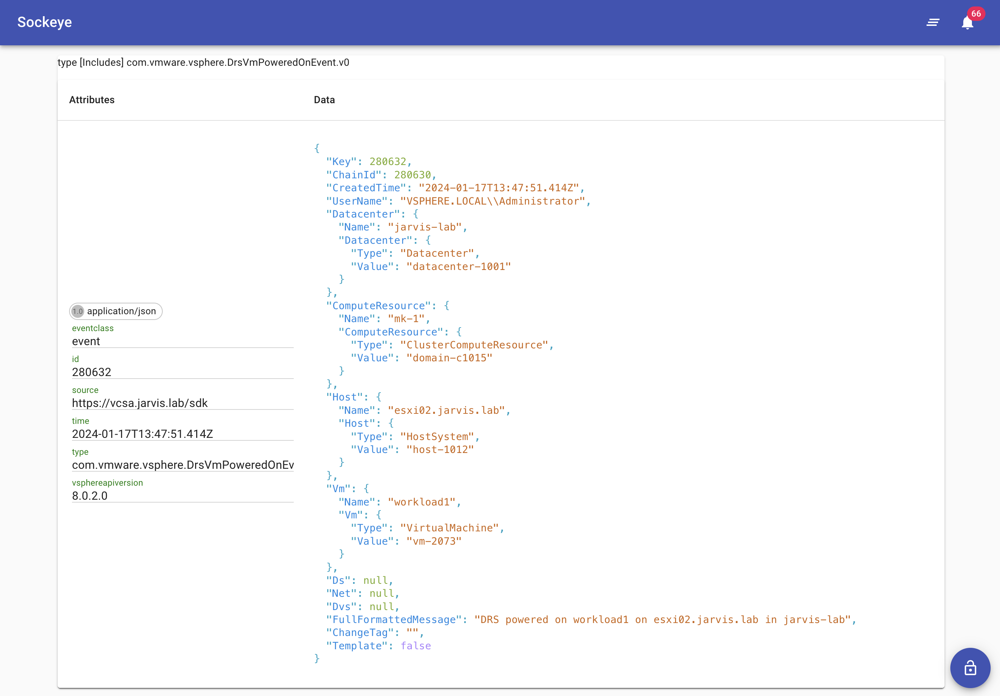

# Troubleshooting Functions

If a function is not behaving as expected, you can look at the logs to troubleshoot. You can either perform this operation remotely by copying the `/root/.kube/config` onto your local desktop and you can interact with VEBA using your local `kubectl` client or `ssh` to the appliance using the local `kubectl` client.

List out the pods within the `vmware-functions` namespace.

```console
kubectl -n vmware-functions get pods
```

This is an example output:

```
default-broker-ingress-78b9f88599-2vwwn           1/1     Running   1 (2d ago)   4d13h
kn-pcli-tag-00001-deployment-6d6db78495-bdz8j     2/2     Running   0            8m8s
sockeye-79b7fc7c55-klcnh                          1/1     Running   1 (2d ago)   4d13h
sockeye-trigger-dispatcher-84cf59c5d9-wdfqj       1/1     Running   1 (2d ago)   4d13h
vcsa-source-adapter-9984f787-h7bth                1/1     Running   0            18h
veba-pcli-tag-trigger-dispatcher-796895df-4fx2c   1/1     Running   0            6m57s
```

First, we want to see if the event-viewer application Sockeye is receiving events from the configured `VSphereSource`.

Use this command to follow the logs.

```console
kubectl logs -n vmware-functions deployment/sockeye -f
```

You should continuously see event payloads on your terminal.

The same can be done by browsing the VEBA events endpoint `https://[veba-fqdn]/events`.

For this sample troubleshooting, we have the sample [PowerCLI Tagging function](https://github.com/vmware-samples/vcenter-event-broker-appliance/blob/development/examples/knative/powercli/kn-pcli-tag) running which will react to a VM powered on Event `com.vmware.vsphere.DrsVmPoweredOnEvent.v0`. To see if the appliance is properly handling the event, create a test VM and power it on before proceeding with the next steps.

When we look at the log output, we should see an entry similar to the following:

```console
Context Attributes,
  specversion: 1.0
  type: com.vmware.vsphere.DrsVmPoweredOnEvent.v0
  source: https://vcsa.jarvis.lab/sdk
  id: 280034
  time: 2024-01-17T13:02:05.426999Z
  datacontenttype: application/json
Extensions,
  eventclass: event
  vsphereapiversion: 8.0.2.0
Data,
  {
    "Key": 280034,
    "ChainId": 280032,
    "CreatedTime": "2024-01-17T13:02:05.426999Z",
    "UserName": "VSPHERE.LOCAL\\Administrator",
    "Datacenter": {
      "Name": "jarvis-lab",
      "Datacenter": {
        "Type": "Datacenter",
        "Value": "datacenter-1001"
      }
    },
    "ComputeResource": {
      "Name": "mk-1",
      "ComputeResource": {
        "Type": "ClusterComputeResource",
        "Value": "domain-c1015"
      }
    },
    "Host": {
      "Name": "esxi02.jarvis.lab",
      "Host": {
        "Type": "HostSystem",
        "Value": "host-1012"
      }
    },
    "Vm": {
      "Name": "workload1",
      "Vm": {
        "Type": "VirtualMachine",
        "Value": "vm-2073"
      }
    },
    "Ds": null,
    "Net": null,
    "Dvs": null,
    "FullFormattedMessage": "DRS powered on workload1 on esxi02.jarvis.lab in jarvis-lab",
    "ChangeTag": "",
    "Template": false
  }
```

Similar in Sockeye:



Each Knative function will have its own pod running in the `vmware-functions` namespace. If you have deployed the provided tagging function example from the [VEBA function examples](https://github.com/vmware-samples/vcenter-event-broker-appliance/tree/development/examples/knative), you can examine the logs with the following command:

```console
kubectl logs -n vmware-functions deployment/kn-pcli-tag-00001-deployment user-container
```

> **Note:** Replace the name of the deployment in the examples with the name within your environment.

First indications of a working function can be obtained directly after deploying a function. For example if a function is successfully connected to a system. The Tagging function for example establishes a connection to the specified vCenter Server system. Here's a log output sample:

```console
kubectl -n vmware-functions logs kn-pcli-tag-00001-deployment-6d6db78495-bdz8j

Defaulted container "user-container" out of: user-container, queue-proxy
01/17/2024 10:34:57 - PowerShell HTTP server start listening on 'http://*:8080/'
01/17/2024 10:34:57 - Processing Init

01/17/2024 10:34:57 - Configuring PowerCLI Configuration Settings


DefaultVIServerMode         : Multiple
ProxyPolicy                 : UseSystemProxy
ParticipateInCEIP           : True
CEIPDataTransferProxyPolicy : UseSystemProxy
DisplayDeprecationWarnings  : True
InvalidCertificateAction    : Ignore
WebOperationTimeoutSeconds  : 300
VMConsoleWindowBrowser      :
Scope                       : Session
PythonPath                  : /usr/local/bin/python3

DefaultVIServerMode         :
ProxyPolicy                 :
ParticipateInCEIP           : True
CEIPDataTransferProxyPolicy :
DisplayDeprecationWarnings  :
InvalidCertificateAction    : Ignore
WebOperationTimeoutSeconds  :
VMConsoleWindowBrowser      :
Scope                       : User
PythonPath                  :

DefaultVIServerMode         :
ProxyPolicy                 :
ParticipateInCEIP           :
CEIPDataTransferProxyPolicy :
DisplayDeprecationWarnings  :
InvalidCertificateAction    :
WebOperationTimeoutSeconds  :
VMConsoleWindowBrowser      :
Scope                       : AllUsers
PythonPath                  : /usr/local/bin/python3

01/17/2024 10:35:02 - Connecting to vCenter Server vcsa.jarvis.lab

IsConnected   : True
Id            : /VIServer=vsphere.local\administrator@vcsa.jarvis.lab:443/
ServiceUri    : https://vcsa.jarvis.lab/sdk
SessionSecret : "a58cfe1ebd168aff2345ab80c0a1343ae4414c3d"
Name          : vcsa.jarvis.lab
Port          : 443
SessionId     : "a58cfe1ebd168aff2345ab80c0a1343ae4414c3d"
User          : VSPHERE.LOCAL\Administrator
Uid           : /VIServer=vsphere.local\administrator@vcsa.jarvis.lab:443/
Version       : 8.0.2
Build         : 22617221
ProductLine   : vpx
InstanceUuid  : 60b82abd-ba3b-4114-825b-d48c1bdd5dea
RefCount      : 1
ExtensionData : VMware.Vim.ServiceInstance

01/17/2024 10:35:07 - Successfully connected to vcsa.jarvis.lab

01/17/2024 10:35:07 - Init Processing Completed

01/17/2024 10:35:07 - Starting HTTP CloudEvent listener
```

If a function got correctly invoked can be seen via the logs as well after the specified event occured.

This command will show you the last 5 minutes worth of logs.

```console
kubectl -n vmware-functions logs deployment/kn-pcli-tag-00001-deployment user-container --since=5m
```

This command will show you the last 20 lines of logs.

```console
kubectl -n vmware-functions logs deployment/kn-pcli-tag-00001-deployment user-container --tail=20
```

Log output showing a successful function invocation:

```console
01/17/2024 10:37:41 - Applying vSphere Tag "backup-sla" to workload1 ...

01/17/2024 10:37:51 - vSphere Tag Operation complete ...

01/17/2024 10:37:51 - Handler Processing Completed ...
```
