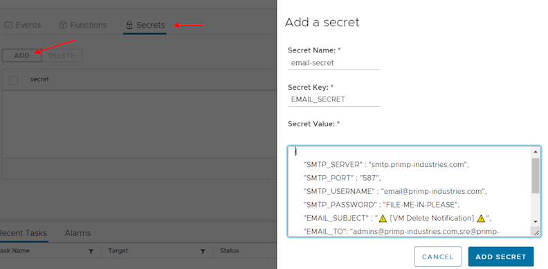
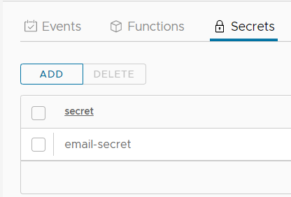

# Getting started with using functions

The steps below describe a generalized deployment step of a function on the VMware Event Broker Appliance. For customers looking to get started quickly, please look at deploying from our growing list of [Prebuilt Functions](/examples). The functions are organized by the language that they are written in and have well-documented README.md files with detailed deployment steps.

Deployment or development of functions can require the use of the following development tools: `git`, `docker`, and `kubectl`.  If you would like some help in how to setup your workstation to use those tools, an in-depth tutorial is available that shows how to do that and to modify and deploy the [kn-ps-slack](https://github.com/vmware-samples/vcenter-event-broker-appliance/tree/master/examples/knative/powershell/kn-ps-slack) function (Knative powershell slack notification function) as an example.  The tutorial can be found here: [in-depth function tutorial](function-tutorial-intro).

### Deployment Prerequisites

Before proceeding to deploy a function, you must have VMware Event Broker Appliance deployed and be able to SSH to the appliance or have access to the kubernetes configuration file (`/root/.kube/config`) locally on your desktop to authenticate.
### Knative Function Deployment using kubectl
Step 1 - Clone repo

```
git clone https://github.com/vmware-samples/vcenter-event-broker-appliance
cd vcenter-event-broker-appliance/examples/knative/powershell/kn-ps-echo
git checkout master
```

Step 2 - Edit the configuration files

* Edit `function.yml` to update `subject:` with the specific vCenter Event. All available events can be reviewed in the [vCenter Event Mapping](https://github.com/lamw/vcenter-event-mapping){:target="_blank"} document.

```yaml
apiVersion: serving.knative.dev/v1
kind: Service
metadata:
  name: kn-ps-echo
  labels:
    app: veba-ui
spec:
  template:
    spec:
      containers:
        - image: projects.registry.vmware.com/veba/kn-ps-echo:1.0
---
apiVersion: eventing.knative.dev/v1
kind: Trigger
metadata:
  name: veba-ps-echo-trigger
  labels:
    app: veba-ui
spec:
  broker: default
  filter:
    attributes:
      type: com.vmware.event.router/event
      subject: DrsVmPoweredOnEvent
  subscriber:
    ref:
      apiVersion: serving.knative.dev/v1
      kind: Service
      name: kn-ps-echo
```

Step 3 - Deploy function to VMware Event Broker Appliance

```
kubectl -n vmware-functions apply -f function.yaml
```

Step 4 - Test your functions

* Your function is now deployed and available for the VMware Event Router to invoke when it sees a matching event

### Knative Function Deployment using vSphere UI

Step 1 - Login to the vSphere UI and navigate to the VMware Event Broker Appliance UI by going to `Menu->VMware Event Broker`.

Step 2 (Optional) - If a secret is required for a function. Select the `Secrets` tab and then click Add to create a new Kubernetes secret.

Step 3 - Under the `Events` tab, search and filter for the specific vSphere Event to deploy a function. One an event has been identified, click on the `>>` icon to expand and click on Deploy button to begin the guided wizard.

Step 4 - In the `Function` section of the wizard, users will need to provide the following required parameters:

* `Function name` - A name for the function to be deployed

* `Docker Image` - The Docker image that contains the function logic

Step 5 - (optional) In the `Configuration` section of the wizard, users can control the concurrency and scale bounds for the function:

* `Container concurrency:` - Specifies the maximum allowed in-flight (concurrent) requests per container of the Revision. Defaults to 0 which means concurrency to the application is not limited, and the system decides the target concurrency for the autoscaler.

* `Minimum scale:` - Controls the minimum number of replicas that each Revision should have. Knative will attempt to never have less than this number of replicas at any one point in time. Defaults to 0 which means scale to zero.

* `Maximum scale:` - Controls the maximum number of replicas that each revision should have. Knative will attempt to never have more than this number of replicas running, or in the process of being created, at any one point in time. Defaults to 0 which means unlimited scale.

Step 6 - (optional) In the `Configure Variables` section of the wizard, users can define new environment variables that can be used within their function

* `Name` - The name should begin with an uppercase letter and contain only uppercase letters(A-Z), numbers(0-9) and underscores(_)

* `Value` - The value for the environment variable

Step 7 - (optional) In the `4 Configure Secrets` section of the wizard, users can select specific Kubernetes Secrets that were created earlier in Step 2 for use within their function

Step 8 - Finally, review the summary for the function deployment and click `Finish` to begin the function deployment.

To verify the function deployment was successful, click on the `Functions` tab and ensure the function status `True` for the following:

* `ConfigurationsReady` : True

* `Ready` : True

* `RoutesReady` : True

Step 9 - Test and Invoke your functions

* Your function is now deployed and available for VMware Event Router to invoke when it sees a matching event

### Function Deployment with Kubernetes Secrets

Although the previous examples using the `kn-ps-echo` function did not require configuration parameters, most functions do require parameters to work correctly. A function author can hard code parameter values inside the function. However, any changes to the configuration parameters means the function's container image must be rebuilt. By using configuration parameters stored in a Kubernetes secret, a function can be reconfigured by simply changing the secret. This walk-through uses the [`kn-ps-email`](/examples) function from the examples folder to demonstrate working with secrets.

You can verify whether a function requires a secret by looking at the function's `function.yaml`. Below is part of the `function.yaml` for `kn-ps-email`. Note the `secretRef:` section specifying the name of the secret the function expects.
```yaml
      containers:
        - image: us.gcr.io/daisy-284300/veba/kn-ps-email:1.4
          envFrom:
            - secretRef:
                name: email-secret
          env:
            - name: FUNCTION_DEBUG
              value: "false"
```

The `kn-ps-email` function uses several configuration parameters. The secrets file for `kn-ps-email` is named `email_secrets.json`. 

```json
{
    "SMTP_SERVER" : "smtp.primp-industries.com",
    "SMTP_PORT" : "587",
    "SMTP_USERNAME" : "email@primp-industries.com",
    "SMTP_PASSWORD" : "FILE-ME-IN-PLEASE",
    "EMAIL_SUBJECT" : "⚠️ [VM Delete Notification] ⚠️",
    "EMAIL_TO": "admins@primp-industries.com,sre@primp-industries.com",
    "EMAIL_FROM" : "notification-do-not-reply@primp-industries.com"
}
```
### Kubernetes Secrets - Command Line

To create the Kubernetes secret via the command line, modify the secrets file with configuration data specific to your environment. Then run this command:
```bash
kubectl -n vmware-functions create secret generic email-secret --from-file=EMAIL_SECRET=email_secret.json
```

`email-secret`, the argument just before `--from-file=`, is the name that Kubernetes uses to refer to the secret. This name must match the `secretRef` in `function.yaml`. 

`EMAIL_SECRET`, the value just after `--from-file=`, is the function environment variable that the secret gets loaded into. You can find the environment variable the function expects by looking at `handler.ps1`. 

```powershell
try {
    $jsonSecrets = ${env:EMAIL_SECRET} | ConvertFrom-Json
} catch {
    throw "`nK8s secrets `$env:EMAIL_SECRET does not look to be defined"
}
```

### Kubernetes Secrets - vCenter UI
If you deployed VEBA with the vCenter UI option, you can create the secret by clicking on the `Secrets` section, then clicking `Add`. The `Secret Name` must match the `secretRef` in `function.yaml`. The `Secret Key` must match the environment variable the function expects, as shown in `handler.ps1` above. The `Secret Value` is the JSON copied from `email_secret.json`, modified with configuration data specific to your environment. Once all fields are filled out, click `Add Secret`.



The secret has been created.

