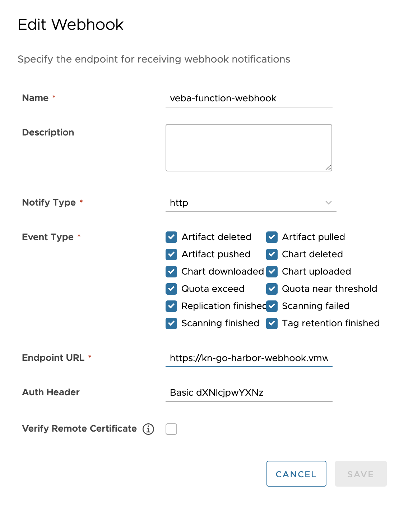

# kn-go-harbor-webhook

Example Knative Go function for receiving [Project Harbor
webhook](https://goharbor.io/docs/latest/working-with-projects/project-configuration/configure-webhooks/)
notifications (events).

⚠️ This guide assumes that you have stood up a working Knative environment using
the vCenter Event Broker Appliance (VEBA). Since the function needs to be
exposed to the outside (so Harbor can send webhook notifications to it), **your
DNS server needs to be set up with wildcard DNS support for the VEBA host**.

# How the function works

The function starts an HTTP server, transforms Harbor webhook event
notifications to [CloudEvents](https://cloudevents.io/) and sends them to the
configured `K_SINK` (injected via a Knative
[`SinkBinding`](https://knative.dev/docs/eventing/custom-event-source/sinkbinding/)).
By default, `K_SINK` is set as the VEBA `default` broker in the
`vmware-functions` namespace. 

The function can be set up with
[`basic_auth`](https://developer.mozilla.org/en-US/docs/Web/HTTP/Authentication)
for the HTTP endpoint. This is highly recommended (and the default in this guide
using a Kubernetes secret).

The webhook endpoint in the function, i.e. the HTTP `POST` target, by default is
`/webhook` (configurable.)

See the [deployment](#step-3---deploy) section for configuration options and
details.

The event transformation is done as follows:

| CloudEvent Field | Harbor Event Field | Comment                                                                                                                 | Example                                |
|------------------|--------------------|-------------------------------------------------------------------------------------------------------------------------|----------------------------------------|
| `ID`             | n/a                | An `ID` is autogenerated using UUIDv4                                                                                   | `35f42638-4627-4a8e-8862-360cae64dc44` |
| `Source`         | n/a                | The Source is generated using a fixed format (`/%s`) using the Knative `service` Name                                   | `/kn-go-harbor-webhook`                |
| `Type`           | `type`             | Harbor event `type` field is lower-cased and injected into a fixed CloudEvent `Type` format (`com.vmware.harbor.%s.v0`) | `com.vmware.harbor.pull_artifact.v0`   |
| `Subject`        | `operator`         | This field might be empty                                                                                               | `admin`                                |
| `Time`           | `occur_at`         | Converted Harbor time to RFC3339 (UTC)                                                                                  | `2022-06-22T08:49:48Z`                 |
| `Data`           | n/a                | JSON-encoded full Harbor event                                                                                          |                                        |

A full example of a structured CloudEvent (JSON):

```json
{
    "specversion": "1.0",
    "id": "",
    "source": "/kn-go-harbor-webhook",
    "type": "com.vmware.harbor.pull_artifact.v0",
    "subject": "admin",
    "datacontenttype": "application/json",
    "time": "2022-06-22T08:49:48Z",
    "data": {
        "type": "PULL_ARTIFACT",
        "occur_at": 1655887788,
        "operator": "admin",
        "event_data": {
            "resources": [{
                "digest": "sha256:3b465cbcadf7d437fc70c3b6aa2c93603a7eef0a3f5f1e861d91f303e4aabdee",
                "tag": "sha256:3b465cbcadf7d437fc70c3b6aa2c93603a7eef0a3f5f1e861d91f303e4aabdee",
                "resource_url": "harbor-app.jarvis.tanzu/veba-test/csi-test@sha256:3b465cbcadf7d437fc70c3b6aa2c93603a7eef0a3f5f1e861d91f303e4aabdee"
            }],
            "repository": {
                "date_created": 1655887764,
                "name": "csi-test",
                "namespace": "veba-test",
                "repo_full_name": "veba-test/csi-test",
                "repo_type": "public"
            }
        }
    }
}
```

# Step 1 - Build

⚠️ This step is only required if you made code changes to any of the \*.go
files. To directly deploy the function jump to [Step 3](#step-3---deploy).

Requirement: If you make changes to the Go code, the
[ko](https://github.com/google/ko) tool is required to create the artifacts. 

Set the destination to push the function container image with an environment
variable.

```bash
export KO_DOCKER_REPO=docker.io/my-user
export KO_COMMIT=$(git rev-parse --short=8 HEAD)
export KO_TAG=1.0
```

The following command will build and push the image to the specified
`KO_DOCKER_REPO` repository.

```bash
# for docker.io
ko publish --bare -t $KO_TAG .

# for GCR
ko publish -B -t $KO_TAG .
```

⚠️ Using the above example, the resulting image would be
`docker.io/myuser/kn-go-harbor-webhook:1.0`.


# Step 2 - Test

Run unit tests using the following command:

```bash
go test -v -race -count 1 ./...
```

# Step 3 - Deploy

⚠️ The following steps assume a working Knative environment using the `default`
 Rabbit `broker`. The Knative `service` and `sinkbinding` will be installed in
 the `vmware-functions` Kubernetes namespace, assuming that the `broker` is also
 available there.

## Create Basic Auth Credentials Secrets

Create a secret holding the username and password enforcing basic authentication
on the HTTP endpoint of the function which receives Harbor webhook
notifications.

```bash
kubectl create secret generic webhook-auth \
--type=kubernetes.io/basic-auth \
--from-literal=username='webhookuser' \
--from-literal=password='replaceme'
--namespace vmware-functions

# update label for secret to show up in VEBA UI
kubectl -n vmware-functions label secret webhook-auth app=veba-ui
```

## Update Environment Settings

The `function.yaml` comes with sane defaults, incl. basic auth for the HTTP
endpoint. Users may update environment specific settings under `env:` in the
`function.yaml` file.

Please see the table below for a description of the available (and **required**)
settings.


| Configuration         | Description                                                                  | Example Values            | Required |
|-----------------------|------------------------------------------------------------------------------|---------------------------|----------|
| `ADDRESS`             | HTTP listen (bind) address of the function                                   | `"0.0.0.0"` (default)     | **Yes**  |
| `WEBHOOK_PATH`        | Endpoint where the function HTTP server accepts Harbor webhook notifications | `"/webhook"` (default)    | **Yes**  |
| `WEBHOOK_SECRET_PATH` | The path where the basic auth credentials secret will be mounted             | `"/var/bindings/webhook"` | No       |
| `DEBUG`               | Enable debug logging                                                         | `"true"`                  | No       |

## Deploy the Function

Create the `SinkBinding` which will automatically inject the VEBA `default`
broker into the function.

```bash
kubectl create -f sinkbinding.yaml -n vmware-functions
```

⚠️ If you made changes to the Go code/container image in [Step
1](#step-1---build) edit the `function.yaml` file with the custom name of the
container image used to build and push.

Deploy the function to the VMware Event Broker Appliance (VEBA):

```bash
kubectl create -f function.yaml -n vmware-functions
```

For testing purposes, the [Knative manifest](function.yaml) contains the
following annotations, which will ensure the Knative Service Pod will always run
**exactly** one instance for debugging purposes. Functions deployed through the
VMware Event Broker Appliance UI defaults to scale to 0, which means the pods
will only run when it is triggered by a vCenter Event.

```yaml
annotations:
  autoscaling.knative.dev/maxScale: "1"
  autoscaling.knative.dev/minScale: "1"
```

## Configure the Harbor Webhook

Configure the webhook notifications in the Harbor UI. For example, the following
screenshot shows how to send all Harbor events to the `kn-go-harbor-webhook`
function with basic auth enabled.

Change the "Endpoint URL" and "Auth Header" fields accordingly:

The "Endpoint URL" is
`https://kn-go-harbor-webhook.vmware-functions.<VEBA-FQDN>/webhook` if you used
the default values provided in the `function.yaml`.

The value in "Auth Header" needs to start with `Basic` followed by a whitespace
and the base64-encoded value of the `<username>:<password>` string combination
defined in the `webhook-auth` secret created earlier. You can use [this online
tool](https://www.debugbear.com/basic-auth-header-generator) to create the
required value.



# Step 4 - Undeploy

```bash
# undeploy function
kubectl delete -f function.yaml -n vmware-functions

# undeploy sinkbinding
kubectl delete -f sinkbinding.yaml -n vmware-functions

# delete secret
kubectl delete secret webhook-auth -n vmware-functions
```
