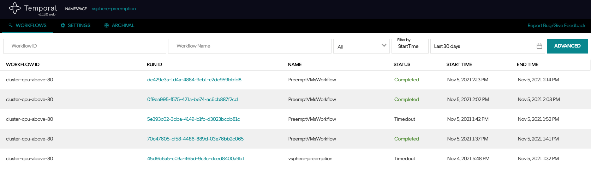
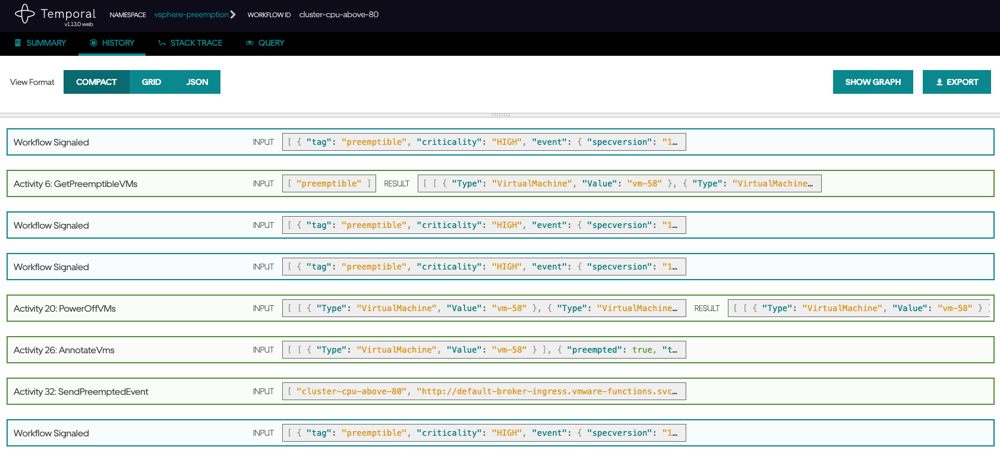

# kn-go-preemption

Example Knative Go function for triggering vSphere virtual machine preemption
(power off) using a workflow engine and the
[`vsphere-preemption`](https://github.com/embano1/vsphere-preemption) prototype.

## Background

Virtual Machine (VM) preemption is a common pattern in cloud environments where
certain VMs can be powered off based on their criticality (quality of service)
or lifetime (also known as "spot instances").

This pattern is often used to offer "cheap" compute or power off/terminate
instances when resources are short.

As of today, VMware vSphere does not support preemption natively. This function,
together with the
[`vsphere-preemption`](https://github.com/embano1/vsphere-preemption) prototype,
shows how such a feature can be built on top of vSphere primitives in an
event-driven manner, using vSphere `AlarmStatusChangedEvents` to trigger a
multi-step workflow which identifies and powers off preemptible VMs.

## Requirements

The [`vsphere-preemption`](https://github.com/embano1/vsphere-preemption)
service and its dependencies (Temporal [Workflow Engine](https://temporal.io/))
must be configured and deployed in a Kubernetes environment. Note down its
**configuration values** as they will be used in this example.

Ideally (but not required), the same Kubernetes environment is used where this
function and its dependencies (Knative) are installed.

💡 A detailed video walkthrough to deploy the `vsphere-preemption` backend and
this function is available [here](https://www.youtube.com/watch?v=K22Jdiu1HiY)
(Youtube).

# Step 1 - Build (optional)

**Note:** This step is only required if you made code changes to the Go code.

This example uses [`ko`](https://github.com/google/ko) to build and push
container artifacts.

```console
# change the variables accordingly
export KO_DOCKER_REPO=us.gcr.io/daisy-284300/veba
export KO_COMMIT=$(git rev-parse --short=8 HEAD)
export KO_TAG=1.0

# make code changes...

# build and push
ko publish -B -t latest,${KO_TAG},${KO_COMMIT} .
```

# Step 2 - Deploy

**Note:** The following steps assume a working Knative environment using the
`default` Rabbit `broker`. The Knative `service` and `trigger` will be installed
in the `vmware-functions` Kubernetes namespace, assuming that the `broker` is
also available there.

## Create vSphere Tag

The logic to identify preemptible VMs is based on vSphere tags associated to
respective virtual machines. This
[document](https://docs.vmware.com/en/VMware-vSphere/6.7/com.vmware.vsphere.vcenterhost.doc/GUID-05323758-1EBF-406F-99B6-B1A33E893453.html)
describes how to create a tag which will be used in later steps. Note down the
**name** of the tag, e.g. `preemptible`, created as part of this step.

**Note:** This step can also be performed programmatically, e.g. via PowerCLI or
[`govc`](https://github.com/vmware/govmomi/tree/master/govc).

## Create vSphere Alarm

The function will trigger the preemption workflow based on a specific vSphere
alarm and its condition (`yellow` or `red`). If the alarm is lowering, e.g. from
`red` to `yellow` or from `yellow` to `green`, any running preemption workflow
will be canceled to avoid unnecessary preemption runs.

 Create an
[alarm](https://docs.vmware.com/en/VMware-vSphere/6.7/com.vmware.vsphere.monitoring.doc/GUID-B0E61111-CEE9-4141-A66B-00935AF3976D.html)
in vSphere. Note down the **name** of the alarm, e.g. `cluster-cpu-above-80`,
created as part of this step. 

## Configure `SinkBinding` (optional)

**Note:** This is an optional but recommended step.

As part of a preemption run, the function can set a response address where the
workflow engine will send a CloudEvent with the `type` set to
`com.vmware.workflows.vsphere.VmPreemptedEvent.v0` after a successful execution.
This event can then be forwarded to Slack or any other notification system,
using one of our pre-defined VEBA examples.

Instead of hardcoding the `broker` ("sink") address, a Knative `SinkBinding` is
used to dynamically inject the VEBA default `broker` as an environment variable
(`K_SINK`) into every function with the label `workflow: vsphere-preemption`. 

The function in this example is already configured with this matching label and
if the variable `K_SINK` is set through the dynamic binding, it will include
this information in the workflow engine preemption request.

```console
kubectl -n vmware-functions create -f sinkbinding.yaml
```

## Configure Function

In the `function.yaml` file make the following modifications.

### Function Image

If you changed the code and built a custom container image (see [Step
1](#step-1---build)), change `image:
us.gcr.io/daisy-284300/veba/kn-go-preemption:1.0` accordingly.

### Function Environment Variables

Update the environment variables, which are used to configure the function. The
values in the `env` section must match your environment. The following table
describes the individual (and **required**) settings.

| Variable                 | Description                                                                                      | Example                                                              | Required |
| ------------------------ | ------------------------------------------------------------------------------------------------ | -------------------------------------------------------------------- | -------- |
| `TEMPORAL_URL`           | `IP/FQDN:<port>` of the Temporal Frontend*                                                       | `temporaltest-frontend.default.svc.cluster.local:7233`               | **yes**  |
| `TEMPORAL_NAMESPACE`     | Temporal (not Kubernetes!) [namespace](https://docs.temporal.io/docs/server/namespaces/) to use* | `vsphere-preemption`                                                 | **yes**  |
| `TEMPORAL_TASKQUEUE`     | Temporal [task queue](https://docs.temporal.io/docs/concepts/task-queues) to send workflows to*  | `vsphere-preemption`                                                 | **yes**  |
| `VSPHERE_PREEMPTION_TAG` | vSphere tag to use to identify preemptible VMs (tag must exist)                                  | `preemptible`                                                        | **yes**  |
| `VSPHERE_ALARM_NAME`     | vSphere alarm name which this function will act on (events from other alarms are ignored)        | `cluster-cpu-above-80`                                               | **yes**  |
| `DEBUG`                  | Enable debug logs                                                                                | `"true"` or `"false"` (note the `""` around the value are mandatory) | no       |


\* Must match the configuration used for the
[`vsphere-preemption`](https://github.com/embano1/vsphere-preemption) deployment
as per the [requirements](#requirements) to deploy this example.

### Function Trigger

The function is configured to trigger on (any) `AlarmStatusChangedEvent`. This
is a general vSphere event triggered on **any** alarm state change. You should
not need to change this field as the function only works when a valid
`AlarmStatusChangedEvent` is supplied (the function will ignore any other
events).

Since we do not want to run preemption on any alarm but on the one configured
[above](#create-vsphere-alarm), the function has logic to only run on the
configured alarm (`VSPHERE_ALARM_NAME`) and ignores all other alarms and events.


**Note:** Currently there is no option to filter on data inside the alarm
payload, hence the workaround in the function code.

### Function Deployment

Deploy the function to the VMware Event Broker Appliance (VEBA).

```console
kubectl -n vmware-functions apply -f function.yaml
```

For testing purposes, the `function.yaml` contains the following annotations,
which will ensure the Knative Service Pod will always run **exactly** one
instance for debugging purposes. Functions deployed through through the VMware
Event Broker Appliance UI defaults to scale to 0, which means the pods will only
run when it is triggered by an vCenter Event.

```yaml
annotations:
  autoscaling.knative.dev/maxScale: "1"
  autoscaling.knative.dev/minScale: "1"
```

## Verification

Get the latest (serving/running) revision of the function:

```console
kubectl -n vmware-functions get ksvc
NAME               URL                                                         LATESTCREATED            LATESTREADY              READY   REASON
kn-go-preemption   http://kn-go-preemption.vmware-functions.127.0.0.1.nip.io   kn-go-preemption-00004   kn-go-preemption-00004   True
```

In this case, `kn-go-preemption-00004` is the latest ready revision.

Observe (tail) the log file of the function.

```console
kubectl -n vmware-functions logs deploy/kn-go-preemption-00004-deployment -c user-container -f
```

It should produce a similar output when receiving `AlarmStatusChangedEvents`:

```console
kn-go-preemption/handler.go:88  received event  {"eventID": "d65a8ad1-7d3c-4f72-ace4-e3f2883c4475", "event": "Context Attributes,\n  specversion: 1.0\n  type: com.vmware.event.router/event\n  source: https://10.161.164.224/sdk\n  subject: AlarmStatusChangedEvent\n  id: d65a8ad1-7d3c-4f72-ace4-e3f2883c4475\n  time: 2021-11-05T13:13:49.993999Z\n  datacontenttype: application/json\nExtensions,\n  vsphereapiversion: 6.7.3\nData,\n  {\n    \"Key\": 15227,\n    \"ChainId\": 15227,\n    \"CreatedTime\": \"2021-11-05T13:13:49.993999Z\",\n    \"UserName\": \"\",\n    \"Datacenter\": {\n      \"Name\": \"vcqaDC\",\n      \"Datacenter\": {\n        \"Type\": \"Datacenter\",\n        \"Value\": \"datacenter-2\"\n      }\n    },\n    \"ComputeResource\": {\n      \"Name\": \"cls\",\n      \"ComputeResource\": {\n        \"Type\": \"ClusterComputeResource\",\n        \"Value\": \"domain-c7\"\n      }\n    },\n    \"Host\": {\n      \"Name\": \"10.161.166.252\",\n      \"Host\": {\n        \"Type\": \"HostSystem\",\n        \"Value\": \"host-21\"\n      }\n    },\n    \"Vm\": null,\n    \"Ds\": null,\n    \"Net\": null,\n    \"Dvs\": null,\n    \"FullFormattedMessage\": \"Alarm 'cluster-cpu-above-80' on 10.161.166.252 changed from Green to Red\",\n    \"ChangeTag\": \"\",\n    \"Alarm\": {\n      \"Name\": \"cluster-cpu-above-80\",\n      \"Alarm\": {\n        \"Type\": \"Alarm\",\n        \"Value\": \"alarm-282\"\n      }\n    },\n    \"Source\": {\n      \"Name\": \"cls\",\n      \"Entity\": {\n        \"Type\": \"ClusterComputeResource\",\n        \"Value\": \"domain-c7\"\n      }\n    },\n    \"Entity\": {\n      \"Name\": \"10.161.166.252\",\n      \"Entity\": {\n        \"Type\": \"HostSystem\",\n        \"Value\": \"host-21\"\n      }\n    },\n    \"From\": \"green\",\n    \"To\": \"red\"\n  }\n"}
kn-go-preemption/handler.go:134 alarm level is raising  {"eventID": "d65a8ad1-7d3c-4f72-ace4-e3f2883c4475", "from": "green", "to": "red"}
kn-go-preemption/handler.go:135 triggering preemption   {"eventID": "d65a8ad1-7d3c-4f72-ace4-e3f2883c4475"}
kn-go-preemption/handler.go:194 executing workflow      {"workflow": "PreemptVMsWorkflow", "eventID": "d65a8ad1-7d3c-4f72-ace4-e3f2883c4475", "queue": "vsphere-preemption", "tag": "preemptible", "criticality": "HIGH", "sink": "http://default-broker-ingress.vmware-functions.svc.cluster.local", "alarmName": "cluster-cpu-above-80", "event": "Context Attributes,\n  specversion: 1.0\n  type: com.vmware.event.router/event\n  source: https://10.161.164.224/sdk\n  subject: AlarmStatusChangedEvent\n  id: d65a8ad1-7d3c-4f72-ace4-e3f2883c4475\n  time: 2021-11-05T13:13:49.993999Z\n  datacontenttype: application/json\nExtensions,\n  vsphereapiversion: 6.7.3\nData,\n  {\n    \"Key\": 15227,\n    \"ChainId\": 15227,\n    \"CreatedTime\": \"2021-11-05T13:13:49.993999Z\",\n    \"UserName\": \"\",\n    \"Datacenter\": {\n      \"Name\": \"vcqaDC\",\n      \"Datacenter\": {\n        \"Type\": \"Datacenter\",\n        \"Value\": \"datacenter-2\"\n      }\n    },\n    \"ComputeResource\": {\n      \"Name\": \"cls\",\n      \"ComputeResource\": {\n        \"Type\": \"ClusterComputeResource\",\n        \"Value\": \"domain-c7\"\n      }\n    },\n    \"Host\": {\n      \"Name\": \"10.161.166.252\",\n      \"Host\": {\n        \"Type\": \"HostSystem\",\n        \"Value\": \"host-21\"\n      }\n    },\n    \"Vm\": null,\n    \"Ds\": null,\n    \"Net\": null,\n    \"Dvs\": null,\n    \"FullFormattedMessage\": \"Alarm 'cluster-cpu-above-80' on 10.161.166.252 changed from Green to Red\",\n    \"ChangeTag\": \"\",\n    \"Alarm\": {\n      \"Name\": \"cluster-cpu-above-80\",\n      \"Alarm\": {\n        \"Type\": \"Alarm\",\n        \"Value\": \"alarm-282\"\n      }\n    },\n    \"Source\": {\n      \"Name\": \"cls\",\n      \"Entity\": {\n        \"Type\": \"ClusterComputeResource\",\n        \"Value\": \"domain-c7\"\n      }\n    },\n    \"Entity\": {\n      \"Name\": \"10.161.166.252\",\n      \"Entity\": {\n        \"Type\": \"HostSystem\",\n        \"Value\": \"host-21\"\n      }\n    },\n    \"From\": \"green\",\n    \"To\": \"red\"\n  }\n"}
```

The Temporal UI should indicate a successful execution, similar to this output:

 

If a `SinkBinding` (see [above](#configure-sinkbinding-optional)) was
configured, an event should also be sent through the configured destination,
e.g. `broker`.

If a virtual machine is powered off as part of a preemption, the custom
attribute `com.vmware.workflows.vsphere.preemption` will contain information
about which workflow run and event caused the power off operation.

```console
govc fields.info -n com.vmware.workflows.vsphere.preemption -json test-vm-1 | jq '.Info[].Value|fromjson'
```

This is an example output:

```console
{
  "preempted": true,
  "tag": "preemptible",
  "forcedShutdown": true,
  "criticality": "HIGH",
  "workflowID": "cluster-cpu-above-80",
  "workflowStarted": "2021-11-05T13:02:34.437444Z",
  "event": {
    "specversion": "1.0",
    "id": "15c7f3f5-072d-4cc8-994b-773992b78979",
    "source": "https://10.161.164.224/sdk",
    "type": "com.vmware.event.router/event",
    "subject": "AlarmStatusChangedEvent",
    "datacontenttype": "application/json",
    "time": "2021-11-05T13:02:32.966Z",
    "data": {
      "Key": 15158,
      "ChainId": 15158,
      "CreatedTime": "2021-11-05T13:02:32.966Z",
      "UserName": "",
      "Datacenter": {
        "Name": "vcqaDC",
        "Datacenter": {
          "Type": "Datacenter",
          "Value": "datacenter-2"
        }
      },
      "ComputeResource": {
        "Name": "cls",
        "ComputeResource": {
          "Type": "ClusterComputeResource",
          "Value": "domain-c7"
        }
      },
      "Host": {
        "Name": "10.161.167.160",
        "Host": {
          "Type": "HostSystem",
          "Value": "host-27"
        }
      },
      "Vm": null,
      "Ds": null,
      "Net": null,
      "Dvs": null,
      "FullFormattedMessage": "Alarm 'cluster-cpu-above-80' on 10.161.167.160 changed from Green to Red",
      "ChangeTag": "",
      "Alarm": {
        "Name": "cluster-cpu-above-80",
        "Alarm": {
          "Type": "Alarm",
          "Value": "alarm-282"
        }
      },
      "Source": {
        "Name": "cls",
        "Entity": {
          "Type": "ClusterComputeResource",
          "Value": "domain-c7"
        }
      },
      "Entity": {
        "Name": "10.161.167.160",
        "Entity": {
          "Type": "HostSystem",
          "Value": "host-27"
        }
      },
      "From": "green",
      "To": "red"
    },
    "vsphereapiversion": "6.7.3"
  }
}
```

## Troubleshooting

If the function is not working as expected, inspect/verify the following:

- The function logs (enable `DEBUG` environment flag if not already done)
- The `vsphere-preemption` [service](#requirements) and its dependencies are
  installed and working correctly
- Environment [variables](#configure-function) to configure the function are set
  correctly (especially **required** variables)

# Step 4 - Undeploy

```console
# undeploy function
kubectl -n vmware-functions delete -f function.yaml

# undeploy SinkBinding (optional)
kubectl -n vmware-functions delete -f sinkbinding.yaml
```


