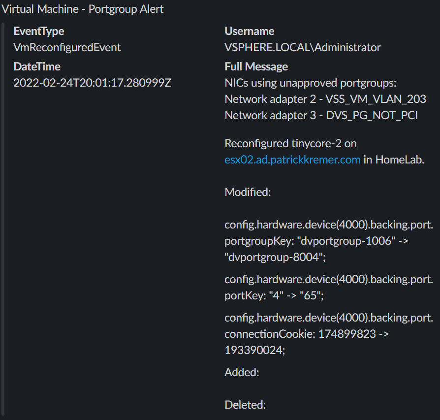

# kn-pcli-pg-check
Example Knative PowerCLI function kn-pcli-pg-check

This function creates a Slack notification when VM network portgroups are out of compliance. The original intent was to ensure that VMs tagged as PCI VMs remain on portgroups tagged as PCI portgroups. Any time the VM is edited and a portgroup is changed to a non-PCI portgroup, the function alerts via Slack.

# Step 1 - Build

> **Note:** This step is only required if you made code changes to `handler.ps1`
> or `Dockerfile`.

Create the container image locally to test your function logic.

Mac/Linux
```
# change the IMAGE name accordingly, example below for Docker
export TAG=<version>
export IMAGE=<docker-username>/kn-pcli-pg-check:${TAG}
docker build -t ${IMAGE} .
```

Windows
```
# change the IMAGE name accordingly, example below for Docker
$TAG=<version>
$IMAGE="<docker-username>/kn-pcli-pg-check:${TAG}"
docker build -t ${IMAGE} .
```
# Step 2 - Test

## Configure your vCenter

In order for this function to work, you must assign at least one vCenter tag to a virtual machine,
and one vCenter tag to a virtual network.
This function supports multiple tags. You can configure your tags in any way suitable for your
environment. You do not have to configure multiple portgroups, nor a mix of standard and
distributed portgroups.
This function was tested with the folowing configuration:

Tags
- New Tag Category named `PCI`
- New Tag named `PCI-VM` in Category `PCI`
- New Tag named `PCI-VM2` in Category `PCI`
- New Tag named `PCI-Network` in Category `PCI`

Port Groups
- New Distributed Virtual Portgroup named `DVS_PG_PCI_01`, tagged with `PCI/PCI-Network`
- New Distributed Virtual Portgroup named `DVS_PG_PCI_02`, tagged with `PCI/PCI-Network`
- New Distributed Virtual Portgroup named `DVS_PG_NOT_PCI`, no vSphere tag
- Existing Standard Virtual Portgroup named `VSS_VM_VLAN_203`, no vSphere tag

Virtual Machine
- New Virtual Machine named `tinycore-2`, tagged with `PCI/PCI-VM`
- Network Adapter 1 assigned to `DVS_PG_PCI_01`
- Network Adapter 2 assigned to `VSS_VM_VLAN_203`
- Network Adapter 3 assigned to `DVS_PG_NOT_PCI`
## Test your container image

Verify the container image works by executing it locally.

Change into the `test` directory
```console
cd test
```

Update the following variable names within the `docker-test-env-variable` file:

* `VCENTER_SERVER` - IP Address or FQDN of the vCenter Server to connect to
* `VCENTER_USERNAME` - vCenter account with permission to reconfigure distributed virtual switches
* `VCENTER_PASSWORD` - vCenter password associated with the username
* `VCENTER_CERTIFCATE_ACTION` - Set-PowerCLIConfiguration Action to configure when connection fails due to certificate error, default is Fail. (Possible values: Fail, Ignore or Warn)
* `VM_WATCH_TAGS` - vCenter tags indicating a VM belongs on the PCI segment. In this example, `PCI/PCI-VM` and `PCI/PCI-VM2`.
* `PG_WATCH_TAGS` - vCenter tags indicating a portgroup is a valid PCI segment. In this example, `PCI/PCI-Network` and `PCI/PCI-Network2`
* `SLACK_WEBHOOK_URL` - Slack webhook URL

If you built a custom image in Step 1, comment out the default `IMAGE` command below - the `docker run` command will then use use the value previously stored in the `IMAGE` variable. Otherwise, use the default image as shown below.  Start the container image by running the following commands:

Mac/Linux
```console
export TAG=<version>
export IMAGE=ghcr.io/vmware-samples/vcenter-event-broker-appliance/kn-pg-check:${TAG}
docker run -e FUNCTION_DEBUG=true -e PORT=8080 --env-file docker-test-env-variable -it --rm -p 8080:8080 ${IMAGE}
```
Windows
```console
$TAG=<version>
$IMAGE="ghcr.io/vmware-samples/vcenter-event-broker-appliance/kn-pcli-pg-check:${TAG}"
docker run -e FUNCTION_DEBUG=true -e PORT=8080 --env-file docker-test-env-variable -it --rm -p 8080:8080 ${IMAGE}
```
# Configure the payload file

In the `test` directory, edit `test-payload.json`. Locate the `Vm` section of the JSON file. Change the `Name:` property from `REPLACE-ME` to the name of a the VM you configured above. Locate the `Vm.Vm` section of the JSON file. Change the `Value` property to the object ID of the VM. One way to retrieve the object ID is using the PowerCLI `Get-VM` cmdlet

```powershell
C:\> (Get-VM "tinycore-2").id
VirtualMachine-vm-6001
```

```json
	"Vm": {
	  "Name": "REPLACE-ME",
	  "Vm": {
		"Type": "VirtualMachine",
		"Value": "REPLACE-ME"
	  }
```
For our example VM named `tinycore-2`, the relevant JSON looks like this:
```json
	"Vm": {
	  "Name": "tinycore-2",
	  "Vm": {
		"Type": "VirtualMachine",
		"Value": "vm-6001"
	  }
```

If you do not make this change, the function will fail because it will be unable to locate the virtual machine in inventory.

---

In a separate terminal, run either `send-cloudevent-test.ps1` (PowerShell Script) or `send-cloudevent-test.sh` (Bash Script) to simulate a CloudEvent payload being sent to the local container image. When run with no arguments, the scripts will send the contents of `test-payload.json` as the payload. If you pass the scripts a different filename as an argument, they will send the contents of the specified file instead. Example: `send-cloudevent-test.ps1 test-payload2.json`. This testing technique is useful when writing complex functions with varying payloads.

```console
Testing Function ...
See docker container console for output

# Output from docker container console
03/03/2022 22:23:05 - PowerShell HTTP server start listening on 'http://*:8080/'
03/03/2022 22:23:05 - Processing Init

03/03/2022 22:23:05 - Configuring PowerCLI Configuration Settings
03/03/2022 22:23:06 - Connecting to vCenter Server vc02.lab.local

IsConnected   : True
Id            : /VIServer=vsphere.local\administrator@vc02.lab.local:443/
ServiceUri    : https://vc02.lab.local/sdk
SessionSecret : "58d1ce3755ad6f35af5135c1139e03ea52898d5a"
Name          : vc02.lab.local
Port          : 443
SessionId     : "58d1ce3755ad6f35af5135c1139e03ea52898d5a"
User          : VSPHERE.LOCAL\Administrator
Uid           : /VIServer=vsphere.local\administrator@vc02.lab.local:443/
Version       : 7.0.2
Build         : 17920168
ProductLine   : vpx
InstanceUuid  : 9db92255-bc00-4e91-9777-0e37928c5771
RefCount      : 1
ExtensionData : VMware.Vim.ServiceInstance

03/03/2022 22:23:08 - Successfully connected to vc02.lab.local

03/03/2022 22:23:08 - Init Processing Completed

03/03/2022 22:23:08 - Starting HTTP CloudEvent listener
03/03/2022 22:23:10 - DEBUG: ConfigSpec.DeviceChange Is Null? False

03/03/2022 22:23:10 - DEBUG: Vm.Vm.Type Is Null? False

03/03/2022 22:23:10 - DEBUG: Vm.Vm.Value Is Null? False

03/03/2022 22:23:10 - DEBUG: vmID is VirtualMachine-vm-6001

03/03/2022 22:23:10 - Retrieving tags on tinycore-2

03/03/2022 22:23:12 - DEBUG: Tags found on VM: PCI/PCI-VM TestBedVMs/TestBed1

03/03/2022 22:23:12 - DEBUG: Tags to monitor: PCI/PCI-VM PCI/PCI-VM2

03/03/2022 22:23:12 - DEBUG: Comparing VM tag: PCI/PCI-VM on VM tinycore-2

03/03/2022 22:23:12 - DEBUG: Comparing watch tag: PCI/PCI-VM

03/03/2022 22:23:12 - DEBUG: Match found for: PCI/PCI-VM, breaking out of loop

03/03/2022 22:23:12 - Match found for tinycore-2, checking portgroups

03/03/2022 22:23:12 - DEBUG: VM tinycore-2 - NIC Network adapter 1 - PortGroup DVS_PG_PCI_01

03/03/2022 22:23:12 - DEBUG: DVS Port Group Key is dvportgroup-8004

03/03/2022 22:23:12 - DEBUG: Virtual Network ID: DistributedVirtualPortgroup-dvportgroup-8004

03/03/2022 22:23:12 - DEBUG: PortGroup Tag: PCI/PCI-Network

03/03/2022 22:23:12 - INFO: Found a match on PCI/PCI-Network

03/03/2022 22:23:12 - DEBUG: VM tinycore-2 - NIC Network adapter 2 - PortGroup VSS_VM_VLAN_203

03/03/2022 22:23:12 - DEBUG: VSS Backing network is Network-network-63

03/03/2022 22:23:12 - DEBUG: Virtual Network ID: Network-network-63

03/03/2022 22:23:12 - DEBUG: VM tinycore-2 - NIC Network adapter 3 - PortGroup DVS_PG_NOT_PCI

03/03/2022 22:23:12 - DEBUG: DVS Port Group Key is dvportgroup-9002

03/03/2022 22:23:12 - DEBUG: Virtual Network ID: DistributedVirtualPortgroup-dvportgroup-9002

03/03/2022 22:23:12 - DEBUG: PortGroup Tag: PCI/Non-PCI-Networks

03/03/2022 22:23:12 - INFO: No permitted tags were found on the portgroup

03/03/2022 22:23:12 - NICs using unapproved portgroups:

Network adapter 2 VSS_VM_VLAN_203
Network adapter 3 DVS_PG_NOT_PCI
03/03/2022 22:23:12 - DEBUG: "{
  "attachments": [
    {
      "pretext": "Virtual Machine - Portgroup Alert",
      "fields": [
        {
          "short": "false",
          "title": "EventType",
          "value": "VmReconfiguredEvent"
        },
        {
          "short": "false",
          "title": "Username",
          "value": "VSPHERE.LOCAL\\Administrator"
        },
        {
          "short": "false",
          "title": "DateTime",
          "value": "2022-02-24T20:01:17.280999Z"
        },
        {
          "short": "false",
          "title": "Full Message",
          "value": "NICs using unapproved portgroups:\nNetwork adapter 2 - VSS_VM_VLAN_203\nNetwork adapter 3 - DVS_PG_NOT_PCI\n\n\nReconfigured tinycore-2 on esx02.lab.local in HomeLab.  \n \nModified:  \n \nconfig.hardware.device(4000).backing.port.portgroupKey: \"dvportgroup-1006\" -> \"dvportgroup-8004\"; \n\nconfig.hardware.device(4000).backing.port.portKey: \"4\" -> \"65\"; \n\nconfig.hardware.device(4000).backing.port.connectionCookie: 174899823 -> 193390024; \n\n Added:  \n \n Deleted:  \n \n"
        }
      ]
    }
  ]
}"
03/03/2022 22:23:12 - Sending Webhook payload to Slack ...
03/03/2022 22:23:13 - Successfully sent Webhook ...
03/03/2022 22:23:13 - PG Check operation complete ...

03/03/2022 22:23:13 - Handler Processing Completed ...
```

You should see a Slack alert similar to this. In our test setup, Network Adapter 1 was connected to a portgroup tagged as PCI. It does not show up on the unapproved list in the Slack message below. The other two NICs do show up.



> Pro Tip - If you are rapidly iterating on the code and want to easily rebuild and launch the container,
> you can chain all of the commands together with ampersands. This will allow you to re-run
> the commands by simply pressing the `up` arrow and `Enter`.

```console
cd .. && docker build -t ${IMAGE} . && cd test && docker run -e FUNCTION_DEBUG=true -e PORT=8080 --env-file docker-test-env-variable -it --rm -p 8080:8080 ${IMAGE}
```
# Step 3 - Deploy

> **Note:** The following steps assume a working Knative environment using the
`default` Rabbit `broker`. The Knative `service` and `trigger` will be installed in the
`vmware-functions` Kubernetes namespace, assuming that the `broker` is also available there.

If you built a custom image, push it to an accessible registry such as Docker once you're done developing and testing your function logic.

```console
docker push ${IMAGE}
```

Update the `pg_check_secret.json` file with the same vCenter Server credentials and configurations that you used in `test/docker-test-env-variable` and then create the kubernetes secret which can then be accessed from within the function by using the environment variable named called `PG_CHECK_SECRET`.

```console
# create secret
kubectl -n vmware-functions create secret generic pg-check-secret --from-file=PG_CHECK_SECRET=pg_check_secret.json

# update label for secret to show up in VEBA UI
kubectl -n vmware-functions label secret pg-check-secret app=veba-ui
```

Edit the `function.yaml` file with the name of the container image from Step 1 if you made any changes. If not, the default VMware container image will suffice. By default, the function deployment will filter on the `VmReconfiguredEvent` vCenter Server Event. If you wish to change this, update the `subject` field within `function.yaml` to the desired event type.

Deploy the function to the VMware Event Broker Appliance (VEBA).

```console
# deploy function
kubectl -n vmware-functions apply -f function.yaml
```

For testing purposes, the `function.yaml` contains the following annotations, which will ensure the Knative Service Pod will always run **exactly** one instance for debugging purposes. Functions deployed through through the VMware Event Broker Appliance UI defaults to scale to 0, which means the pods will only run when it is triggered by an vCenter Event.

```yaml
annotations:
  autoscaling.knative.dev/maxScale: "1"
  autoscaling.knative.dev/minScale: "1"
```

# Step 4 - Undeploy

```console
# undeploy function

kubectl -n vmware-functions delete -f function.yaml

# delete secret
kubectl -n vmware-functions delete secret function-secret
```
