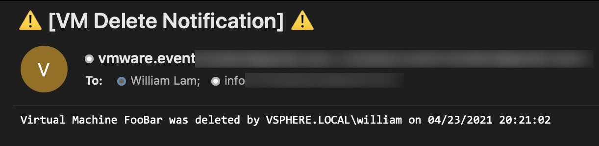

# kn-ps-email
Example Knative PowerShell function that uses [Send-MailKitMessage](https://www.powershellgallery.com/packages/Send-MailKitMessage) to send email notification when a Virtual Machine is deleted.



# Step 1 - Build

Create the container image locally to test your function logic.

```
export TAG=<version>
docker build -t <docker-username>/kn-ps-email:${TAG} .
```

# Step 2 - Test

Verify the container image works by executing it locally.

Change into the `test` directory
```console
cd test
```

Update the following variable names  within the `docker-test-env-variable` file

* SMTP_SERVER - Address of Email Server
* SMTP_PORT - Port of Email Server
* SMTP_USERNAME - Username to send email (use empty string for no username)
* SMTP_PASSWORD - Password to send email (use empty string for no password)
* EMAIL_SUBJECT - Subject to use for email
* EMAIL_TO - Recipient email address (comma separated)
* EMAIL_FROM - Sender email address to use

Start the container image by running the following command:

```console
docker run -e FUNCTION_DEBUG=true -e PORT=8080 --env-file docker-test-env-variable -it --rm -p 8080:8080 <docker-username>/kn-ps-email:${TAG}
```

In a separate terminal, run either `send-cloudevent-test.ps1` (PowerShell Script) or `send-cloudevent-test.sh` (Bash Script) to simulate a CloudEvent payload being sent to the local container image

```

Testing Function ...
See docker container console for output

# Output from docker container console
Server start listening on 'http://*:8080/'
DEBUG: K8s Secrets:
....
DEBUG: CloudEventData
 {
  "Vm": {
    "Vm": {
      "Type": "VirtualMachine",
      "Value": "vm-10838"
    },
    "Name": "FooBar"
  },
  "Key": 2040013,
  "Ds": null,
  "Dvs": null,
  "CreatedTime": "2021-04-23T20:21:02.277Z",
  "Net": null,
  "ChainId": 2040012,
  "ComputeResource": {
    "ComputeResource": {
      "Type": "ClusterComputeResource",
      "Value": "domain-c8"
    },
    "Name": "Supermicro-Cluster"
  },
  "UserName": "VSPHERE.LOCAL\\william",
  "ChangeTag": "",
  "Datacenter": {
    "Datacenter": {
      "Type": "Datacenter",
      "Value": "datacenter-3"
    },
    "Name": "Primp-Datacenter"
  },
  "Host": {
    "Host": {
      "Type": "HostSystem",
      "Value": "host-11"
    },
    "Name": "192.168.30.5"
  },
  "Template": false,
  "FullFormattedMessage": "Removed FooBar on 192.168.30.5 from Primp-Datacenter"
}

Sending Secure Email ...
```

# Step 3 - Deploy

> **Note:** The following steps assume a working Knative environment using the
`default` Rabbit `broker`. The Knative `service` and `trigger` will be installed in the
`vmware-functions` Kubernetes namespace, assuming that the `broker` is also available there.

Push your container image to an accessible registry such as Docker once you're done developing and testing your function logic.

```console
docker push <docker-username>/kn-ps-email:${TAG}
```

Update the `email_secret.json` file with your email configurations and then create the kubernetes secret which can then be accessed from within the function by using the environment variable named called `EMAIL_SECRET`.

```console
# create secret

kubectl -n vmware-functions create secret generic email-secret --from-file=EMAIL_SECRET=email_secret.json

# update label for secret to show up in VEBA UI
kubectl -n vmware-functions label secret email-secret app=veba-ui
```

Edit the `function.yaml` file with the name of the container image from Step 1 if you made any changes. If not, the default VMware container image will suffice. By default, the function deployment will filter on the `VmRemovedEvent` vCenter Server Event. If you wish to change this, update the `subject` field within `function.yaml` to the desired event type.


Deploy the function to the VMware Event Broker Appliance (VEBA).

```console
# deploy function

kubectl -n vmware-functions apply -f function.yaml
```

For testing purposes, the `function.yaml` contains the following annotations, which will ensure the Knative Service Pod will always run **exactly** one instance for debugging purposes. Functions deployed through through the VMware Event Broker Appliance UI defaults to scale to 0, which means the pods will only run when it is triggered by an vCenter Event.

```yaml
annotations:
  autoscaling.knative.dev/maxScale: "1"
  autoscaling.knative.dev/minScale: "1"
```

# Step 4 - Undeploy

```console
# undeploy function

kubectl -n vmware-functions delete -f function.yaml

# delete secret
kubectl -n vmware-functions delete secret email-secret
```