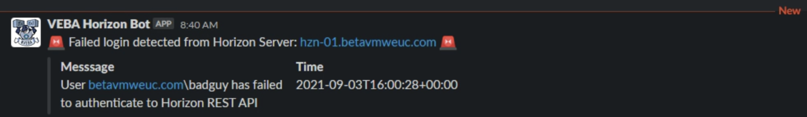

# kn-ps-horizon-login-slack
Example Knative PowerShell function for sending a Slack notification when a failed login to VMware Horizon has occurred.



# Step 1 - Build


Create the container image locally to test your function logic.

```
export TAG=<version>
docker build -t <docker-username>/kn-ps-horizon-login-slack:${TAG} .
```

# Step 2 - Test

Verify the container image works by executing it locally.

Change into the `test` directory
```console
cd test
```

Update the following variable names within the `docker-test-env-variable` file

* SLACK_WEBHOOK_URL - Slack webhook URL

Start the container image by running the following command:

```console
docker run -e FUNCTION_DEBUG=true -e PORT=8080 --env-file docker-test-env-variable -it --rm -p 8080:8080 <docker-username>/kn-ps-horizon-login-slack:${TAG}
```

In a separate terminal, run either `send-cloudevent-test.ps1` (PowerShell Script) or `send-cloudevent-test.sh` (Bash Script) to simulate a CloudEvent payload being sent to the local container image

```console
Testing Function ...
See docker container console for output

# Output from docker container console
Id     Name            PSJobTypeName   State         HasMoreData     Location
--     ----            -------------   -----         -----------     --------
2      Job2            ThreadJob       NotStarted    False           PowerShell
09/11/2021 15:40:11 - PowerShell HTTP server start listening on 'http://*:8080/'
09/11/2021 15:40:11 - Processing Init

09/11/2021 15:40:11 - Init Processing Completed

09/11/2021 15:40:20 - DEBUG: K8s Secrets:
{"SLACK_WEBHOOK_URL":"https://hooks.slack.com/services/XXX"}

09/11/2021 15:40:20 - DEBUG: CloudEventData

Name                           Value
----                           -----
severity                       AUDIT_FAIL
id                             166419
time                           1630684828187
machine_dns_name               hz-01.vmware.corp
message                        User vmware.corp\badguy has failed to authentica…
module                         Vlsi
type                           VLSI_USERLOGIN_REST_FAILED

09/11/2021 15:40:20 - DEBUG: "{
  "attachments": [
    {
      "pretext": ":rotating_light: Failed login detected from Horizon Server: hz-01.vmware.corp :rotating_light:",
      "fields": [
        {
          "value": "User vmware.corp\\badguy has failed to authenticate to Horizon REST API",
          "short": "false",
          "title": "Messsage"
        },
        {
          "value": "2021-09-03T16:00:28+00:00",
          "short": "false",
          "title": "Time"
        }
      ]
    }
  ]
}"
09/11/2021 15:40:20 - Sending Webhook payload to Slack ...
09/11/2021 15:40:21 - Successfully sent Webhook ...
```

# Step 3 - Deploy

> **Note:** The following steps assume a working Knative environment using the
`default` Rabbit `broker`. The Knative `service` and `trigger` will be installed in the
`vmware-functions` Kubernetes namespace, assuming that the `broker` is also available there.

Push your container image to an accessible registry such as Docker once you're done developing and testing your function logic.

```console
docker push <docker-username>/kn-ps-horizon-login-slack:${TAG}
```

Update the `slack_secret.json` file with your Slack webhook configurations and then create the kubernetes secret which can then be accessed from within the function by using the environment variable named called `SLACK_SECRET`.

```console
# create secret

kubectl -n vmware-functions create secret generic slack-secret --from-file=SLACK_SECRET=slack_secret.json

# update label for secret to show up in VEBA UI
kubectl -n vmware-functions label secret slack-secret app=veba-ui
```

Edit the `function.yaml` file with the name of the container image from Step 1 if you made any changes. If not, the default VMware container image will suffice. By default, the function deployment will filter on the `com.vmware.event.router/horizon.vlsi_userlogin_rest_failed.v0` VMware Horizon Event. If you wish to change this, update the `type` field within `function.yaml` to the desired event type. Please [see this resources](https://williamlam.com/2021/08/listing-all-vmware-horizon-events.html) for complete listing of VMware Horizon Events.


Deploy the function to the VMware Event Broker Appliance (VEBA).

```console
# deploy function

kubectl -n vmware-functions apply -f function.yaml
```

For testing purposes, the `function.yaml` contains the following annotations, which will ensure the Knative Service Pod will always run **exactly** one instance for debugging purposes. Functions deployed through through the VMware Event Broker Appliance UI defaults to scale to 0, which means the pods will only run when it is triggered by an VMware Horizon Event.

```yaml
annotations:
  autoscaling.knative.dev/maxScale: "1"
  autoscaling.knative.dev/minScale: "1"
```

# Step 4 - Undeploy

```console
# undeploy function

kubectl -n vmware-functions delete -f function.yaml

# delete secret
kubectl -n vmware-functions delete secret slack-secret
```