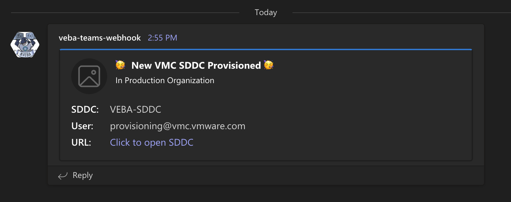

# kn-ps-ngw-teams
Example Knative PowerShell function for sending a [Microsoft Team](https://www.microsoft.com/en-us/microsoft-teams/group-chat-software) notification when a VMware Cloud on AWS SDDC is provisioned.



## Prerequisites

* Deploy the latest VEBA appliance with the webhook feature enabled, configured with a trusted TLS Certificate and accessible from the VMware Cloud Notification service. For more details, please see the instructions [here](http://www.patrickkremer.com/vmware-event-broker-appliance-part-vii-public-certificates-with-lets-encrypt/)
* Publish custom VMware Cloud Notification Gateway Events to VEBA using the VMware Cloud Notification Gateway (NGW) service, please see the instructions [here](https://williamlam.com/2021/09/publishing-and-consuming-custom-events-with-vmware-event-broker-appliance-veba.html)

> **Note:** VEBA must be accessible by the VMware Cloud Notification service. To protect and limit access to your VEBA instance, you can configure your external firewall to only allow traffic that originate from the VMware Cloud Notification service using the following IP Addresses (54.184.76.163, 44.226.97.82, 54.188.164.72).

# Step 1 - Build

Create the container image locally to test your function logic.

```
export TAG=<version>
docker build -t <docker-username>/kn-ps-ngw-teams:${TAG} .
```

# Step 2 - Test

Verify the container image works by executing it locally.

Change into the `test` directory
```console
cd test
```

Update the following variable names within the `docker-test-env-variable` file

* TEAMS_WEBHOOK_URL - Microsoft Teams webhook URL

Start the container image by running the following command:

```console
docker run -e FUNCTION_DEBUG=true -e PORT=8080 --env-file docker-test-env-variable -it --rm -p 8080:8080 <docker-username>/kn-ps-ngw-teams:${TAG}
```

In a separate terminal, run either `send-cloudevent-test.ps1` (PowerShell Script) or `send-cloudevent-test.sh` (Bash Script) to simulate a CloudEvent payload being sent to the local container image

```console
Testing Function ...
See docker container console for output

# Output from docker container console
Id     Name            PSJobTypeName   State         HasMoreData     Location             Command
--     ----            -------------   -----         -----------     --------             -------
2      Job2            ThreadJob       NotStarted    False           PowerShell           …
09/14/2021 21:49:48 - PowerShell HTTP server start listening on 'http://*:8080/'
09/14/2021 21:49:48 - Processing Init

09/14/2021 21:49:48 - Init Processing Completed

09/14/2021 21:49:51 - DEBUG: K8s Secrets:
{"TEAMS_WEBHOOK_URL":"XXX"}

09/14/2021 21:49:51 - DEBUG: CloudEventData

Name                           Value
----                           -----
resource_id                    315a4b5a-25d2-476f-879e-4c6b27224e1b
org_id                         b12345e8-48f1-4517-99fe-0bddc753e999
message_username               provisioning@vmc.vmware.com
resource                       SDDC
message                        Deployment of SDDC
resource_name                  VEBA-SDDC
org_name                       Production

09/14/2021 21:49:51 - Sending notification to Microsoft Teams ...
09/14/2021 21:49:57 - Successfully sent notification to Microsoft Teams ...
```

# Step 3 - Deploy

> **Note:** The following steps assume a working Knative environment using the
`default` Rabbit `broker`. The Knative `service` and `trigger` will be installed in the
`vmware-functions` Kubernetes namespace, assuming that the `broker` is also available there.

Push your container image to an accessible registry such as Docker once you're done developing and testing your function logic.

```console
docker push <docker-username>/kn-ps-ngw-teams:${TAG}
```

Update the `teams_secret.json` file with your Microsoft Teams webhook configurations and then create the kubernetes secret which can then be accessed from within the function by using the environment variable named called `TEAMS_SECRET`.

```console
# create secret

kubectl -n vmware-functions create secret generic teams-secret --from-file=TEAMS_SECRET=teams_secret.json

# update label for secret to show up in VEBA UI
kubectl -n vmware-functions label secret teams-secret app=veba-ui
```

Edit the `function.yaml` file with the name of the container image from Step 1 if you made any changes. If not, the default VMware container image will suffice. By default, the function deployment will filter on a custom `vmware.vmc.SDDC-PROVISION.v0` VMware Cloud Notification Gateway Event. If you wish to change this, update the `type` field within `function.yaml` to the desired event type.

Deploy the function to the VMware Event Broker Appliance (VEBA).

```console
# deploy function

kubectl -n vmware-functions apply -f function.yaml
```

For testing purposes, the `function.yaml` contains the following annotations, which will ensure the Knative Service Pod will always run **exactly** one instance for debugging purposes. Functions deployed through through the VMware Event Broker Appliance UI defaults to scale to 0, which means the pods will only run when it is triggered by an vCenter Event.

```yaml
annotations:
  autoscaling.knative.dev/maxScale: "1"
  autoscaling.knative.dev/minScale: "1"
```

# Step 4 - Undeploy

```console
# undeploy function

kubectl -n vmware-functions delete -f function.yaml

# delete secret
kubectl -n vmware-functions delete secret teams-secret
```