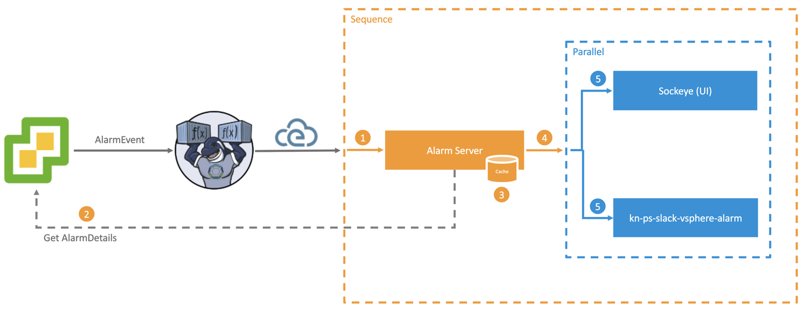
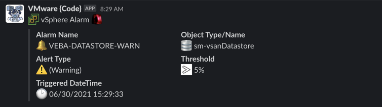

# kn-ps-slack-vsphere-alarm

Example Knative PowerShell function for sending to a Slack webhook when a vSphere Alarm is triggered leveraging [Knative Flows (Sequence and Parallel)](https://knative.dev/docs/eventing/flows/) constructs. This example also uses (deploys) the [vSphere Alarm Server](https://github.com/embano1/vsphere-alarm-server) to enrich vSphere Alarms with useful information, reduce the number of vCenter roundtrips (latency) and simplify the logic of the function in this example.

The example below currently forwards **all** "enriched" vSphere Alarm Events to the function. To restrict or limit the function applicability, you can filter on the specific vSphere Alarm name. For further details, please refer to the `handler.ps1` example.





# Step 1 - Build


Create the container image locally to test your function logic.

```
export TAG=<version>
docker build -t <docker-username>/kn-ps-slack-vsphere-alarm:${TAG} .
```

# Step 2 - Test

Verify the container image works by executing it locally.

Change into the `test` directory
```console
cd test
```

Update the following variable names within the `docker-test-env-variable` file

* `SLACK_WEBHOOK_URL` - Slack webhook URL

Start the container image by running the following command:

```console
docker run -e FUNCTION_DEBUG=true -e PORT=8080 --env-file docker-test-env-variable -it --rm -p 8080:8080 <docker-username>/kn-ps-slack-vsphere-alarm:${TAG}
```

In a separate terminal, run either `send-cloudevent-test.ps1` (PowerShell Script) or `send-cloudevent-test.sh` (Bash Script) to simulate a CloudEvent payload being sent to the local container image

```console
Testing Function ...
See docker container console for output

# Output from docker container console
06/30/2021 14:08:03 - PowerShell HTTP server start listening on 'http://*:8080/'
06/30/2021 14:08:03 - Processing Init

06/30/2021 14:08:03 - Init Processing Completed

06/30/2021 14:12:42 - DEBUG: K8s Secrets:
{"SLACK_WEBHOOK_URL":"************"}

06/30/2021 14:12:42 - DEBUG: CloudEventData

Name                           Value
----                           -----
Entity                         {Name, Entity}
Net
FullFormattedMessage           Alarm 'VEBA-DATASTORE-WARN' on sm-vsanDatastore cha…
To                             yellow
ChangeTag
ComputeResource
CreatedTime                    06/30/2021 13:57:22
Host
From                           gray
Datacenter                     {Name, Datacenter}
Dvs
Vm
Key                            4269111
ChainId                        4269111
Ds                             {Name, Datastore}
UserName
Source                         {Name, Entity}
AlarmInfo                      {SystemName, Enabled, Entity, Alarm…}
Alarm                          {Name, Alarm}

DEBUG:
AlarmName: VEBA-DATASTORE-WARN
AlarmDataTime: 06/30/2021 13:57:22
ObjectType: :database-6178:
ObjectStatus: Warning
ObjectName: sm-vsanDatastore
ObjectColor: :warning:
ObjectOperator: :gt:
ObjectPercentage: 5
DEBUG: "{
  "attachments": [
    {
      "pretext": ":vsphere_icon: vSphere Alarm :alert:",
      "fields": [
        {
          "title": "Alarm Name",
          "value": ":bell: VEBA-DATASTORE-WARN",
          "short": "false"
        },
        {
          "title": "Object Type/Name",
          "value": ":database-6178: sm-vsanDatastore",
          "short": "false"
        },
        {
          "title": "Alert Type",
          "value": ":warning: (Warning)",
          "short": "false"
        },
        {
          "title": "Threshold",
          "value": ":gt: 5%",
          "short": "false"
        },
        {
          "title": "Triggered DateTime",
          "value": ":clock2: 06/30/2021 13:57:22",
          "short": "false"
        }
      ]
    }
  ]
}"
Sending Webhook payload to Slack ...
Successfully sent Webhook ...
```

# Step 3 - Deploy

The following steps assume a working Knative environment using the
`default` Rabbit `broker`. The Knative `service` and `trigger` will be installed in the
`vmware-functions` Kubernetes namespace, assuming that the `broker` is also available there.

## Push Image

> **Note** this step is only required if you made changes to the function code. Otherwise you can skip the `docker push` and use the image provided in this example.

Push your container image to an accessible registry such as Docker once you're done developing and testing your function logic.

```console
docker push <docker-username>/kn-ps-slack-vsphere-alarm:${TAG}
```

## Create vCenter Secret

Update the `slack_secret.json` file with your Slack webhook configurations and then create the kubernetes secret which can then be accessed from within the function by using the environment variable named called `SLACK_SECRET`.

```console
# create secret

kubectl -n vmware-functions create secret generic slack-secret --from-file=SLACK_SECRET=slack_secret.json

# update label for secret to show up in VEBA UI
kubectl -n vmware-functions label secret slack-secret app=veba-ui
```

Create the kubernetes `vsphere-credentials ` secret which will be used by the vSphere Alarm Service to connect to the vCenter Server to retrieve the additional information for a given vSphere Alarm event.

```console
kubectl -n vmware-functions create secret generic vsphere-credentials --from-literal=username=<vcenter-username> --from-literal=password=<vcenter-password>
```

## Deploy the vSphere Alarm Server

Download the latest deployment manifest for the [vSphere Alarm Server](https://github.com/embano1/vsphere-alarm-server).

```console
curl -L -O https://github.com/embano1/vsphere-alarm-server/releases/latest/download/release.yaml
```

Edit the `release.yaml` file and update the `VCENTER_URL` to the vCenter Server. You may also need to update the value of `VCENTER_INSECURE` if a self-signed TLS certificate is being used by the vCenter Server.

Deploy the vSphere Alarm Server.
```console
kubectl -n vmware-functions apply -f release.yaml
```

## Deploy In-Memory Channel

Deploy the Knative In-Memory Channel which is required when using Knative `Sequence` and `Parallels` since the RabbitMQ `broker` currently does not support these.

```console
kubectl apply -f in-memory-channel.yaml
```

## Deploy the Function and its Components

Edit the `parallel.yaml` file with the name of the container image from Step 1 **if you made any changes to the function code**. If not, the default VMware container image will suffice and you can keep the defaults.

Deploy the functions to the VMware Event Broker Appliance (VEBA).

```console
kubectl -n vmware-functions apply -f function.yaml
```

For testing purposes, the `function.yaml` contains the following annotations, which will ensure the Knative Service Pod will always run **exactly** one instance for debugging purposes. Functions deployed through through the VMware Event Broker Appliance UI defaults to scale to 0, which means the pods will only run when it is triggered by an vCenter Event.

```yaml
annotations:
  autoscaling.knative.dev/maxScale: "1"
  autoscaling.knative.dev/minScale: "1"
```

# Step 4 - Undeploy

```console
# undeploy function and in-mem channel
kubectl -n vmware-functions delete -f function.yaml
kubectl delete -f in-memory-channel.yaml

# delete secret
kubectl -n vmware-functions delete secret slack-secret
```