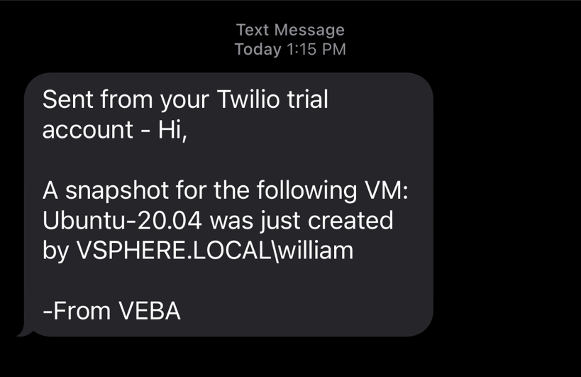

# kn-ps-twillo-sms
Example Knative PowerShell function to [send SMS message](https://www.twilio.com/docs/sms/send-messages) using the [Twillio](https://www.twilio.com/) service.



# Step 1 - Build

Create the container image locally to test your function logic.

```
export TAG=<version>
docker build -t <docker-username>/kn-ps-twillo-sms:${TAG} .
```

# Step 2 - Test

Verify the container image works by executing it locally.

Change into the `test` directory
```console
cd test
```

Update the following variable names within the `docker-test-env-variable` file

* TWILLO_BASE_API_URL_ENDPOINT - The current base URL for Twillo's REST API is `https://api.twilio.com/2010-04-01`. For more information, please refer to [Twillo's REST API documentation](https://www.twilio.com/docs/sms/api)
* TWILLO_SID - Twillo Account SID which can be found under your project info
* TWILLO_AUTH_TOKEN - Twillo auth token which can be found under your project info
* TWILLO_NUMBER - Twillo source phone number to send SMS messages from. Must be prefix with +1 country code and number (e.g. +14151234567)
* SMS_DESTINATION_NUMBER - Destination phone number to receive SMS messages from Twillo. Must be prefix with +1 country code and number (e.g. +14151234567)

Start the container image by running the following command:

```console
docker run -e FUNCTION_DEBUG=true -e PORT=8080 --env-file docker-test-env-variable -it --rm -p 8080:8080 <docker-username>/kn-ps-twillo-sms:${TAG}
```

In a separate terminal, run either `send-cloudevent-test.ps1` (PowerShell Script) or `send-cloudevent-test.sh` (Bash Script) to simulate a CloudEvent payload being sent to the local container image

```console
Testing Function ...
See docker container console for output

# Output from docker container console
07/12/2021 19:48:43 - PowerShell HTTP server start listening on 'http://*:8080/'
07/12/2021 19:48:43 - Processing Init

07/12/2021 19:48:43 - Init Processing Completed

07/12/2021 19:48:46 - [Function Secrets]:
{"TWILLO_BASE_API_URL_ENDPOINT": "https://api.twilio.com/2010-04-01","TWILLO_SID": "********","TWILLO_AUTH_TOKEN": "********","TWILLO_NUMBER": "********","SMS_DESTINATION_NUMBER": "********"}

07/12/2021 19:48:46 - [CloudEventData]:

Name                           Value
----                           -----
Info                           {State, StartTime, ChangeTag, ActivationId…}
CreatedTime                    07/12/2021 15:42:53
ComputeResource                {ComputeResource, Name}
Vm                             {Vm, Name}
Dvs
Key                            4671568
Net
Host                           {Host, Name}
UserName                       VSPHERE.LOCAL\Administrator
Ds
ChainId                        4671568
Datacenter                     {Datacenter, Name}
FullFormattedMessage           Task: Create virtual machine snapshot
ChangeTag

07/12/2021 19:48:46 - Sending SMS Message
07/12/2021 19:48:46 - Successfully sent SMS message
```

# Step 3 - Deploy

> **Note:** The following steps assume a working Knative environment using the
`default` Rabbit `broker`. The Knative `service` and `trigger` will be installed in the
`vmware-functions` Kubernetes namespace, assuming that the `broker` is also available there.

Push your container image to an accessible registry such as Docker once you're done developing and testing your function logic.

```console
docker push <docker-username>/kn-ps-twillo-sms:${TAG}
```

Update the `sms_secret.json` file with your Twillo credentials and configuration and then create the kubernetes secret which can then be accessed from within the function by using the environment variable named `SMS_SECRET`.

```console
# create secret

kubectl -n vmware-functions create secret generic sms-secret --from-file=SMS_SECRET=sms_secret.json

# update label for secret to show up in VEBA UI
kubectl -n vmware-functions label secret sms-secret app=veba-ui
```

Edit the `function.yaml` file with the name of the container image from Step 1 if you made any changes. If not, the default VMware container image will suffice. By default, the function deployment will filter on the `TaskEvent` vCenter Server Event and VM snapshot creation task. For more details on identifying a specific task descriptionId from a TaskEvent, please [see this blog post](https://williamlam.com/2019/02/creating-vcenter-alarms-based-on-task-events-such-as-folder-creation.html) for more details. If you wish to change this, update the `subject` field within `function.yaml` to the desired event type.

Deploy the function to the VMware Event Broker Appliance (VEBA).

```console
# deploy function

kubectl -n vmware-functions apply -f function.yaml
```

For testing purposes, the `function.yaml` contains the following annotations, which will ensure the Knative Service Pod will always run **exactly** one instance for debugging purposes. Functions deployed through the VMware Event Broker Appliance UI defaults to scale to 0, which means the pods will only run when it is triggered by an vCenter Event.

```yaml
annotations:
  autoscaling.knative.dev/maxScale: "1"
  autoscaling.knative.dev/minScale: "1"
```

# Step 4 - Undeploy

```console
# undeploy function

kubectl -n vmware-functions delete -f function.yaml

# delete secret
kubectl -n vmware-functions delete secret sms-secret
```