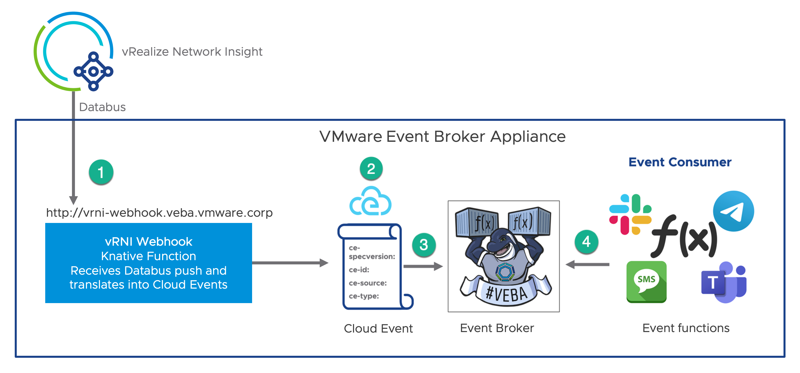
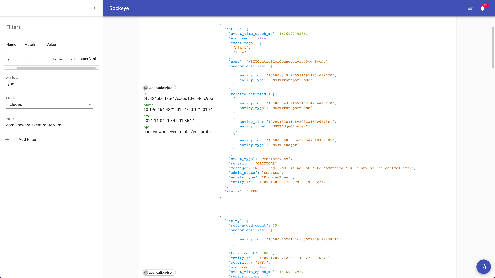

# vRealize Network Insight Databus Incoming Webhook

Example Knative PowerShell function that accepts an incoming webhook from the vRealize Network Insight Databus, constructs a CloudEvent and sends it to the VMware Event Router (`broker`).



The `CloudEvent` will be constructed with the following parameters and values:

* **Source:** - Hostname (FQDN)
* **Timestamp:** - Current Time of incoming request
* **ID:** - v4 UUID
* **Type:**
  * `com.vmware.event.router/vrni.problem.opened.v0` (alerts)
  * `com.vmware.event.router/vrni.problem.updated.v0` (alerts)
  * `com.vmware.event.router/vrni.problem.closed.v0` (alerts)
  * `com.vmware.event.router/vrni.application.v0` (application updates)
* **Subject:** (not-set)
* **Data:** - Incoming body payload from vRealize Network Insight Databus (encoded using UTF8 and in a JSON format)

## Prerequisites

* VEBA deployed with a [wildcard DNS entry](https://en.wikipedia.org/wiki/Wildcard_DNS_record), which is required for the ability to externally invoke a Knative Service URL that is serving the custom webhook function. Please [refer to this blog post](https://williamlam.com/2021/09/custom-webhook-function-to-publish-events-into-vmware-event-broker-appliance-veba.html) for more information.

# Step 1 - Build

Create the container image locally to test your function logic.

```console
export TAG=<version>
docker build -t <docker-username>/kn-ps-vrni-databus:${TAG} .
```

# Step 2 - Test

Verify the container image works by executing it locally.

Change into the `test` directory
```console
cd test
```

Update the following variable names within the `docker-test-env-variable` file and either the `send-local-webhook-test.ps1` (PowerShell Script) or `send-local-webhook-test.sh` (Bash Script)

* `WEBHOOK_SINK_URL` - The sink URL (e.g. http://default-broker-ingress.vmware-functions.svc.cluster.local) to send the CloudEvent (leave blank for default internal URL)

Start the container image by running the following command:

```console
docker run -e SERVICE_TEST=true -e SERVICE_DEBUG=true -e PORT=8080 --env-file docker-test-env-variable -it --rm -p 8080:8080 <docker-username>/kn-ps-vrni-databus:${TAG}
```

In a separate terminal, run either `send-local-webhook-test.ps1` (PowerShell Script) or `send-local-webhook-test.sh` (Bash Script) to simulate a payload being sent to the local container image

```console
Testing Function ...
See docker container console for output

# Output from docker container console
Id     Name            PSJobTypeName   State         HasMoreData     Location             Command
--     ----            -------------   -----         -----------     --------             -------
2      Job2            ThreadJob       NotStarted    False           PowerShell           …
11/04/2021 11:19:01 - PowerShell HTTP server start listening on 'http://*:8080/'
11/04/2021 11:19:01 - Processing Init

11/04/2021 11:19:01 - Init Processing Completed

11/04/2021 11:19:03 - Unable to get remote client, setting CloudEvent source to function hostname
11/04/2021 11:19:03 - [Headers]:

Name                           Value
----                           -----
Accept                         {*/*}
User-Agent                     {curl/7.77.0}
Content-Length                 {3750}
Host                           {localhost:8080}
Content-Type                   {application/json}


11/04/2021 11:19:03 - [Body]:

{	"EntityMessageList": [..big array of data..]}

11/04/2021 11:19:03 - Creating CloudEvents...

11/04/2021 11:19:03 - Running in local development: not sending CloudEvent to VMware Event Broker
```

# Step 3 - Deploy

> **Note:** The following steps assume a working Knative environment using the
`default` Rabbit `broker`. The Knative `service` and `trigger` will be installed in the
`vmware-functions` Kubernetes namespace, assuming that the `broker` is also available there.

Push your container image to an accessible registry such as Docker once you're done developing and testing your function logic.

```console
docker push <docker-username>/kn-ps-vrni-databus:${TAG}
```

---
> **Note:** If you deploy this function to a VEBA environment, not change is needed to the webhook_config.json. In all other cases, update the file with the sink address where the function should send the CloudEvent to.

Update the `webhook_config.json` file with your webhook configuration and then create the kubernetes secret which can then be accessed from within the function by using the environment variable named called `WEBHOOK_CONFIG`.

```console
# create secret

kubectl -n vmware-functions create secret generic webhook-config --from-file=WEBHOOK_CONFIG=webhook_config.json

# update label for secret to show up in VEBA UI
kubectl -n vmware-functions label secret webhook-config app=veba-ui
```

---

Edit the `function.yaml` file with the name of the container image from Step 1 if you made any changes. If not, the default VMware container image will suffice.

Deploy the function to the VMware Event Broker Appliance (VEBA).

```console
# deploy function

kubectl -n vmware-functions apply -f function.yaml
```

For testing purposes, the `function.yaml` contains the following annotations, which will ensure the Knative Service Pod will always run **exactly** one instance for debugging purposes. Functions deployed through through the VMware Event Broker Appliance UI defaults to scale to 0, which means the pods will only run when it is triggered by an vCenter Event.

```yaml
annotations:
  autoscaling.knative.dev/maxScale: "1"
  autoscaling.knative.dev/minScale: "1"
```

# Step 4 - Verify webhook function

Retrieve the Knative service URL for the deployed function. In the example below, the name of the function is called `kn-ps-vrni-databus` and ensure the the `READY` field shows `True`.

```console
# kubectl -n vmware-functions get ksvc kn-ps-vrni-databus

NAME                 URL                                                                 LATESTCREATED              LATESTREADY                READY   REASON
kn-ps-vrni-databus   http://kn-ps-vrni-databus.vmware-functions.veba.vrni.cmbu.local     kn-ps-vrni-databus-00001   kn-ps-vrni-databus-00001   True
```

Change into the `test` directory
```console
cd test
```

Update the following variable names within the `send-webhook-to-veba.sh` script:

* `WEBHOOK_FUNCTION_URL` - Knative service URL for deployed webhook function (retrieved in step above)

Run the `send-webhook-to-veba.sh` script to send test payload to Knative service URL and verify the success by ensuring HTTP status of 200 is returned.

```console
# ./send-webhook-to-veba.sh

Testing Function ...
HTTP/2 200
content-length: 0
date: Mon, 4 Nov 2021 11:42:01 GMT
server: envoy
x-envoy-upstream-service-time: 25
```

> **Note:** You can also use the VMware Event Broker Appliance Event Viewer (e.g. *https://[VEBA-FQDN]/events*) and filter on the event `type` of `com.vmware.event.router/vrni.problem.opened.v0` or `com.vmware.event.router/vrni.application.v0`. In this example payload, both event types are sent and once the filter has been created, you should now see the custom event processed by the VMware Event Broker Appliance upon running the `send-webhook-to-veba.sh` script.



# Step 5 - Undeploy

```console
# undeploy function

kubectl -n vmware-functions delete -f function.yaml

# delete secret
kubectl -n vmware-functions delete secret webhook-config
```