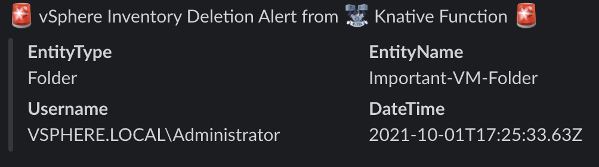

# kn-ps-vsphere-inv-slack
Example Knative PowerShell function for sending a Slack notification when a specific vSphere inventory resource (e.g. VM Folder, Resource Pool, etc.) has been deleted.



**Note:** The current example demonstrates two vSphere inventory resource being monitored: VM Folder and Resource Pool. Additional vSphere inventory objects can be added to `$inventoryOperationsProcess` variable within the `handler.ps1` script.

# Step 1 - Build

Create the container image locally to test your function logic.

```
export TAG=<version>
docker build -t <docker-username>/kn-ps-vsphere-inv-slack:${TAG} .
```

# Step 2 - Test

Verify the container image works by executing it locally.

Change into the `test` directory
```console
cd test
```

Update the following variable names within the `docker-test-env-variable` file

* SLACK_WEBHOOK_URL - Slack webhook URL

Start the container image by running the following command:

```console
docker run -e FUNCTION_DEBUG=true -e PORT=8080 --env-file docker-test-env-variable -it --rm -p 8080:8080 <docker-username>/kn-ps-vsphere-inv-slack:${TAG}
```

In a separate terminal, run either `send-cloudevent-test.ps1` (PowerShell Script) or `send-cloudevent-test.sh` (Bash Script) to simulate a CloudEvent payload being sent to the local container image. An additional CloudEvent example is included in `test-payload-2.json` for a vSphere ResourcePool deletion. If you wish to use this example, simply update the PowerShell or Shell Script and replace that with the `test-payload-2.json` file for testing purposes.

```console
Testing Function ...
See docker container console for output

# Output from docker container console
10/01/2021 19:05:28 - PowerShell HTTP server start listening on 'http://*:8080/'
10/01/2021 19:05:28 - Processing Init

10/01/2021 19:05:28 - Init Processing Completed

10/01/2021 19:05:28 - Starting HTTP CloudEvent listener
10/01/2021 19:05:32 - DEBUG: K8s Secrets:
{"SLACK_WEBHOOK_URL":"XXX"}

10/01/2021 19:05:32 - DEBUG: CloudEventData

Name                           Value
----                           -----
Datacenter                     {Name, Datacenter}
CreatedTime                    10/01/2021 17:25:33
ComputeResource
Dvs
Net
Ds
Host
Info                           {ActivationId, Entity, Result, Reason…}
ChainId                        8480217
FullFormattedMessage           Task: Unregister and Delete
UserName                       VSPHERE.LOCAL\Administrator
ChangeTag
Key                            8480217
Vm

10/01/2021 19:05:32 - DEBUG: "{
  "attachments": [
    {
      "fields": [
        {
          "value": "Folder",
          "short": "false",
          "title": "EntityType"
        },
        {
          "value": "Important-VM-Folder",
          "short": "false",
          "title": "EntityName"
        },
        {
          "value": "VSPHERE.LOCAL\\Administrator",
          "short": "false",
          "title": "Username"
        },
        {
          "value": "2021-10-01T17:25:33.63Z",
          "short": "false",
          "title": "DateTime"
        }
      ],
      "pretext": ":rotating_light: vSphere Inventory Deletion Alert from :veba: Knative Function :rotating_light:"
    }
  ]
}"
10/01/2021 19:05:32 - Sending Webhook payload to Slack ...
10/01/2021 19:05:32 - Successfully sent Webhook ...
```

# Step 3 - Deploy

> **Note:** The following steps assume a working Knative environment using the
`default` Rabbit `broker`. The Knative `service` and `trigger` will be installed in the
`vmware-functions` Kubernetes namespace, assuming that the `broker` is also available there.

Push your container image to an accessible registry such as Docker once you're done developing and testing your function logic.

```console
docker push <docker-username>/kn-ps-vsphere-inv-slack:${TAG}
```

Update the `slack_secret.json` file with your Slack webhook configurations and then create the kubernetes secret which can then be accessed from within the function by using the environment variable named called `SLACK_SECRET`.

```console
# create secret

kubectl -n vmware-functions create secret generic slack-secret --from-file=SLACK_SECRET=slack_secret.json

# update label for secret to show up in VEBA UI
kubectl -n vmware-functions label secret slack-secret app=veba-ui
```

Edit the `function.yaml` file with the name of the container image from Step 1 if you made any changes. If not, the default VMware container image will suffice. By default, the function deployment will filter on the `VmPoweredOffEvent` vCenter Server Event. If you wish to change this, update the `subject` field within `function.yaml` to the desired event type.


Deploy the function to the VMware Event Broker Appliance (VEBA).

```console
# deploy function

kubectl -n vmware-functions apply -f function.yaml
```

For testing purposes, the `function.yaml` contains the following annotations, which will ensure the Knative Service Pod will always run **exactly** one instance for debugging purposes. Functions deployed through through the VMware Event Broker Appliance UI defaults to scale to 0, which means the pods will only run when it is triggered by an vCenter Event.

```yaml
annotations:
  autoscaling.knative.dev/maxScale: "1"
  autoscaling.knative.dev/minScale: "1"
```

# Step 4 - Undeploy

```console
# undeploy function

kubectl -n vmware-functions delete -f function.yaml

# delete secret
kubectl -n vmware-functions delete secret slack-secret
```