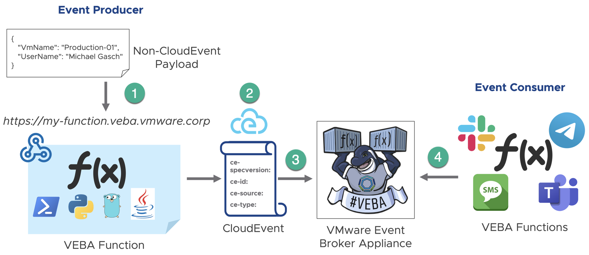
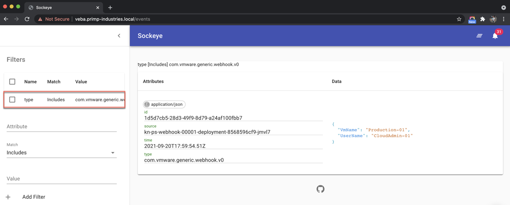

# kn-ps-webhook
Example Knative PowerShell function that accepts a custom incoming webhook, constructs a CloudEvent and sends it to the VMware Event Router (`broker`).



The `CloudEvent` will be constructed with the following parameters and values:

* **Source:** - Hostname (FQDN)
* **Timestamp:** - Current Time of incoming request
* **ID:** - v4 UUID
* **Type:** - `com.vmware.generic.webhook.v0` (configurable via configuration secret/ENV variable)
* **Subject:** (not-set)
* **Data:** - Incoming body payload (body will be encoded using UTF8 and is expected to be JSON format)

## Prerequisites

* VEBA deployed with a [wildcard DNS entry](https://en.wikipedia.org/wiki/Wildcard_DNS_record), which is required for the ability to externally invoke a Knative Service URL that is serving the custom webhook function. Please [refer to this blog post](https://williamlam.com/2021/09/custom-webhook-function-to-publish-events-into-vmware-event-broker-appliance-veba.html) for more information.


# Step 1 - Build

Create the container image locally to test your function logic.

```console
export TAG=<version>
docker build -t <docker-username>/kn-ps-webhook:${TAG} .
```

# Step 2 - Test

Verify the container image works by executing it locally.

Change into the `test` directory
```console
cd test
```

Update the following variable names within the `docker-test-env-variable` file and either the `send-local-webhook-test.ps1` (PowerShell Script) or `send-local-webhook-test.sh` (Bash Script)

* WEBHOOK_USERNAME - Username to login to webhook function endpoint
* WEBHOOK_PASSWORD - Password to login to webhook function endpoint
* WEBHOOK_CE_EVENT_TYPE - The type value used for creating the CloudEvent (e.g. com.vmware.generic.webhook.v0)
* WEBHOOK_SINK_URL - The sink URL (e.g. http://default-broker-ingress.vmware-functions.svc.cluster.local) to send the CloudEvent (leave blank for local development)

Start the container image by running the following command:

```console
docker run -e SERVICE_DEBUG=true -e PORT=8080 --env-file docker-test-env-variable -it --rm -p 8080:8080 <docker-username>/kn-ps-webhook:${TAG}
```

In a separate terminal, run either `send-local-webhook-test.ps1` (PowerShell Script) or `send-local-webhook-test.sh` (Bash Script) to simulate a payload being sent to the local container image

```console
Testing Function ...
See docker container console for output

# Output from docker container console
Id     Name            PSJobTypeName   State         HasMoreData     Location             Command
--     ----            -------------   -----         -----------     --------             -------
2      Job2            ThreadJob       NotStarted    False           PowerShell           …
09/20/2021 17:19:19 - PowerShell HTTP server start listening on 'http://*:8080/'
09/20/2021 17:19:19 - Processing Init

09/20/2021 17:19:19 - Init Processing Completed

09/20/2021 17:19:22 - Processing Body ...

09/20/2021 17:19:22 - [Function Secrets]:
{"WEBHOOK_USERNAME": "XXX","WEBHOOK_PASSWORD": "XXX","WEBHOOK_CE_EVENT_TYPE": "com.vmware.generic.webhook.v0","WEBHOOK_SINK_URL": ""}

09/20/2021 17:19:22 - Checking for authorization ...

09/20/2021 17:19:22 - [Expected Authorization Header]:
Basic XXX

09/20/2021 17:19:22 - Creating CloudEvent ...

09/20/2021 17:19:22 - [Headers]:

Name                           Value
----                           -----
Authorization                  {Basic XXX}
Content-Type                   {application/json}
Content-Length                 {57}
Host                           {localhost:8080}
User-Agent                     {curl/7.64.1}
Accept                         {*/*}

09/20/2021 17:22:23 - [Body]:

@{VmName=Production-01; UserName=CloudAdmin-01}

09/20/2021 17:22:23 - [CloudEvent]:

DataContentType : application/json
Data            : {123, 9, 34, 86…}
Id              : a1d184f4-b435-44d2-9456-085c76c2634d
DataSchema      :
Source          : 192.168.0.4
SpecVersion     : V1_0
Subject         :
Time            : 09/20/2021 17:22:23
Type            : com.vmware.generic.webhook.v0

09/20/2021 17:19:22 - Running in local development: not sending CloudEvent to VMware Event Broker
```

# Step 3 - Deploy

> **Note:** The following steps assume a working Knative environment using the
`default` Rabbit `broker`. The Knative `service` and `trigger` will be installed in the
`vmware-functions` Kubernetes namespace, assuming that the `broker` is also available there.

Push your container image to an accessible registry such as Docker once you're done developing and testing your function logic.

```console
docker push <docker-username>/kn-ps-webhook:${TAG}
```

Update the `webhook_secret.json` file with your webhook credentials and configurations and then create the kubernetes secret which can then be accessed from within the function by using the environment variable named called `WEBHOOK_SECRET`. The username/password defined here will be validated against the basic authorization that must be included as part of the incoming webhook submission for added level of security.

```console
# create secret

kubectl -n vmware-functions create secret generic webhook-secret --from-file=WEBHOOK_SECRET=webhook_secret.json

# update label for secret to show up in VEBA UI
kubectl -n vmware-functions label secret webhook-secret app=veba-ui
```

Edit the `function.yaml` file with the name of the container image from Step 1 if you made any changes. If not, the default VMware container image will suffice.

Deploy the function to the VMware Event Broker Appliance (VEBA).

```console
# deploy function

kubectl -n vmware-functions apply -f function.yaml
```

For testing purposes, the `function.yaml` contains the following annotations, which will ensure the Knative Service Pod will always run **exactly** one instance for debugging purposes. Functions deployed through through the VMware Event Broker Appliance UI defaults to scale to 0, which means the pods will only run when it is triggered by an vCenter Event.

```yaml
annotations:
  autoscaling.knative.dev/maxScale: "1"
  autoscaling.knative.dev/minScale: "1"
```

# Step 4 - Verify webhook function

Retrieve the Knative service URL for the deployed function. In the example below, the name of the function is called `kn-ps-webhook` and ensure the the `READY` field shows `True`.

```console
# kubectl -n vmware-functions get ksvc kn-ps-webhook

NAME            URL                                                                 LATESTCREATED         LATESTREADY           READY   REASON
kn-ps-webhook   http://kn-ps-webhook.vmware-functions.veba.primp-industries.local   kn-ps-webhook-00001   kn-ps-webhook-00001   True
```

Change into the `test` directory
```console
cd test
```

Update the following variable names within the `send-webhook-to-veba.sh` script:

* WEBHOOK_USERNAME - Username to login to webhook function endpoint
* WEBHOOK_PASSWORD - Password to login to webhook function endpoint
* WEBHOOK_FUNCTION_URL - Knative service URL for deployed webhook function (retrieved in step above)

Run the `send-webhook-to-veba.sh` script to send test payload to Knative service URL and verify the success by ensuring HTTP status of 200 is returned.

```console
# ./send-webhook-to-veba.sh

Testing Function ...
HTTP/2 200
content-length: 0
date: Mon, 20 Sep 2021 17:58:59 GMT
server: envoy
x-envoy-upstream-service-time: 25
```

> **Note:** You can also use the VMware Event Broker Appliance Event Viewer (e.g. *https://[VEBA-FQDN]/events*) and filter on the custom event `type` which is defined within `webhook_secret.json`. In this example, the type has a value of `com.vmware.generic.webhook.v0` and once the filter has been created, you should now see the custom event processed by the VMware Event Broker Appliance upon running the `send-webhook-to-veba.sh` script.



# Step 5 - Undeploy

```console
# undeploy function

kubectl -n vmware-functions delete -f function.yaml

# delete secret
kubectl -n vmware-functions delete secret webhook-secret
```