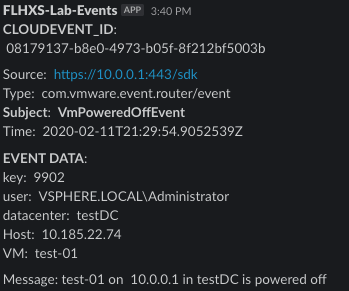

# kn-ps-slack
Example Knative Python function for sending to a Slack webhook when a Virtual Machine is powered off.

# Step 1 - Build with `pack`

[Buildpacks](https://buildpacks.io) are used to create the container image.

```bash
IMAGE=<docker-username>/kn-py-slack:1.0
pack build -B gcr.io/buildpacks/builder:v1 ${IMAGE}
```


# Step 2 - Test

Verify the container image works by executing it locally.

Change into the `test` directory
```console
cd test
```

Update the `docker-test-env-variable` file with your Slack webook URL.

Start the container image by running the following command:

```console
docker run -e FUNCTION_DEBUG=true -e PORT=8080 --env-file docker-test-env-variable -it --rm -p 8080:8080 <docker-username>/kn-py-slack:1.0

Serving Flask app "handler.py" (lazy loading)
 * Environment: development
 * Debug mode: on
 * Running on all addresses.
   WARNING: This is a development server. Do not use it in a production deployment.
 * Running on http://172.17.0.2:8080/ (Press CTRL+C to quit)
 * Restarting with stat
 * Debugger is active!
 ```
 
In a separate terminal window, go to the test directory and use the ```testevent.json``` file to validate the function is working. You should see output similar to this below.

```
curl -i -d@testevent.json localhost:8080

HTTP/1.1 100 Continue

HTTP/1.0 204 NO CONTENT
Content-Type: application/json
Server: Werkzeug/2.0.1 Python/3.8.6
Date: Thu, 20 May 2021 18:04:36 GMT
```
Return to the previous terminal window where you started the docker image, and you should see something similar to the following:

```
2021-05-20 20:40:18,007 INFO requests.packages.urllib3.connectionpool Thread-3 : Starting new HTTPS connection (1): hooks.slack.com
2021-05-20 20:40:18,284 DEBUG requests.packages.urllib3.connectionpool Thread-3 : "POST /services/T024JFTN4/B01U92186ES/rAAyiTbJFc2gNLe91X7ZjumO HTTP/1.1" 200 22
172.17.0.1 - - [20/May/2021 20:40:18] "POST / HTTP/1.1" 204 -
2021-05-20 20:40:18,286 INFO werkzeug Thread-3 : 172.17.0.1 - - [20/May/2021 20:40:18] "POST / HTTP/1.1" 204 -
```


Finally, check your Slack channel to see if the test event posted.




# Step 3 - Deploy

> **Note:** The following steps assume a working Knative environment using the
`default` Rabbit `broker`. The Knative `service` and `trigger` will be installed in the
`vmware-functions` Kubernetes namespace, assuming that the `broker` is also available there.

Push your container image to an accessible registry such as Docker once you're done developing and testing your function logic.

```console
docker push <docker-username>/kn-py-slack:1.0
```

Update the `slack_secret.json` file with your Slack webhook configurations and then create the kubernetes secret which can then be accessed from within the function by using the environment variable named called `SLACK_SECRET`.

```console
# create secret

kubectl -n vmware-functions create secret generic slack-secret --from-file=SLACK_SECRET=slack_secret.txt

# update label for secret to show up in VEBA UI
kubectl -n vmware-functions label secret slack-secret app=veba-ui
```

Edit the `function.yaml` file with the name of the container image from Step 1 if you made any changes. If not, the default VMware container image will suffice. By default, the function deployment will filter on the `VmPoweredOffEvent` vCenter Server Event. If you wish to change this, update the `subject` field within `function.yaml` to the desired event type.


Deploy the function to the VMware Event Broker Appliance (VEBA).

```console
# deploy function

kubectl -n vmware-functions apply -f function.yaml
```

For testing purposes, the `function.yaml` contains the following annotations, which will ensure the Knative Service Pod will always run **exactly** one instance for debugging purposes. Functions deployed through through the VMware Event Broker Appliance UI defaults to scale to 0, which means the pods will only run when it is triggered by an vCenter Event.

```yaml
annotations:
  autoscaling.knative.dev/maxScale: "1"
  autoscaling.knative.dev/minScale: "1"
```

# Step 4 - Undeploy

```console
# undeploy function

kubectl -n vmware-functions delete -f function.yaml

# delete secret
kubectl -n vmware-functions delete secret slack-secret
```
