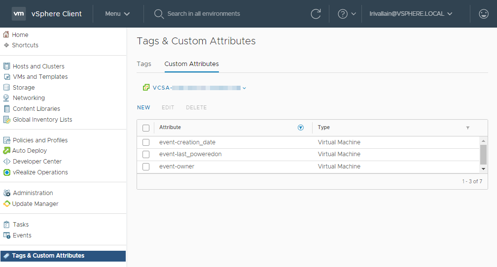

# kn-vm-creation-attr-fn

> This function is greatly inspired by the content from [embano1/kn-echo](https://github.com/embano1/kn-echo) and
> [lrivallain/openfaas-fn/.../vm-creation-attr-fn](https://github.com/lrivallain/openfaas-fn/tree/master/vm-creation-attr-fn).

A sample python function with `Flask` REST API running in Knative to apply _custom attributes_
 to a VM object based on an event submitted by the [VEBA](https://vmweventbroker.io/) 
 (VMware Event Broker) services:

* `event-creation_date`: To store the creation date
* `event-last_poweredon`: To store the last powered on date
* `event-owner`: To store the user that created the VM



> **Note:** Only cloud event payload ("*data*") in JSON format is supported.


# Step 1 - Build with `pack`

> **Note:** If you not plan to edit the function behavior, you can directly go to **Step 3 - Deploy**part of this 
> document.

[Buildpacks](https://buildpacks.io) are used to create the container image.

Requirements:

- `pack` (see: https://buildpacks.io/docs/app-developer-guide/)
- Docker

```bash
export IMAGE=<docker-username>/kn-py-vm-attr
pack build --builder gcr.io/buildpacks/builder:v1 ${IMAGE}
```


# Step 2 - Test

Edit the content of `kn-py-vm-attr_secret.json` to configure the following settings:

```json
{
  "VC_SERVER": "vcsa.local",
  "VC_USER": "test@vsphere.local",
  "VC_PASSWORD": "ReplaceMe!",
  "VC_SSLVERIFY": "True",
  "VC_ATTR_OWNER": "event-owner",
  "VC_ATTR_CREATION_DATE": "event-creation_date",
  "VC_ATTR_LAST_POWEREDON": "event-last_poweredon"
}
```

Run a local container based on the `${IMAGE}` image or the one you just built.

```bash
docker run -e PORT=8080 -it --rm -p 8080:8080 --env VCCONFIG_SECRET="$(cat kn-py-vm-attr_secret.json)" ${IMAGE}

# now in a separate window or use -d in the docker cmd above to detach
curl -i -d@test/testevent.json localhost:8080

HTTP/1.0 204 NO CONTENT
Content-Type: application/json
Server: Werkzeug/1.0.1 Python/3.8.6
Date: Wed, 17 Feb 2021 09:16:09 GMT

# you should see the following lines printed in the docker container
 * Serving Flask app "handler.py" (lazy loading)
 * Environment: development
 * Debug mode: on
 * Running on http://0.0.0.0:8080/ (Press CTRL+C to quit)
 * Restarting with stat
 * Debugger is active!
 * Debugger PIN: 138-375-841
2021-05-04 14:09:18,464 INFO vcenter Thread-4 : Initializing vCenter connection...
2021-05-04 14:09:18,992 INFO vcenter Thread-4 : Connected to vCenter vcsa.local
2021-05-04 14:09:19,483 INFO handler Thread-4 : Apply attribute > event-last_poweredon
172.17.0.1 - - [04/May/2021 14:09:19] "POST / HTTP/1.1" 204 -
2021-05-04 14:09:19,777 INFO werkzeug Thread-4 : 172.17.0.1 - - [04/May/2021 14:09:19] "POST / HTTP/1.1" 204 -
```


# Step 3 - Deploy

## Pre-requisites

You need:

* A deployed VEBA instance (K8S or appliance based)
* A deployed knative setup
* A set of custom attributes applicable to VMs like the previous ones.
* This repository

> * VMware Event Broker Appliance v0.6 ships with embedded Knative deployment.

## Push container image to registry

Push your container image to an accessible registry such as Docker once you're done developing and testing your 
function logic.

```console
docker push ${IMAGE}
```

## Configuration

**Note:** The following steps assume a working Knative environment using a broker named
`broker: default`. The Knative `service` and `trigger` will be installed in the
Kubernetes namespace specified in apply command, assuming that the broker is also available
there. You can customize this in the `function.yaml` file if needed.

If not already done in the *Test* step, edit the content of `kn-py-vm-attr_secret.json` to configure the following 
settings:

```json
{
  "VC_SERVER": "vcsa.local",
  "VC_USER": "test@vsphere.local",
  "VC_PASSWORD": "ReplaceMe!",
  "VC_SSLVERIFY": "True",
  "VC_ATTR_OWNER": "event-owner",
  "VC_ATTR_CREATION_DATE": "event-creation_date",
  "VC_ATTR_LAST_POWEREDON": "event-last_poweredon"
}
```

## Deploy

```bash
export VEBA_NS=vmware-functions

# Create secret
kubectl -n ${VEBA_NS} create secret generic vcconfig-secret --from-file=VCCONFIG_SECRET=kn-py-vm-attr_secret.json

# update label for secret to show up in VEBA UI
kubectl -n ${VEBA_NS} label secret vcconfig-secret app=veba-ui

Edit the `function.yaml` file with the name of the container image from *Step 1* if you made any changes.

```bash
# deploy function
kubectl apply -n ${VEBA_NS} -f function.yaml
```

For testing purposes, the `function.yaml` contains the following annotations, which will ensure the Knative Service
Pod will always run **exactly** one instance for debugging purposes. Functions deployed through through the
VMware Event Broker Appliance UI defaults to scale to 0, which means the pods will only run when it is triggered by
an vCenter Event.

```yaml
annotations:
  autoscaling.knative.dev/maxScale: "1"
  autoscaling.knative.dev/minScale: "1"
```

# Step 4 - Undeploy

```console
# undeploy function
kubectl delete -n ${VEBA_NS} -f function.yaml
```

# Limitations

**Note:** As this function is not using any session or content caching, it may lead to an increase of the API workload in large
environments. Some extra modifications may be required to safely manage a large environment:

* Move session initialization outside the handler to reduce the number of tokens managed by vCenter system
* Cache the data from inventory requests