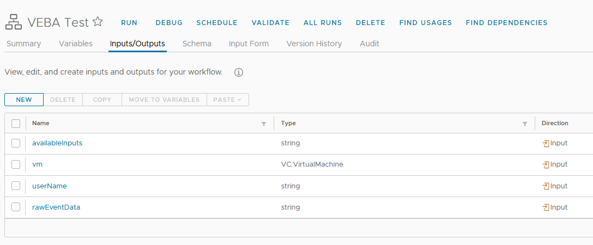
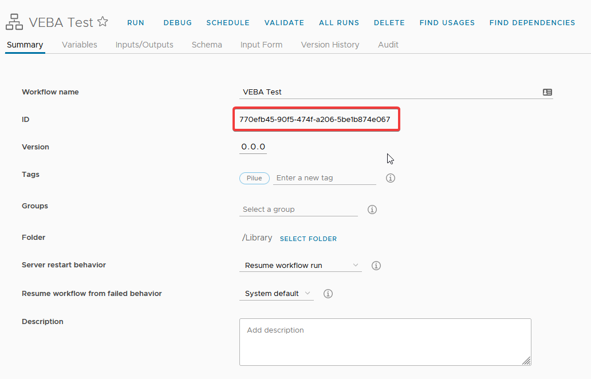
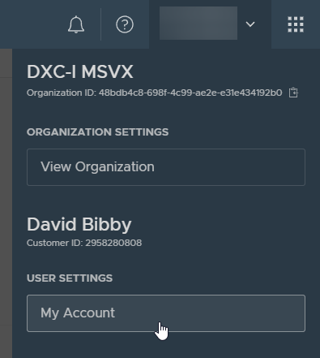
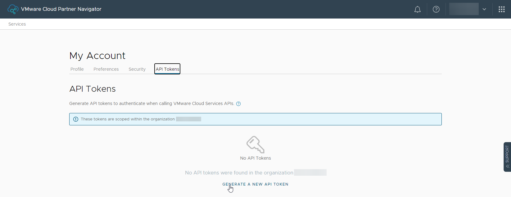
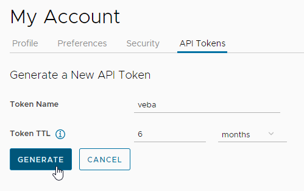
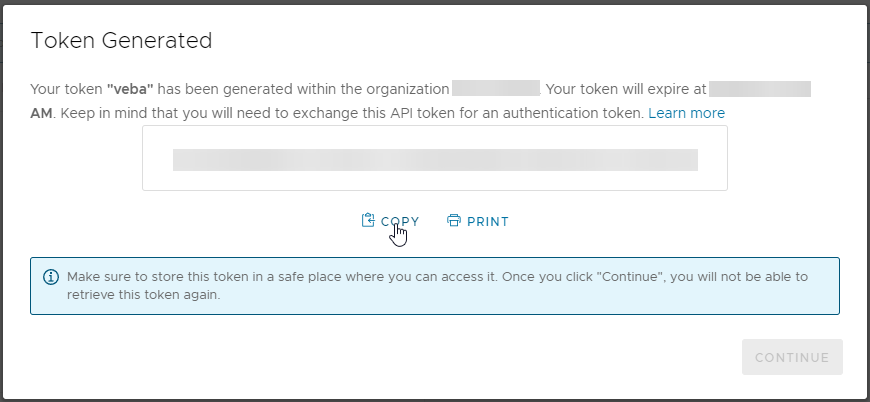

# kn-py-vro <!-- omit in toc -->
- [Overview](#overview)
- [Step 1 - Build with `pack`](#step-1---build-with-pack)
- [Step 2 - Test](#step-2---test)
- [Step 3 - Deploy](#step-3---deploy)
  - [Prerequisites](#prerequisites)
  - [Push container image to registry](#push-container-image-to-registry)
  - [Configuration](#configuration)
  - [Deploy](#deploy)
- [Step 4 - Undeploy](#step-4---undeploy)
- [vRO Workflow](#vro-workflow)
- [Configuration](#configuration-1)
  - [vRO Workflow ID](#vro-workflow-id)
  - [OAUTH via VMWare Cloud Services Console - for CEXP](#oauth-via-vmware-cloud-services-console---for-cexp)

# Overview
This is an example Python function with `Flask` REST API running in Knative to trigger a vRealize Orchestrator (vRO) workflow using the parameters of an event submitted by the [VEBA](https://vmweventbroker.io/) (VMware Event Broker) services.

The Cloud Event parameters are converted in to native vRO datatypes wherever possible, including vCenter SDK Managed Objects, and passed as inputs to a defined vRO Workflow.

The function code not only demonstrates a number of techniques (such as creating persistent OAUTH sessions, and the vRO workflow API), but is generic enough to be usable in a multitude of scenario's out-of-the-box.

> **Note:** Only CloudEvent payload (`data`) in JSON format is supported.


# Step 1 - Build with `pack`

> **Note:** If you do not plan to edit the function behavior, you can go directly to [Step 3 - Deploy](#step-3---deploy) part of this document.

[Buildpacks](https://buildpacks.io) are used to create the container image.

Requirements:

- `pack` (see: https://buildpacks.io/docs/app-developer-guide/)
- Docker

```bash
export IMAGE=<docker-username>/kn-py-vro:1.1
pack build --builder gcr.io/buildpacks/builder:v1 ${IMAGE}
```


# Step 2 - Test

1. Copy `template-kn-py-vro_secret.json` to `kn-py-vro_secret.json` and edit to configure the following settings (see [Configuration](#configuration) below for details):

    ```json
    {
        "SERVER": "VRO_FQDN_OR_IP",
        "PORT": 443,
        "AUTH_TYPE": "BASIC/OAUTH",
        "USERNAME": "VRO_USERNAME",
        "PASSWORD": "VRO_PASSWORD",
        "REFRESH_TOKEN": "VRAC_ONLY",
        "INSECURE_SSL": false,
        "WORKFLOW_ID": "VRO_WORKFLOW_ID"
    }
    ```
2. Run `pytest` from the root of the repo to run all unit tests - the functional tests require a working vRO config so ensure that's in place first.

3. Run a local container based on the `${IMAGE}` image or the one you just built.
    
    Via a Linux shell:
    ```bash
    docker run -e PORT=8080 -it --rm -p 8080:8080 --env VROCONFIG_SECRET="$(cat tests/test-kn-py-vro_secret.json)" ${IMAGE}
    ```
    
    Or via Powershell:
    ```PowerShell
    docker run -e PORT=8080 -it --rm -p 8080:8080 --env VROCONFIG_SECRET=$((Get-Content -raw tests/test-kn-py-vro_secret.json).replace('"', '\"')) $IMAGE
    ```

4. Now in a separate window (or use -d in the docker cmd above to detach) run:
    ```bash
    curl -i -d@test/testevent.json localhost:8080
    ```
    You should see the following output if all has worked:
    ```console
    HTTP/1.1 100 Continue

    HTTP/1.0 202 ACCEPTED
    Content-Type: application/json
    Content-Length: 96
    Server: Werkzeug/1.0.1 Python/3.9.5
    Date: Mon, 22 Nov 2021 10:59:55 GMT

    {
      "message": "Workflow Token b96c4d96-6a38-4395-a706-8084b37a41c4: running", 
      "status": 202
    }
    ```

    You should see the following lines printed in the docker container:
    ```console
    * Serving Flask app "handler.py" (lazy loading)
    * Environment: development
    * Debug mode: on
    * Running on http://0.0.0.0:8080/ (Press CTRL+C to quit)
    * Restarting with stat
    * Debugger is active!
    * Debugger PIN: 298-051-811
   2021-11-22 11:36:34,420 DEBUG handler Thread-3 : Attempting to fetch refresh token for user david
   2021-11-22 11:36:34,430 DEBUG urllib3.connectionpool Thread-3 : Starting new HTTPS connection (1): vra01.local:443
   2021-11-22 11:36:34,696 DEBUG urllib3.connectionpool Thread-3 : https://vra01.local:443 "POST /csp/gateway/am/api/login?access_token HTTP/1.1" 200 52
   2021-11-22 11:36:34,698 DEBUG handler Thread-3 : Attempting to fetch bearer token from https://vra01.local:443
   2021-11-22 11:36:34,700 DEBUG urllib3.connectionpool Thread-3 : Starting new HTTPS connection (1): vra01.local:443
   2021-11-22 11:36:35,724 DEBUG urllib3.connectionpool Thread-3 : https://vra01.local:443 "POST /iaas/api/login HTTP/1.1" 200 1595
   2021-11-22 11:36:35,725 DEBUG handler Thread-3 : Reading Cloud Event: 
   2021-11-22 11:36:35,726 DEBUG handler Thread-3 : Event > <class 'cloudevents.http.event.CloudEvent'> - {'attributes': {'specversion': '1.0', 'id': '42516969-218a-406f-9ccc-db387befc4bf', 'source': 'https://vcsa.local/sdk', 'type': 'com.vmware.event.router/event', 'datacontenttype': 'application/json', 'subject': 'DrsVmPoweredOnEvent', 'time': '2021-05-04T07:33:33.773581268Z', 'knativearrivaltime': '2021-05-04T07:33:33.772937393Z'}, 'data': {'Key': 992270, 'ChainId': 992267, 'CreatedTime': '2021-05-04T07:33:32.759Z', 'UserName': 'VSPHERE.LOCAL\\test-user', 'Datacenter': {'Name': 'Datacenter', 'Datacenter': {'Type': 'Datacenter', 'Value': 'datacenter-21'}}, 'ComputeResource': {'Name': 'Cluster01', 'ComputeResource': {'Type': 'ClusterComputeResource', 'Value': 'domain-c84'}}, 'Host': {'Name': 'esxi1.local', 'Host': {'Type': 'HostSystem', 'Value': 'host-34'}}, 'Vm': {'Name': 'TestVM', 'Vm': {'Type': 'VirtualMachine', 'Value': 'vm-596'}}, 'Ds': None, 'Net': None, 'Dvs': None, 'FullFormattedMessage': 'DRS powered On TestVM on esxi1.local in Datacenter', 'ChangeTag': '', 'Template': False}}

    ...
    
    2021-11-22 11:36:35,897 INFO handler Thread-3 : Workflow Token 006664b9-3bf1-4a74-9366-cebc2ece4701: running
    172.17.0.1 - - [22/Nov/2021 11:36:35] "POST / HTTP/1.1" 202 -
    2021-11-22 11:36:35,898 INFO werkzeug Thread-3 : 172.17.0.1 - - [22/Nov/2021 11:36:35] "POST / HTTP/1.1" 202 -
    ```
> **Note:** If you just want to test and build the function, there is a helper script you can run: `./build.sh`
> This will run all the unit and functinal tests, build the image and run and test a local version automatically.

# Step 3 - Deploy

## Prerequisites

You need:

* A deployed VEBA instance (v0.6 or later)
* A vRO Installation (standalone or vRA embedded) and a [receiving workflow](#vro-workflow)
* This repository

## Push container image to registry

Push your container image to an accessible registry such as Docker once you're done developing and testing your function logic.

```console
docker push ${IMAGE}
```
> **Note:** You can skip this step if you are using the pre-built function without any changes


## Configuration

**Note:** The following steps assume a working Knative environment using a broker named `broker: default`. The Knative `service` and `trigger` will be installed in the Kubernetes namespace specified in the apply command, assuming that the broker is also available there. You can customize this in the `function.yaml` file if needed.

If not already done in the [Test](#step-2---test) step, edit the content of `kn-py-vro_secret.json` to configure the following settings:

```json
{
    "SERVER": "VRO_FQDN_OR_IP",
    "PORT": 443,
    "AUTH_TYPE": "BASIC/OAUTH",
    "USERNAME": "VRO_USERNAME",
    "PASSWORD": "VRO_PASSWORD",
    "REFRESH_TOKEN": "VRAC_ONLY",
    "INSECURE_SSL": true,
    "WORKFLOW_ID": "VRO_WORKFLOW_ID"
}
```

## Deploy

```bash
export VEBA_NS=vmware-functions

# Create secret
kubectl -n ${VEBA_NS} create secret generic vroconfig-secret --from-file=VROCONFIG_SECRET=kn-py-vro_secret.json

# update label for secret to show up in VEBA UI
kubectl -n ${VEBA_NS} label secret vroconfig-secret app=veba-ui
```

Edit the `function.yaml` file with the name of the container image from [Step 1](#step-1---build-with-pack) if you made any changes.

```bash
# deploy function
kubectl apply -n ${VEBA_NS} -f function.yaml
```

For testing purposes, the `function.yaml` contains the following annotations, which will ensure the Knative Service
Pod will always run **exactly** one instance for debugging purposes. Functions deployed through the
VMware Event Broker Appliance UI default to scale to 0, which means the pods will only run when triggered by
a vCenter Event.

```yaml
annotations:
  autoscaling.knative.dev/maxScale: "1"
  autoscaling.knative.dev/minScale: "1"
```

# Step 4 - Undeploy

```bash
# undeploy function
kubectl delete -n ${VEBA_NS} -f function.yaml
```

# vRO Workflow
To use this function you will need to create a vRO workflow to recieve the Cloud Events forwarded by VEBA. The vRO workflow can have any number of inputs defined for the information you are interested in. For example, for a `DrsVmPoweredOnEvent` event you may be interested in which VM was powered on, and by whom. In this example you would need to create input parameters in the vRO workflow as follows:

| Name       | Type                |
| ---------- | ------------------- |
| `vm`       | `VC:VirtualMachine` |
| `userName` | `string`            |



Additionally you can create an input parameter called `cloudEventAttributes` of type `Properties` in order for the workflow to receive the CloudEvent's context attributes from the source event. These include the `subject` (which is the vCenter Event type that triggered the function) and the `time` of the event.

You can also create an input parameter called `rawEventData` of type `string` which will be passed the entire CloudEvent data as a JSON string to be used however you need within the workflow.

Finally you can create an input parameter called `availableInputs` of type `string` which will be passed a human readable list of available inputs and their datatypes. This can be useful in order to see what data is available in the CloudEvent and as such, what input fields you can specify in your workflow.

You can also see this information (and lots of other useful debug info) by viewing the function logs when running in a test state (see [Step 2](#step-2---test) above).


```console
2021-11-22 15:16:04,666 DEBUG handler Thread-3 : Passing the following params to vRO:
2021-11-22 15:16:04,666 DEBUG handler Thread-3 : Param: key - Type: number
2021-11-22 15:16:04,666 DEBUG handler Thread-3 : Param: chainId - Type: number
2021-11-22 15:16:04,666 DEBUG handler Thread-3 : Param: createdTime - Type: Date
2021-11-22 15:16:04,666 DEBUG handler Thread-3 : Param: userName - Type: string
2021-11-22 15:16:04,666 DEBUG handler Thread-3 : Param: datacenter - Type: VC:Datacenter
2021-11-22 15:16:04,666 DEBUG handler Thread-3 : Param: computeResource - Type: VC:ClusterComputeResource
2021-11-22 15:16:04,666 DEBUG handler Thread-3 : Param: host - Type: VC:HostSystem
2021-11-22 15:16:04,667 DEBUG handler Thread-3 : Param: vm - Type: VC:VirtualMachine
2021-11-22 15:16:04,667 DEBUG handler Thread-3 : Param: fullFormattedMessage - Type: string
2021-11-22 15:16:04,667 DEBUG handler Thread-3 : Param: changeTag - Type: string
2021-11-22 15:16:04,667 DEBUG handler Thread-3 : Param: template - Type: boolean
2021-11-22 15:16:04,667 DEBUG handler Thread-3 : Param: cloudEventAttributes - Type: Properties
2021-11-22 15:16:04,669 DEBUG handler Thread-3 : Param: rawEventData - Type: string
2021-11-22 15:16:04,669 DEBUG handler Thread-3 : Param: availableInputs - Type: string
2021-11-22 15:16:04,669 DEBUG handler Thread-3 : Workflow ID: 770efb45-90f5-474f-a206-5be1b874e067
```

# Configuration

This section details the configuration options available in the required `secret` including the various options for authorisation.

The JSON formatted secret contains all the required configuration - the following options are available:
* `SERVER` - This is the FQDN (or IP) of the vRO instance. This can be either a standalone vRO instance, a vRA embedded instance, or a Cloud Extensibility Proxy's (CEXP) vRO instance.
* `PORT` - For vRO 8.x, this is usually `443`
* `AUTH_TYPE` - can be set to either `BASIC` or `OAUTH`:
  * `BASIC` uses basic HTTP authentication to the vRO API.
  * `OAUTH` will allow authentication via vIDM or via VMware's Cloud Services Console for vRAC.
* `USERNAME` - required for `BASIC` auth or vIDM `OAUTH`
* `PASSWORD` - required for `BASIC` auth or vIDM `OAUTH`
* `REFRESH_TOKEN` - required for `OAUTH` via VMware's Cloud Services Console.
* `INSECURE_SSL` - ignore SSL certificate validation errors
* `WORKFLOW_ID` - the ID of the vRO workflow to be triggered.

## vRO Workflow ID
To get the ID of the vRO workflow to be triggered, you need to navigate to the workflow's Summary tab in vRO and copy the ID field shown below:


## OAUTH via VMWare Cloud Services Console - for CEXP
Rather than using a username and password for authentication, an API token is generated via the Cloud Services Console. This is then used as the `REFRESH_TOKEN` in the config above.
1. Log in to the [VMware Cloud Services Console](https://console.navigator.vmware.com/portal/), then click your name at the top right and chose **My Account**

    

2. Click the **API Tokens** tab then **Generate A New API Token** at the bottom of the screen

    

3. Fill in appropriate details, then click the **Generate** button

    

4. Copy the displayed token in to the `REFRESH_TOKEN` field of your function config

    