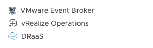
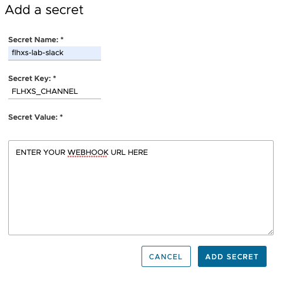
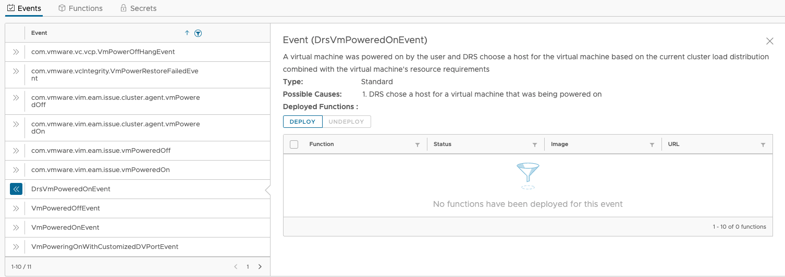
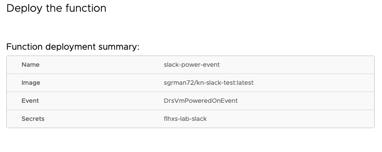
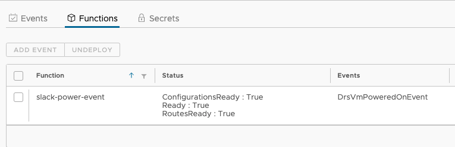
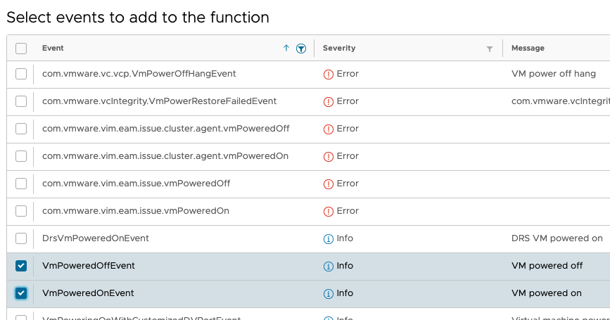
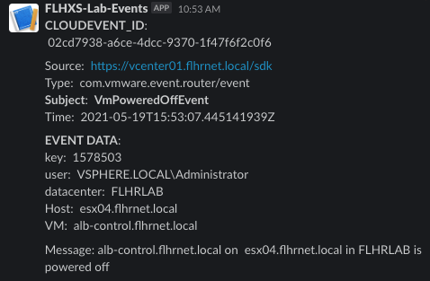

# Simple Python Based Slack Notification Function

Simple Python function with `Flask` REST API running in Knative to push 
[CloudEvents](https://github.com/cloudevents/sdk-python) to a Slack channel.

In addition [Buildpacks](https://buildpacks.io) are used to create the container image.

> **Note:** CloudEvents using structured or binary mode are supported.

In the function, we are using the Slack formatting guide to break out certain fields in the notification from the `attributes` and `data` sections for easier readability.


# Deployment Leveraging VMware Event Broker Appliance (VEBA) 

## Prerequisites

-[Deploy the VMware Event Broker Appliance](https://vmweventbroker.io/)

-[Configure a Slack Channel](https://api.slack.com/messaging/webhooks)with webhook url for posting messages. Test posting messages to insure proper configuration.

-A working [Docker Installation](https://docs.docker.com/get-docker/)

-[Install pack](https://buildpacks.io/docs/tools/pack/)

## Adjust the `handler.py` file with your variable

This example leverages the secrets function within the VEBA appliance. This secret will map to your Slack channel webhook url configured in the prerequisite section. 

When adding a secret within VEBA, you will provide a "secret name", a "secret key" and finally the secret itself.  In this case the secret is the webhook url for your Slack channel. The handler uses environ to get this secret by using the "secret key' as an environment variable.  

For example, the name of the secret key in this example below is `FLHXS_CHANNEL`.

Edit & save the following in the `handler.py` file.

```
url = os.environ.get('<INSERT YOUR CHOSEN SECRET KEY>')
```

## Build Image with `pack`

```bash
IMAGE=sgrman72/kn-slack-test:latest
pack build -B gcr.io/buildpacks/builder:v1 ${IMAGE}
```

## Push the image
```bash
docker push sgrman72/kn-slack-test:latest
```

## Deploy the Secret within VEBA

In your vCenter menu, select the VMware Event Broker plugin menu item.



Select the Secrets Option from the top menu

Click on Add and provide the following:
* Secret Name
* Secret Key (*this is the value you provided in the handler.py file*)
* Secret Value (*this is your Slack channel's webhook url*)



Save the secret.  This secret can now be used for multiple functions within VEBA.


Click on Events and filter to locate DrsVmPoweredOnEvent. Click the two arrows to the left to expand and select the "Deploy" button.



Provide the following Information:
* Function Name
* Docker Image (e.g. sgrman72/kn-slack-test:latest)
* Configure Variables (not needed for this basic example)
* Configure Secret-- select the secret created above



Deploy the function. Wait until the Status column for the function shows "True" for ConfigurationsReady, Ready and RoutesReady. You may need to refresh your vSphere Client a couple of times.



Once the function is deployed, go to the functions menu, select it, and click on "Add Event". I would add VmPoweredOnEvent and VmPoweredOffEvent. This will capture power events regardless if the cluster has DRS enabled or not.




## Test your Function

Find a VM, and perform a power function. You should see an event similar to the one below posted in your Slack Channel.

