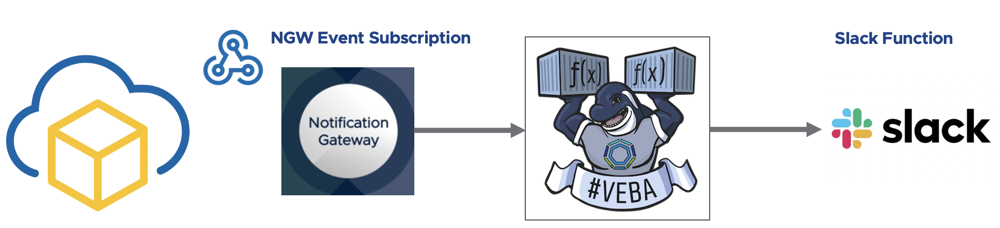
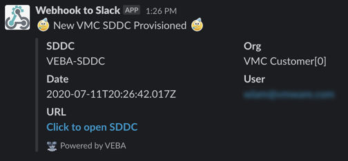
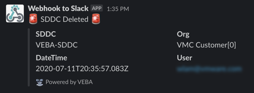

# VMware Cloud Notification Gateway Slack Function

## Description

This function demonstrates using PowerShell to forward a VMware Cloud on AWS Notification to Slack



## Prerequisites

* VEBA deployed with a trusted TLS Certificate and is accessible from the public internet. For more details, please see the instructions [here](https://medium.com/@pkblah/publicly-trusted-tls-for-vmware-eventing-platform-6c6f5d0a14fb)
* Incoming Slack Webhook URL already configured. For more details, please see the instructions [here](https://api.slack.com/messaging/webhooks#enable_webhooks)
* VMware Cloud on AWS Refresh Token. For more details, please see the instructions [here](https://cloud.vmware.com/community/2019/04/30/generating-cloud-services-platform-api-token-cloud-automation-services/)

> **Note:** VEBA must be accessible by the VMware Cloud Notification service. To protect and limit access to your VEBA instance, you can configure your external firewall to only allow traffic that originate from the following IP Addresses: `34.211.171.65, 54.186.195.111, 35.163.127.96`.

## Instruction Consuming Function

### Deploy function to VEBA

Step 1 - Update `stack.yml` and `ngw-slack-config.json` with your environment information

> **Note:** If you are building your own function, you will need to update the `image:` property in the stack.yaml to point to your own Dockerhub account and Docker Image (e.g. `<dockerhubid>/<dockerimagename>`)

Step 2 - Deploy function to vCenter Event Broker Appliance

```
VEBA_GATEWAY=https://veba.primp-industries.com
export OPENFAAS_URL=${VEBA_GATEWAY}

faas-cli login --username admin --password [password]
faas-cli secret create ngw-slack-config --from-file=ngw-slack-config.json
faas-cli deploy -f stack.yml
```

### Configure VMware Cloud Notification Webhook

Step 1 - Install the VMware Cloud Notification PowerShell Module by running the following command:

```
Install-Module VMware.VMC.Notification
```

Step 2 - Connect to the VMC Service API endpoint using the Connect-VMC cmdlet and pass in your Refresh Token:

```
Connect-VMC -RefreshToken $RefreshToken
```

Step 3 - Connect to the VMC Notification Gateway API endpoint using the Connect-VmcNotification and pass in the name of your VMC organization and Refresh Token:

```
Connect-VmcNotification -OrgName $OrgName -RefreshToken $RefreshToken
```

Step 4 - Create a new VMC Notification subscription based on the VMC event you wish to subscribe to and provide the URL to the functioned deployed in VEBA which is in the form of `https://<veba>/function/<function-name>, e.g.:

```
$vmcVebaSlackNotificationParams = @{
ClientId = "vmc-sddc-veba-slack-notification";
WebhookURL = "https://veba.primp-industries.com/function/powershell-ngw-slack";
NotificationEvents = @("SDDC-PROVISION","SDDC-DELETE");
}

New-VmcNotificationWebhook @vmcVebaSlackNotificationParams
```

> **Note:** For list of all available VMware Cloud Notification Events, please see this [blog post](https://www.williamlam.com/2020/06/extending-vmware-cloud-on-aws-notifications-using-the-notification-gateway-api.html) for more details.

### Test VMware Cloud Notification

To verify that everything was configured correctly, we can manually test our VMC Notification Webhook by running the following command and providing the Webhook ID and one of the VMC Event IDs from the previous step.

```
Test-VmcNotificationWebhook -Id [NGW-WEBHOOK-ID] -EventId [NGW-EVENT-ID]
```

Here is screenshot of the Slack notification when a new a SDDC is created:



Here is screenshot of the Slack notification when an SDDC is is delete:



### Remove function from VEBA

```
VEBA_GATEWAY=https://veba.primp-industries.com
export OPENFAAS_URL=${VEBA_GATEWAY}

faas-cli remove -f stack.yml
faas-cli secret remove ngw-slack-config
```

### Remove VMware Cloud Notification Webhook

```
Remove-VmcNotificationEvent -Id [NGW-WEBHOOK-ID]
```

## Instruction Building Function

Follow Step 1 from above and then any changes made to your function, you will need to run these additional two steps before proceeding to Step 2 from above.

Step 1 - Build the function container

```
faas-cli build -f stack.yml
```

Step 2 - Push the function container to Docker Registry (default but can be changed to internal registry)

```
faas-cli push -f stack.yml
```
