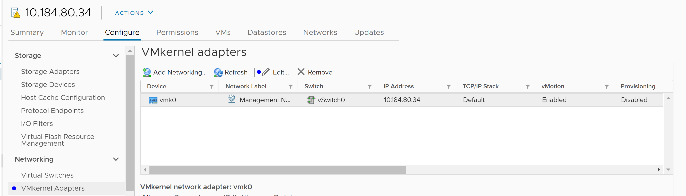
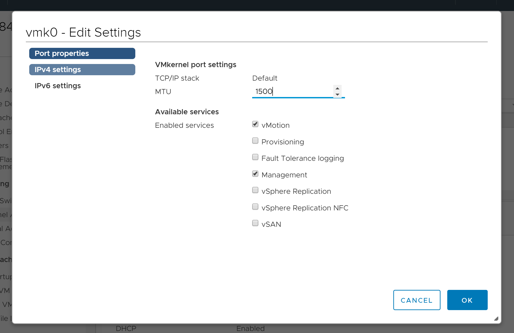

# ESX Maximum transmission unit fixer

This is a remediation function which will be triggered when a VM is powered on. It will make sure that the Maximum Transmission Unit (MTU) of the VM Kernel Adapter on all ESX hosts is at least `1500`. You can find out more about why `1500` is an optimal value in the [wikipedia page](https://en.wikipedia.org/wiki/Maximum_transmission_unit).

## Get the example function

Clone this repository which contains the example functions. 

```bash
git clone https://github.com/vmware-samples/vcenter-event-broker-appliance
cd vcenter-event-broker-appliance/examples/python/esx-mtu-fixer
git checkout master
```

## Set up

The function needs credentials and endpoint of the vCenter with which the function will interact. You can see how to create a secret containing those credentials in your Kubernetes cluster in the [create_secret](./create_secret.sh) script. Your `kubectl` must be configured to communicate with your remote cluster first.

## Deploy the function

Login to the gateway:
```
export OPENFAAS_URL=https://VEBA_FQDN_OR_IP

faas-cli login -p VEBA_OPENFAAS_PASSWORD --tls-no-verify
```

From inside the `esx-mtu-fixer` folder run:
```
faas-cli deploy --tls-no-verify
```

## Try it out

Before you start deploy arbitrary VM on one of your ESX hosts.

### Lower the MTU

* Navigate to one of your ESXi hosts and in `Configure` tab navigate to `Networking` and find `VMkernel Adapters`:


* Pick a device and press `Edit`(blue dot) and a window will appear:


* Change the value so it is smaller than `1500` and press OK.

### Fix the MTU

* Trigger a `VmPoweredOnEvent` by powering on a VM.
  
> **Note:** for DRS-enabled clusters the event should be `DrsVmPoweredOnEvent`

* Navigate to the same place to see the MTU is back to `1500`

